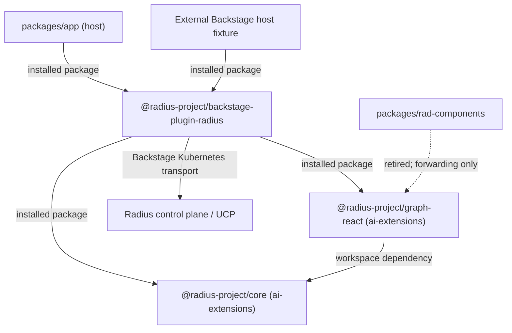

# Radius Dashboard test plan

- **Author**: Nicole James (@nicolejms)
- **Date**: 2026-09
- **Status**: Draft
- **Companion design**: [Radius Dashboard as a distributable Backstage plugin](./2026-09-radius-backstage-plugin.md)
- **Related**: [`radius-project/ai-extensions` canvas test plan](https://github.com/radius-project/ai-extensions/blob/2c789d2e2a309d94e4164a1719c64dda580be36c/docs/design/2026-08-radius-canvas-test-plan.md),
  [canvas test architecture](https://github.com/radius-project/ai-extensions/blob/2c789d2e2a309d94e4164a1719c64dda580be36c/docs/design/2026-08-radius-canvas-test-architecture.md)

## Purpose

The [companion design](./2026-09-radius-backstage-plugin.md) decides the architecture: common
domain logic and graph rendering are owned and published by `radius-project/ai-extensions`
(`@radius-project/core`, `@radius-project/graph-react`), and the Backstage product plugin is
productized and published from this repository (`@radius-project/backstage-plugin-radius`). Two
consequences drive this test plan:

1. **Graph consistency is achieved by deletion, not duplication.** `packages/rad-components` is
   retired as an implementation owner. Its renderer and layout are consolidated into
   `graph-react` alongside the Canvas renderer, and the dashboard consumes that package. The design
   states that duplicated implementations are not an acceptable compatibility mechanism, so this
   plan does **not** test dashboard-side parity against a second copy of the model. It tests that
   the frozen pre-extraction behavior survives the switch and that no parallel implementation
   remains.
2. **The plugin becomes a published contract.** `packages/app` stops being a privileged consumer of
   workspace source and becomes one host among several, alongside an external Backstage host
   fixture.

Both changes rewrite code that today has no meaningful regression net. This plan establishes that
net first, freezes it as a reviewed baseline **before** any extraction, then extends it to the
plugin contract, the installed artifact, and the host boundary.

This document tracks delivery, required checks, and exact requirements. Start with the current
state, then the status table. Use the phase sections for work still to come, and the appendices
when a pull request needs an exact export, route, request, page, fixture, or host case.

The design's own "Test plan" section states the required suites at the program level across both
repositories. This document is the dashboard-side execution plan for them: it enumerates the
dashboard requirements, their IDs, and their order. Where the two disagree, the design wins and
this plan is corrected.

## Current state

Measured on the `main` tree at the time of writing.

| Workspace                       | Source files | With a colocated test | Test cases |
| ------------------------------- | -----------: | --------------------: | ---------: |
| `plugins/plugin-radius`         |           50 |                    26 |        122 |
| `plugins/plugin-radius-backend` |            2 |                     1 |          1 |
| `packages/rad-components`       |            9 |                     2 |          2 |
| `packages/app`                  |            9 |                     1 |          1 |
| `packages/backend`              |            1 |                     1 |          1 |
| **Total**                       |       **71** |                **31** |    **127** |

Plus one Playwright spec with one case, which loads the home page and asserts three strings.

The raw counts understate the gap. Three findings matter more:

- **Coverage is concentrated.** 45 of 127 unit cases live in `plugin-radius/src/api/api.test.ts`.
  Fifteen unit test files contain exactly one case, and most of those assert once or twice.
- **The graph is effectively untested.** `AppGraph.test.tsx` renders the sample application and
  asserts that the React Flow attribution link exists. It asserts nothing about nodes, edges, edge
  direction, ordering, or Dagre layout. `initialNodes` contains a deliberate gateway
  direction-correction branch and an operator-precedence-sensitive `order` computation; neither is
  covered. Any graph rework is currently a blind change.
- **No test describes the plugin as a contract.** `plugin.test.ts` asserts `radiusPlugin` is
  defined. Nothing pins the public export surface, the route refs, the extension mount points, the
  `radiusApiRef` id, or the feature-flag name — exactly the things an external consumer depends on
  and that a rearchitecture silently breaks.
- **Forty source files have no colocated test,** including every `packages/app` component,
  `ResourceListPage`, `ResourceLayout`, `OverviewTab`, `DetailsTab`, `RecipeListPage`,
  `RecipeTable`, and the `resources/resource.ts` domain model. See Appendix F.

There is no coverage threshold in CI. `yarn test:all` runs with `--coverage` but no floor, so
coverage can fall to zero without failing a build.

## Current status

| Phase | Name                                | Status      | Outcome                                                                                        |
| ----- | ----------------------------------- | ----------- | ---------------------------------------------------------------------------------------------- |
| 0     | Record the behavior                 | Not started | Public exports, route table, request table, page inventory, and a coverage floor are written down |
| 1     | Harden existing behavior            | Not started | Every shipped page, table, tab, and domain rule has a real test before it is rearchitected       |
| 2     | Freeze the pre-extraction baseline  | Not started | Real-renderer graph journeys and graph records pass and are frozen at a reviewed baseline        |
| 3     | Plugin contract and packaging       | Not started | The published package surface is pinned and breaking it fails a pull request                     |
| 4     | Consume shared packages             | Not started | The plugin uses `core` and `graph-react`; no parallel implementation remains                     |
| 5     | Host integration and installed artifact | Not started | Both hosts mount the plugin from packed tarballs with no source aliases                      |
| 6     | Permanent CI gates                  | Not started | Coverage floors, contract, packaging, and the consumer pin are required for merge and publish    |
| 7     | Accessibility, visual, reliability  | Not started | Keyboard and axe coverage, reviewed screenshots, and scheduled failure-mode checks               |
| 8     | Release qualification               | Not started | The published plugin loads in the control-plane image and in an external Backstage host          |

Phases 0–2 must complete **before** any extraction begins; the design makes a frozen, reviewed
real-renderer baseline a prerequisite, not a follow-up. Phase 3 may run in parallel with Phase 2.
Phase 4 is the extraction itself and is gated on Phase 2's records. Phases 5–8 follow it.

## Rules for every change

- Add focused tests with the production change. Manual checks do not replace automated tests.
- Use the simplest test that can reproduce the failure, then add a wider test only when the failure
  crosses a real boundary.
- Record behavior **before** changing it. A refactor pull request that also changes assertions is
  not a refactor; split it.
- Keep tests local and repeatable. No live clusters, no personal kubeconfig, no real Radius control
  plane, no network fetches, no public CDN assets.
- Test the plugin through its **public entry point** (today `@internal/plugin-radius`, after Phase 3
  `@radius-project/backstage-plugin-radius`), not through deep relative paths, wherever the test is
  asserting consumer-visible behavior. Deep imports are allowed only for genuinely internal helpers.
- Assert on accessible roles and names, not on CSS classes, Material-UI internals, or React Flow
  internals. The graph rework replaces all of those internals; it must not change what a user can
  perceive. Classify every graph test by tier and say so in the file.
- Never assert graph behavior against a test double for the renderer. A graph suite that passes
  with the renderer removed is not a graph suite.
- Unexpected Kubernetes proxy calls fail the test. A mocked API never returns a default success for
  a request the test did not declare.
- Show external failures as failures. If the cluster, proxy, or resource provider cannot be
  reached, the UI must surface an error state and a test must assert it.
- Close servers, timers, browser contexts, and Storybook processes after success or failure.
- Preserve the public export list, route refs, extension mount points, `radiusApiRef` id, feature
  flag name, and request table in Appendix A unless a separate approved change says otherwise.

## Required checks

| Check                     | Required when                                                                        | What it protects                                                        |
| ------------------------- | ------------------------------------------------------------------------------------ | ----------------------------------------------------------------------- |
| Focused unit tests        | Every behavior change                                                                | Rules, parsing, aggregation, error handling, and state transitions       |
| Component render tests    | Any page, tab, table, card, or icon changes                                          | Loading, empty, populated, and error states, and accessible names        |
| Plugin contract tests     | Exports, routes, extensions, apiRefs, feature flags, or package metadata change      | Silent breakage for anyone consuming the published plugin               |
| Graph invariant tests     | Any graph normalization, node, edge, layout, or rendering change                     | Structural truths that must hold regardless of implementation           |
| Graph semantic tests      | Any graph rendering, labelling, or interaction change                                | What a user can see, name, and operate in the graph                     |
| Graph record diff         | The graph implementation is replaced, extracted, or consolidated                     | Unintended behavior change hidden inside an intended one                |
| API request tests         | A request path, API version, resource type, merge, or fallback rule changes          | Wrong path, wrong version, dropped duplicates, and swallowed failures    |
| Backend plugin tests      | The backend plugin, its routes, or its registration changes                          | Broken registration, missing route, and unhandled errors                 |
| Packaging tests           | Build config, entry points, `files`, dependencies, or peer dependencies change       | Missing code, bundled peer deps, and a package that cannot be installed  |
| Host integration tests    | `packages/app` wiring, route bindings, or plugin consumption changes                 | A host that compiles but cannot mount or navigate the plugin             |
| Chromium behavior tests   | Any graph, page, or navigation behavior changes from Phase 2 onward                  | Real navigation, focus, graph interaction, and rendering                |
| Accessibility and keyboard| An interactive page or graph state changes after Phase 2 begins                      | Unusable controls, poor focus order, missing names, and WCAG            |
| Installed artifact check  | Package contents, dependencies, styles, or build inputs change                       | A package that builds here but cannot be installed anywhere else        |
| Screenshot review         | A selected stable visual state changes after Phase 7 begins                          | Layout, clipping, theme, graph, and status presentation                 |
| Release qualification     | Before release after Phase 8                                                         | Installation, discovery, connection setup, reachability, and page load  |

Tests that do not open a browser do not retry. Browser checks may retry once to collect useful
failure information, but the original failure stays visible and a retry-only pass is recorded as
flaky. Setting a check aside requires a linked issue, an owner, a narrow scope, and a clear end
condition.

## Standard local check

Run the affected focused tests while working. Before completing a source change, run:

```console
yarn install --immutable
yarn tsc
yarn lint:all
yarn format:check
yarn test:all
yarn build:all
yarn test:e2e
```

CI is authoritative for packaging, container, and control-plane checks.

## Test architecture

### Layers

| Layer | Name              | Runner                      | Scope                                                                     |
| ----- | ----------------- | --------------------------- | ------------------------------------------------------------------------- |
| L1    | Pure logic        | Jest (node)                 | Resource IDs, type equivalence, recipe aggregation, domain use cases       |
| L2    | Component render  | Jest + RTL + `@backstage/test-utils` | Pages, tabs, tables, cards, icons, error and empty states        |
| L3    | Plugin contract   | Jest (node)                 | Exports, route refs, extensions, apiRef, feature flags, package metadata   |
| L4    | Host integration  | Jest + RTL, plus a packed-install fixture | Both hosts mounting the plugin from tarballs               |
| L5    | Browser           | Playwright (Chromium)       | Real-renderer journeys, graph interaction, keyboard, accessibility          |
| L6    | Record diff       | Playwright + a normalizer   | The graph record for each fixture, diffed against the frozen baseline      |
| L7    | Visual            | Storybook + Playwright      | Reviewed screenshots of stable states                                      |

The graph spans L5 and L6 rather than L1. Once the renderer is owned by `graph-react`, a
dashboard-side pure-model test would be testing someone else's package; what the dashboard must
keep proving is that the rendered result is still correct in its own host.

### Boundaries the rearchitecture creates

The rearchitecture turns one implicit boundary into several explicit ones, and moves two of them
into another repository. Each gets its own layer so a failure lands at the smallest honest scope.



- **Host boundary.** Neither host may reach inside the plugin. PB-04 enforces it for
  `packages/app`; the external fixture proves it for everyone else.
- **Plugin boundary.** The plugin's public surface is a contract. Appendix A is the source of truth
  and PU-01 compares the real exports against it.
- **Shared-package boundary.** `core` and `graph-react` are consumed as published artifacts, not
  workspace source. IA-03 proves the resolved tree actually uses them.
- **Graph boundary.** The graph implementation leaves this repository. What stays here is the
  evidence that the dashboard still renders correctly: the frozen journeys and the record diff.

### What the graph rework breaks, and why it matters

`AppGraph.tsx` currently mixes normalization, layout, and rendering, and keeps module-level mutable
state — a single shared `Dagre.graphlib.Graph` reused across every call to `getLayoutedElements`,
which accumulates nodes and edges across renders. That state is both a correctness risk and the
reason the current code cannot be tested in isolation. It is also being deleted, which is why this
plan spends its effort on behavior that survives the deletion rather than on the code that does not.

### Graph test taxonomy

The graph is the hardest thing in this plan to test, because the consolidation deliberately
replaces the node objects, the edge objects, the layout engine inputs, and the rendered markup.
Any test that asserts the *shape* of those objects is guaranteed to break and will teach us
nothing when it does. Every graph test is therefore classified by whether it is **allowed to
break**, and that classification is written in the test file.

| Tier | Kind                  | Asserts                                                                | Allowed to change?                            |
| ---- | --------------------- | ---------------------------------------------------------------------- | --------------------------------------------- |
| A    | Invariant             | Structural truths independent of representation                        | **No.** A break is a regression.              |
| B    | Semantic / observable | What a user perceives: accessible names, relationships, operability    | **No**, except by approved product change.    |
| C    | Record diff           | A normalized projection of the whole rendered graph                    | **Yes**, but only via a declared manifest.    |
| D    | Visual baseline       | Reviewed screenshots of selected stable states                         | **Yes**, with a stated product reason.        |
| E    | Implementation unit   | Internals of the current model and layout                              | **Deleted** with the code it describes.       |

#### Tier A — invariants

Properties that must hold for any correct graph implementation, expressed without naming a single
internal field. These are written once and are expected to survive the extraction untouched. They
are the primary regression net.

Examples: every resource yields exactly one node; every retained connection yields exactly one
edge; every edge endpoint resolves to a node that exists; node ids are unique; the same input
produces the same output twice in a row; rendering graph A then graph B equals rendering graph B
alone; every node receives a finite position; no two node bounding boxes overlap.

#### Tier B — semantic and observable

What the product actually promises. Asserted through accessible roles and names and through the
rendered output, never through React Flow or Dagre internals. A user can find a node by its
resource name; a connection between two named resources is represented; zoom and fit controls are
operable; the empty graph states that it is empty; a failed graph states that it failed.

These are the tests the design requires to exist **before** extraction, driven in a real browser
against the real renderer rather than a test double. Today `ApplicationTab.test.tsx` replaces
`AppGraph` with a double, so no such coverage exists.

#### Tier C — record diff, and how we verify we changed what we expected

This is the mechanism that answers the question directly. Snapshotting React Flow's node objects
would produce an unreadable diff full of incidental churn. Instead, each fixture is rendered and
reduced by a single normalization function to a **graph record**: a sorted, stable, semantic
projection.

A record contains, per node, the resource id, the displayed label, the displayed type, the icon
identity, the status badge and its accessible name, and a **quantized** position bucket rather than
raw pixel coordinates. It contains, per edge, the resolved source and target ids and the direction.
It deliberately omits colours, class names, element nesting, transform matrices, and anything else
that is presentation detail rather than meaning.

The records are generated from the current implementation and committed in Phase 2, before any
extraction. The extraction pull request regenerates them and CI diffs old against new. Then:

- **A difference that is not listed in the expected-change manifest fails the check.**
- The manifest is a committed file. Each entry names the fixture, the record field, the old value,
  the new value, and the reason. A reviewer approves the manifest, not a wall of snapshot churn.
- Entries whose reason is "consolidating on the Canvas renderer" are legitimate. Entries that
  cannot be explained are the bugs this whole exercise exists to catch.
- The manifest is emptied at the end of each extraction phase, so it never becomes a permanent
  allowlist.

Because the position bucket is quantized, an equivalent layout does not produce a diff, but a node
that moves to a different region of the graph does.

#### Tier D — visual baselines

Screenshots cover what the record deliberately discards: colour, spacing, clipping, and theme.
Reviewed by a human, re-baselined only with a stated product reason. See Appendix D.

#### Tier E — implementation units

Tests that describe the current `initialNodes`, `getLayoutedElements`, and `ResourceNode`
internals. They are valuable now and are **expected to be deleted**, not migrated, when the code
they describe moves to `graph-react`. The design is explicit that tests move with extracted code
and that dashboard test implementations are not copied into `ai-extensions`. Deleting a Tier E test
requires that the behavior it protected is covered by a Tier A, B, or C test that stays here.

#### Not blessing existing defects

Characterization records capture what the code does today, including what it does wrong. The design
requires that the frozen baseline not bless existing defects. Each known defect is recorded in the
baseline **and** tagged `KNOWN-DEFECT` with a linked issue, which marks its record fields as
expected to change. Three are known already: the shared module-level Dagre graph; the gateway
inbound-to-outbound correction in `initialNodes`, which compensates for an upstream direction bug;
and the divergence where resource reads select the first cluster while the graph request selects
the last. A `KNOWN-DEFECT` field that does **not** change during extraction is also reported, so a
defect cannot be silently carried forward.

## Phases

### Phase 0: record the behavior

Write down what ships today, then make it enforceable. No production behavior changes in this
phase.

Deliverables:

- Appendix A filled in from the real tree: public exports, route refs and paths, extension mount
  points, `radiusApiRef` id, feature flag names, the Kubernetes proxy request table, and the page
  inventory.
- A committed coverage baseline and a `jest.coverageThreshold` per workspace set **at the measured
  baseline**, so coverage can only go up.
- Graph fixtures extracted from `sampledata.ts` into named JSON fixtures (Appendix E) covering the
  shapes the graph must handle.

Completion evidence: `yarn test:all` fails if coverage drops; Appendix A matches the tree; CU-00
and PU-00 snapshot the current surface.

### Phase 1: harden existing behavior

Close the twenty-four substantive gaps in Appendix F and deepen the fifteen one-case smoke tests.
Cover the domain logic and every shipped page in loading, empty, populated, and error states.

Priority order, highest regression risk first:

1. `resources/resource.ts`, `resourceId.ts`, `resourceTypes.ts` — the domain model every page reads.
2. `ResourceListPage`, `ResourceLayout`, `OverviewTab`, `DetailsTab`, `ApplicationResourcesTab`,
   `EnvironmentResourcesTab` — the untested spine of resource navigation.
3. `RecipeListPage`, `RecipeTable` — untested rendering over already-tested aggregation.
4. `ApplicationListInfoCard`, `EnvironmentListInfoCard` — the two exported cards a consumer can
   embed without a route.
5. `packages/app` `Root`, `HomePage`, `LearnCard`, `CommunityCard`, `SupportCard`.
6. `plugin-radius-backend/src/index.ts` registration.

Every page test must assert the error path. Today no page test asserts what a user sees when the
Kubernetes proxy returns a non-OK response, yet `makeRequest` throws on every such response.

Completion evidence: RU-01–RU-14, CU-01–CU-26, and BE-01–BE-05 pass; every substantive file
in Appendix F has a direct test; coverage floors are raised to the new measured values.

### Phase 2: freeze the pre-extraction baseline

The design requires real-renderer journeys before any graph or domain implementation moves. This
phase is the reason the extraction can be reviewed at all, and it is the phase most likely to be
skipped under schedule pressure. Nothing in Phase 4 may start until this is frozen.

- Add dashboard-owned browser journeys that drive the **real** renderer and the real stylesheet
  against deterministic fake Kubernetes and UCP responses. No `AppGraph` test double.
- Cover list-to-application navigation for both `Applications.Core` and `Radius.Core`, visible
  named nodes and edges, non-overlapping layout, zoom and fit, selection and detail behavior,
  theme and CSS loading, direct-link refresh, and the existing graph error and timeout states.
- Generate and commit the graph records for every Appendix E fixture.
- Add the connection regression cases now, while the old behavior is still observable: two
  clusters whose first and last ordering disagree, a connection change during in-flight work, and
  partial failure.
- Triage the baseline. Tag each `KNOWN-DEFECT` with a linked issue rather than blessing it.
- Prove the suite is real: GU-20 requires that removing the renderer or the stylesheet makes the
  journeys fail.

Completion evidence: GU-01–GU-21, CN-01–CN-08, and ER-01–ER-10 pass and are reviewed;
records are committed; GU-20 demonstrates the suite cannot pass against a stub.

### Phase 3: plugin contract and packaging

Make the published package a tested contract before anything consumes it as one.

- Assert the exact public export list, and that it is sorted and free of accidental additions.
- Assert every route ref id and path, every extension's name and mount point, the `radiusApiRef`
  id, and the feature flag name.
- Assert the plugin's api factory builds a working `RadiusApi` from a mock `kubernetesApiRef`.
- Assert package metadata under the public name `@radius-project/backstage-plugin-radius`:
  `backstage.role`, entry points, `files`, `sideEffects`, that React and `react-router-dom` stay
  peer dependencies, and that no `@internal/*` or `workspace:` dependency survives packing.
- Assert the built artifact: build the package and check the emitted `dist` exports match the
  source entry point and that type declarations resolve from a consumer fixture.
- Assert the package-boundary rules: the plugin may import `core` and `graph-react`; nothing in
  the plugin may import Canvas or another adapter's private source; browser code imports
  browser-safe subpaths rather than a root barrel.
- Resolve the license discrepancy before publishing: the plugin and repository declare Apache-2.0
  while `rad-components` declares ISC. A test asserts the published manifest's license and that
  notices for moved code are preserved.

Completion evidence: PU-01–PU-16 and PB-01–PB-05 pass; renaming an export, changing a route
path, or moving a peer dependency into `dependencies` fails a pull request.

### Phase 4: consume shared packages and remove duplicates

This is the extraction. The plugin switches to `@radius-project/core` and
`@radius-project/graph-react`, and the superseded dashboard implementations are deleted.

- Regenerate the graph records and diff them against the Phase 2 baseline. Every difference must
  map to an entry in `graph-expected-changes.md`; an unexplained difference fails the check.
- Tier A and Tier B requirements must pass **unchanged**. They are the evidence that the switch
  preserved behavior; editing them in the same pull request is not permitted.
- Delete, do not migrate, the Tier E implementation unit tests for code that moved. Each deletion
  cites the Tier A, B, or C requirement that now covers the behavior.
- Assert zero remaining parallel implementations of the resource-ID parser, the graph request
  policy, the layout, and the renderer. Both dashboard copies of `resourceId.ts` collapse to one
  import of `core`.
- If `rad-components` keeps its exports for compatibility, assert it is a pure forwarding wrapper:
  no layout, no renderer, no domain logic, and no independent React Flow or Dagre dependency.
- Report any `KNOWN-DEFECT` field that did not change, so a defect is not carried forward silently.

Completion evidence: GU-22–GU-24 pass; the manifest is emptied and reviewed; no duplicate parser,
layout, or renderer remains; `AppGraph.tsx` either forwards or is gone.

### Phase 5: host integration and the installed artifact

Prove both hosts consume the same packed artifact, with no workspace resolution anywhere.

- A host test mounts `packages/app` with the plugin bound through route bindings and navigates to
  each page. This catches a mount point that compiles but does not resolve.
- An import-boundary test asserts no file under `packages/app/src` imports a path inside the plugin
  other than its package entry point.
- Build and pack the plugin and its common dependencies, install the tarballs into a clean external
  Backstage fixture with no source aliases, then compile declarations, build, load CSS, register
  the plugin, and exercise real host routes against fake upstream data.
- Prove resolution, not just success: both direct and transitive imports resolve to the candidate
  tarballs, no `rad-components` implementation satisfies an import, peer React is not duplicated,
  and the candidate CSS is present in the build output and loaded in the browser.
- Cover nested mounting and a non-root app base path, and both the legacy and the approved new
  frontend entry points.
- Run the same journey implementation in both hosts through host-specific setup. No copied pages,
  graph, or test implementations.

Completion evidence: HU-01–HU-12, IA-01–IA-08, and RX-01–RX-03 pass; removing a file from
`files` or substituting a toy graph fails the gate.

### Phase 6: permanent CI gates

Combine the checks the earlier phases introduced into required gates.

- Coverage thresholds per workspace, ratcheted to the Phase 1 and Phase 4 values, plus the
  design's rule that changed code is meaningfully covered and no baseline is lowered.
- Contract, packaging, installed-artifact, and record-diff checks required for pull requests and
  for publishing.
- Maintain the **supported consumer pin**: a reviewed immutable dashboard commit plus lockfile,
  toolchain, and host configuration that `ai-extensions`'s mandatory common-code consumer CI checks
  out. Dashboard owns keeping that pin current and keeping the shared journey implementation
  runnable from outside this repository.
- The publish workflow runs the installed-artifact check against the exact artifact it will publish,
  and publishes in dependency order after the cross-consumer gates pass.
- CI uploads coverage and bounded failure traces; logs contain no kubeconfig or token values.

Completion evidence: CP-01–CP-05 pass; all suites run without a live cluster or registry
credentials; each gate is required on the default branch.

### Phase 7: accessibility, visual baselines, and reliability

- Keyboard-only traversal of the sidebar, one list page, and the graph controls and details, with
  focus restoration and loading and error announcements.
- Axe scan with no serious or critical violations on every page, in light and dark themes.
- Accessible presentation of resource information that does not depend on reading the graph.
- The reviewed screenshots in Appendix D.
- Scheduled checks for empty data, partial data, slow responses, connection switching under load,
  repeated navigation, and simultaneous graphs.

Completion evidence: E2E-01–E2E-20 and the Appendix D baselines pass; baselines are stable
across three consecutive scheduled runs; retry-only passes are recorded as flaky.

### Phase 8: release qualification

Run HOST-01–HOST-08 against the built container image with the published plugin installed, and
against the external Backstage host fixture, in a disposable cluster with a disposable Radius
install. Confirm plugin discovery, connection configuration, proxy reachability, page load, and
clean, actionable failure when the control plane is absent or access is forbidden. The harness must
distinguish a test-system failure from a product failure and must prove cleanup.

Complete when every host case passes before release. Skipped or simulated runs do not count.

## Test data and safety

- Test data is small, readable, fixed, and uses obvious placeholder names (`demo-app`, `demo-env`,
  `demo-group`). No customer names, cluster names, or real resource IDs.
- No kubeconfig, cluster credential, or control-plane endpoint is read by a unit, component, or
  contract test. `KubernetesApi` is always a declared mock.
- A request the test did not declare fails the test.
- Browser tests serve fixture data from a local stub on an OS-assigned port bound to `127.0.0.1`.
- Vendor assets (React Flow styles, fonts) are served locally; no CDN fetches.
- Saved traces and logs are scrubbed of environment values before upload.

## Decisions taken from the design

These were open when this plan was first drafted and are now settled by the companion design. They
are recorded here because they changed what this plan tests.

1. **Ownership.** Shared domain logic and graph rendering are owned and published by
   `ai-extensions` as `@radius-project/core` and `@radius-project/graph-react`. The Backstage plugin
   is published from this repository as `@radius-project/backstage-plugin-radius`. All three names
   are subject to npm scope confirmation, so PU-07 pins whatever name ships.
2. **No duplicate graph model.** The design rejects duplicated implementations as a compatibility
   mechanism. This plan therefore tests a frozen baseline and a reviewed record diff instead of
   cross-repository parity fixtures.
3. **`rad-components` is retired** as an implementation owner. At most it survives as a forwarding
   wrapper with no layout, renderer, or domain logic, which PU-15 and Phase 4 assert.
4. **React.** The dashboard stays on React 18. `graph-react` is qualified independently on 18 and
   19, so this plan carries a React matrix requirement (RX-01–RX-03) but no host upgrade.
5. **Frontend system.** Both the legacy and the approved new frontend entry points are in scope,
   so contract and host tests cover both surfaces.
6. **The Radius backend plugin is out of the initial distribution.** It is a health-only scaffold
   and is not registered in the running backend. BE-01–BE-05 stay as maintenance coverage but are
   explicitly not release gates.

## Open decisions

1. **Coverage floor targets.** This plan ratchets from the measured baseline. The absolute targets
   in Appendix G are proposed, not agreed. The design's stronger rule — meaningful coverage of
   changed code, never lowering an existing baseline — governs where the two differ.
2. **License.** The plugin and repository declare Apache-2.0; `rad-components` declares ISC. The
   moved code's license must be confirmed by maintainers before publication, and PU-16 asserts
   whatever is decided.
3. **Where the shared journey implementation lives** so that `ai-extensions`'s mandatory consumer
   CI can run it against the supported consumer pin without copying test code. CP-03 assumes it is
   invoked from the dashboard commit itself.
4. **Quantization bucket size for graph record positions.** Too coarse hides a real layout
   regression; too fine produces churn on every harmless change. Calibrate in Phase 2 against the
   Appendix E fixtures.

## Appendices

### Appendix A: compatibility inventory

Filled in during Phase 0 and asserted by PU-01–PU-06. The lists below are the current tree and
are the values the contract tests must pin unless an approved change updates them.

#### Public exports of `plugins/plugin-radius`

Plugin and extensions: `radiusPlugin`, `ApplicationListPage`, `EnvironmentListPage`,
`EnvironmentPage`, `RecipeListPage`, `ResourceListPage`, `ResourcePage`, `ResourceTypesListPage`,
`ResourceTypeDetailPage`.

Route refs: `applicationListPageRouteRef`, `environmentListPageRouteRef`,
`environmentPageRouteRef`, `recipeListPageRouteRef`, `resourceListPageRouteRef`,
`resourceTypesListPageRouteRef`, `resourceTypeDetailPageRouteRef`, `resourcePageRouteRef`.

Components: `RadiusLogo`, `RadiusLogomarkReverse`, `ApplicationIcon`, `EnvironmentIcon`,
`ResourceIcon`, `RecipeIcon`, `ApplicationListInfoCard`, `EnvironmentListInfoCard`.

Other: `featureRadiusCatalog` (value `radius-catalog`).

Not currently exported but depended on by the host in practice — confirm intent in Phase 2:
`radiusApiRef` (id `radius-api`), `rootRouteRef`, `RadiusApi` and `RadiusApiImpl`.

#### Public exports of `packages/rad-components`

`AppGraph`, `ResourceNode`, `parseResourceId`, and the types `AppGraphData` and `ResourceId`.

This package is retired as an implementation owner in Phase 4. Inventory external consumers of the
`@radapp.io/rad-components` identity before migration; if the exports must survive, they become
forwarding wrappers over `graph-react` and PU-15 asserts they contain no logic.

#### Kubernetes proxy request table

Every request the plugin issues, asserted by RU-08–RU-14:

| Operation             | Path shape                                                                  | API version                       |
| --------------------- | --------------------------------------------------------------------------- | --------------------------------- |
| Resource by id        | `/apis/api.ucp.dev/v1alpha3{id}?api-version=…`                              | Best version for the parsed type  |
| List by type          | `/planes/radius/local[/resourceGroups/{g}]/providers/{type}?api-version=…`  | Best version for the type         |
| List applications     | As above for `Applications.Core/applications` and `Radius.Core/applications`| Best version per type             |
| List environments     | As above for `Applications.Core/environments` and `Radius.Core/environments`| Best version per type             |
| List resource groups  | `/planes/radius/local/resourceGroups`                                       | `2023-10-01-preview`              |
| List group resources  | `/planes/radius/local/resourceGroups/{g}/resources`                         | `2023-10-01-preview`              |
| List providers        | `/planes/radius/{plane}/providers`                                          | `2023-10-01-preview`              |
| Resource type detail  | `/planes/radius/{plane}/providers/{ns}/resourceTypes/{type}`                | `2023-10-01-preview`              |

Fixed behaviors the tests must pin: the `2023-10-01-preview` fallback when version discovery fails;
the `Microsoft.Resources/deployments` skip in group listing; de-duplication by `id` when merging
equivalent types; throwing the first rejection only when **every** equivalent-type request fails;
and the `fixupResource` back-fill of `environment` from the owning application.

#### Page inventory

Applications list, Environments list, Environment detail (overview, details, resources tabs),
Resources list, Resource detail (overview, details, application tabs), Resource types list,
Resource type detail, Recipes list.

### Appendix B: unit and contract requirements

#### Domain and API: RU-01–RU-14

| ID    | Requirement                                                                                  |
| ----- | -------------------------------------------------------------------------------------------- |
| RU-01 | `parseResourceId` returns plane, group, type, and name for well-formed ids                    |
| RU-02 | `parseResourceId` returns null for malformed, empty, and partially formed ids                 |
| RU-03 | Resource type equivalence maps `Applications.Core/*` and `Radius.Core/*` in both directions   |
| RU-04 | An unknown resource type yields no equivalents and takes the single-type path                 |
| RU-05 | `resource.ts` accessors handle a resource with absent, empty, and partial `properties`        |
| RU-06 | Recipe aggregation groups by type and name, and is stable for duplicate entries               |
| RU-07 | Recipe aggregation tolerates an environment with no recipes                                   |
| RU-08 | Each operation in the request table issues exactly the declared path and version              |
| RU-09 | Version discovery failure falls back to `2023-10-01-preview` and does not throw               |
| RU-10 | Equivalent-type merge de-duplicates by `id` and preserves first-seen order                    |
| RU-11 | A partial failure across equivalent types returns the successful results                      |
| RU-12 | A total failure across equivalent types throws the first rejection                            |
| RU-13 | A non-OK proxy response throws an error containing the status and body                        |
| RU-14 | No configured connection produces setup guidance, not an empty successful list                |

RU-14 replaces the current behavior deliberately. Today `selectCluster()` returns the first cluster
it finds and the graph request in `ApplicationTab` uses a different one; Phase 0 records that
divergence and Phase 2 adds CN-01–CN-08 as the regression cases that make the fix reviewable.

#### Connections: CN-01–CN-08

| ID    | Requirement                                                                                   |
| ----- | --------------------------------------------------------------------------------------------- |
| CN-01 | A single configured connection is selected automatically                                       |
| CN-02 | Multiple configured connections require an explicit selection; none is auto-picked             |
| CN-03 | Two clusters whose first and last ordering disagree resolve to the same connection everywhere  |
| CN-04 | Resource reads and the graph request use the same selected connection                          |
| CN-05 | Changing connection cancels in-flight work and rejects late responses from the superseded one  |
| CN-06 | Cache keys, filter persistence, and links are connection-scoped; same-named apps do not collide |
| CN-07 | Plane selection is explicit rather than assuming `radius/local`                                 |
| CN-08 | An invalid or removed connection selection produces an actionable error, not a blank page       |

#### Error states: ER-01–ER-10

The design requires these to be distinguishable, and requires that loading, empty, partial, stale,
and error are separate UI states. One requirement each: no configured connection, invalid
selection, unauthenticated, forbidden, not found, unsupported API version, malformed payload,
partial inventory, timeout, and unavailable upstream.

ER-08 is the one that matters most: a partial inventory must be shown as partial with a retry, and
failed discovery must never be reported as "no resources". Authorization failures are not retried
and never trigger an automatic cluster switch.

#### Package boundaries: PB-01–PB-05

| ID    | Requirement                                                                          |
| ----- | ------------------------------------------------------------------------------------ |
| PB-01 | The plugin imports only the public entry points of `core` and `graph-react`           |
| PB-02 | No plugin file imports Canvas or another adapter's private source                     |
| PB-03 | Browser code imports browser-safe subpaths, never a root barrel that reads `process`  |
| PB-04 | No file under `packages/app/src` imports a path inside the plugin beyond its entry    |
| PB-05 | No dashboard package re-declares a contract that `core` owns                          |

#### Installed artifact: IA-01–IA-08

| ID    | Requirement                                                                                      |
| ----- | ------------------------------------------------------------------------------------------------ |
| IA-01 | Packed tarballs install into a clean fixture with no workspace or source aliases                  |
| IA-02 | Declarations compile and the frontend and backend build from the installed packages               |
| IA-03 | Direct and transitive imports resolve to the candidate tarballs, not a released or local copy     |
| IA-04 | No surviving `rad-components` implementation satisfies a graph import                             |
| IA-05 | Peer React is not duplicated in the resolved tree                                                 |
| IA-06 | Candidate CSS is present in the build output and is loaded in the browser                         |
| IA-07 | The plugin registers and real host routes serve pages against fake upstream data                  |
| IA-08 | The gate exercises built output, never a dev server, and never a mocked `core` or `graph-react`   |

#### React matrix: RX-01–RX-03

| ID    | Requirement                                                                       |
| ----- | --------------------------------------------------------------------------------- |
| RX-01 | The dashboard resolves exactly one React 18 copy after installing the plugin       |
| RX-02 | `graph-react` journeys pass on React 18 as consumed by the dashboard               |
| RX-03 | A React 19 result for the isolated library is never reported as host qualification |

#### Consumer pin: CP-01–CP-05

| ID    | Requirement                                                                                       |
| ----- | ------------------------------------------------------------------------------------------------- |
| CP-01 | The supported consumer pin names an immutable commit, lockfile digest, toolchain, and host matrix  |
| CP-02 | The pinned commit builds and its journeys pass from a clean isolated checkout                      |
| CP-03 | The journey implementation is invokable by `ai-extensions` CI without copying dashboard test code  |
| CP-04 | Updating the pin requires the new commit to pass the same gate                                     |
| CP-05 | A stale pin older than the agreed window fails a scheduled check                                   |

#### Components: CU-01–CU-26

One requirement per shipped page, tab, table, and card, each covering loading, empty, populated,
and error states, and the accessible name of its heading and primary controls. CU-00 records the
current rendered output of every page as a baseline before Phase 1 changes anything.

#### Plugin contract: PU-01–PU-16

| ID    | Requirement                                                                                   |
| ----- | --------------------------------------------------------------------------------------------- |
| PU-01 | The public export list matches Appendix A exactly; extra or missing exports fail               |
| PU-02 | Every route ref has the declared id and path                                                   |
| PU-03 | Every routable extension has the declared name and mount point                                 |
| PU-04 | `radiusApiRef` has id `radius-api` and its factory depends only on `kubernetesApiRef`          |
| PU-05 | The api factory returns a `RadiusApi` that issues a declared request against a mock            |
| PU-06 | The feature flag list is exactly `radius-catalog`                                              |
| PU-07 | `package.json` declares `backstage.role: frontend-plugin` and the expected entry points        |
| PU-08 | React, React DOM, and `react-router-dom` are peer dependencies, not dependencies               |
| PU-09 | No `@internal/*` or workspace-only package appears in `dependencies` of the published package  |
| PU-10 | `files` includes everything the entry point resolves at runtime                                |
| PU-11 | `sideEffects: false` holds — importing the entry point performs no observable side effect      |
| PU-12 | A built `dist` exposes the same named exports as the source entry point                        |
| PU-13 | Emitted type declarations resolve with `tsc --noEmit` from a consumer fixture                  |
| PU-14 | Each lazily imported extension component resolves without throwing                             |
| PU-15 | If `rad-components` retains exports, it forwards only: no layout, renderer, or domain logic    |
| PU-16 | The published manifest declares the agreed license and preserves notices for moved code        |

#### Backend plugin: BE-01–BE-05

| ID    | Requirement                                                                 |
| ----- | --------------------------------------------------------------------------- |
| BE-01 | `createRouter` serves `GET /health` with `{ status: 'ok' }`                  |
| BE-02 | An unknown path returns 404 rather than a hanging request                    |
| BE-03 | `createBackendPlugin` registers with id `radius` and the declared deps       |
| BE-04 | `init` mounts the router on `httpRouter` and logs initialization once        |
| BE-05 | A router construction failure surfaces as a startup error, not a silent skip |

#### Graph: GU-01–GU-24

Each requirement is tagged with its tier from the graph test taxonomy. Tier A and B must not
change during extraction. Tier C changes only through the expected-change manifest.

| ID    | Tier | Requirement                                                                                        |
| ----- | ---- | -------------------------------------------------------------------------------------------------- |
| GU-01 | A    | Every resource in the input yields exactly one node, and node ids are unique                        |
| GU-02 | A    | Every retained connection yields exactly one edge                                                   |
| GU-03 | A    | Every edge endpoint resolves to a node present in the same graph                                    |
| GU-04 | A    | A connection to a resource absent from the graph is dropped or stubbed, never left dangling         |
| GU-05 | A    | A connection with an unparseable id is skipped without dropping its node or other edges             |
| GU-06 | A    | A self-referential connection produces no duplicate node and no self-loop                           |
| GU-07 | A    | Rendering is deterministic: the same fixture rendered twice produces the same record                |
| GU-08 | A    | Rendering graph A then graph B produces the same result as rendering graph B alone                  |
| GU-09 | A    | Every node receives a finite position and no two node bounding boxes overlap                        |
| GU-10 | A    | Node count and edge count are preserved from model through layout to render                         |
| GU-11 | A    | Unmounting and remounting with the same data produces the same record and leaks no timers           |
| GU-12 | B    | A node is findable by its resource name through its accessible name                                 |
| GU-13 | B    | A connection between two named resources is represented in the rendered output                      |
| GU-14 | B    | Zoom, fit, and the graph controls are operable by mouse and by keyboard                             |
| GU-15 | B    | An empty application renders an explicit empty state with an accessible message, not a blank canvas |
| GU-16 | B    | A graph request failure renders a retryable error state, not an empty successful graph              |
| GU-17 | B    | A layout failure renders an explicitly degraded but usable presentation, not overlapping nodes      |
| GU-18 | B    | Selecting a node reveals its details, and focus is restored when the details close                  |
| GU-19 | B    | The graph renders correctly in light and dark themes with the shared stylesheet loaded              |
| GU-20 | B    | Removing the real renderer or its stylesheet makes GU-12, GU-13, and GU-19 fail                     |
| GU-21 | C    | Each Appendix E fixture produces its committed graph record                                         |
| GU-22 | C    | Every record difference in an extraction pull request maps to an expected-change manifest entry     |
| GU-23 | C    | A `KNOWN-DEFECT` record field that does not change during extraction is reported as carried forward |
| GU-24 | C    | The manifest is empty at the end of each extraction phase                                           |

GU-20 is the meta-test. Without it, a graph suite can pass against a stub and prove nothing, which
is the exact failure mode the current `ApplicationTab.test.tsx` has today.

#### Host integration: HU-01–HU-12

| ID    | Requirement                                                                                  |
| ----- | -------------------------------------------------------------------------------------------- |
| HU-01 | The host app mounts with the plugin and renders without error                                 |
| HU-02 | Navigating to each of the eight pages renders that page's heading                             |
| HU-03 | Every external route binding the host declares resolves to a real route ref                   |
| HU-04 | The sidebar exposes each plugin entry with its accessible name                                |
| HU-05 | Navigation uses route refs, with no hard-coded root paths                                     |
| HU-06 | The plugin mounts under a nested route, not only at the app root                              |
| HU-07 | The plugin works under a non-root app base path                                               |
| HU-08 | The plugin mounts through both the legacy and the approved new frontend entry points          |
| HU-09 | The external Backstage fixture mounts the plugin using host-owned authentication              |
| HU-10 | A forbidden host response surfaces an access error rather than an empty list                  |
| HU-11 | The same journey implementation runs in both hosts via host-specific setup only               |
| HU-12 | `packages/backend` starts and serves `/api/radius/health` (maintenance only, not a gate)      |

### Appendix C: browser workflows, E2E-01–E2E-20

Home page loads; sidebar navigation to each of the eight pages; applications list to application
detail; environments list to environment detail and across its three tabs; resources list to
resource detail and across its tabs; breadcrumb return from a nested resource; resource types list
to resource type detail and API version selection; recipes list rendering aggregated recipes; graph
renders real named nodes and edges for each fixture application; selecting a graph node reveals its
details and restores focus on close; graph zoom and fit by mouse and keyboard; direct-link refresh
into a nested resource and into the graph; connection switch during an in-flight request; visible
partial failure with a working retry; a proxy failure shows a retryable error on each list page;
the `radius-catalog` feature flag toggles the catalog path; full keyboard traversal of the sidebar
and one list page; axe scan with no serious or critical violations per page in both themes; both
application namespaces render; and the external host fixture runs the same journeys under a nested
mount.

### Appendix D: visual baselines

Graph with a multi-tier application, light and dark themes; graph with a single node; graph with an
empty application; a node in each deploy status; resource table populated and empty; environment
detail overview; resource type detail; and the home page. Captured from Storybook, reviewed by a
human, and re-baselined only with a stated product reason.

### Appendix E: graph fixtures and records

Fixtures live at `packages/rad-components/src/__fixtures__/graph/` until extraction, then move with
the plugin's graph journeys. Each is small, fixed, and uses placeholder names:

`empty.json`, `single-node.json`, `container-to-database.json`, `gateway-inbound.json`,
`multi-tier.json`, `unparseable-connection.json`, `missing-target.json`, `self-reference.json`,
`managed-cluster.json`, `deploy-status-matrix.json`, `unknown-type.json`, `duplicate-ids.json`,
`both-namespaces.json`, `large-fan-out.json`.

Each fixture has a committed **graph record** produced by one normalization function shared by
every graph test. A record holds, per node: resource id, displayed label, displayed type, icon
identity, status badge kind and accessible name, and a quantized position bucket. Per edge:
resolved source id, resolved target id, and direction. It holds nothing else — no colours, class
names, element nesting, or raw coordinates.

Records are generated and frozen in Phase 2 and diffed in Phase 4 against the
`graph-expected-changes.md` manifest described in the graph test taxonomy. Fixtures tagged
`KNOWN-DEFECT` declare the record fields expected to change.

### Appendix F: source files with no colocated test

Forty of seventy-one source files. Sixteen are barrel `index.ts` files, covered indirectly by
PU-01 and CU-00. The remaining twenty-four need a direct test.

`packages/app` — `apis.ts`, `index.tsx`, `components/Root/Root.tsx`,
`components/home/HomePage.tsx`, `components/home/LearnCard.tsx`,
`components/home/CommunityCard.tsx`, `components/home/SupportCard.tsx`.

`packages/rad-components` — `graph.ts`, `resourceId.ts`, `sampledata.ts`.

`plugins/plugin-radius` — `routes.ts`, `features.ts`, `resources/resource.ts`,
`components/applications/ApplicationListInfoCard.tsx`,
`components/environments/EnvironmentListInfoCard.tsx`,
`components/environments/EnvironmentResourcesTab.tsx`, `components/recipes/RecipeListPage.tsx`,
`components/recipes/RecipeTable.tsx`, `components/resources/ApplicationResourcesTab.tsx`,
`components/resources/DetailsTab.tsx`, `components/resources/OverviewTab.tsx`,
`components/resources/ResourceLayout.tsx`, `components/resources/ResourceListPage.tsx`.

`plugins/plugin-radius-backend` — `index.ts` (the plugin registration, not a barrel).

Barrels with no direct test: `packages/app/src/components/Root/index.ts`;
`rad-components` `index.ts`, `components/index.ts`, `components/appgraph/index.ts`,
`components/resourcenode/index.ts`; `plugin-radius` `index.ts`, `api/index.ts`,
`resources/index.ts`, and the six `components/*/index.ts` files.

Note that `rad-components/src/resourceId.ts` is untested: the existing `resourceId.test.ts` covers
the separate copy in `plugin-radius/src/resources/`. The graph consumes the `rad-components` copy,
so RU-01 and RU-02 must target that one.

### Appendix G: proposed coverage floors

Ratcheted from the Phase 0 baseline; the values below are the Phase 6 targets, not day-one gates.
The design's rule takes precedence where they differ: meaningful coverage of changed code, and
never lowering an existing baseline in either repository.

| Workspace                       | Statements | Branches | Functions | Lines |
| ------------------------------- | ---------: | -------: | --------: | ----: |
| `plugins/plugin-radius`         |        90% |      80% |       90% |   90% |
| `plugins/plugin-radius-backend` |        95% |      85% |       95% |   95% |
| `packages/app`                  |        80% |      70% |       80% |   80% |

`packages/rad-components` is deliberately absent: it is retired in Phase 4, and a forwarding
wrapper with no logic is covered by PU-15 rather than by a coverage floor. Graph coverage moves to
`graph-react` in `ai-extensions` and is governed by that repository's floors; the dashboard's
remaining graph evidence is the L5 journeys and the L6 record diff, which are pass/fail rather than
percentage gates.
