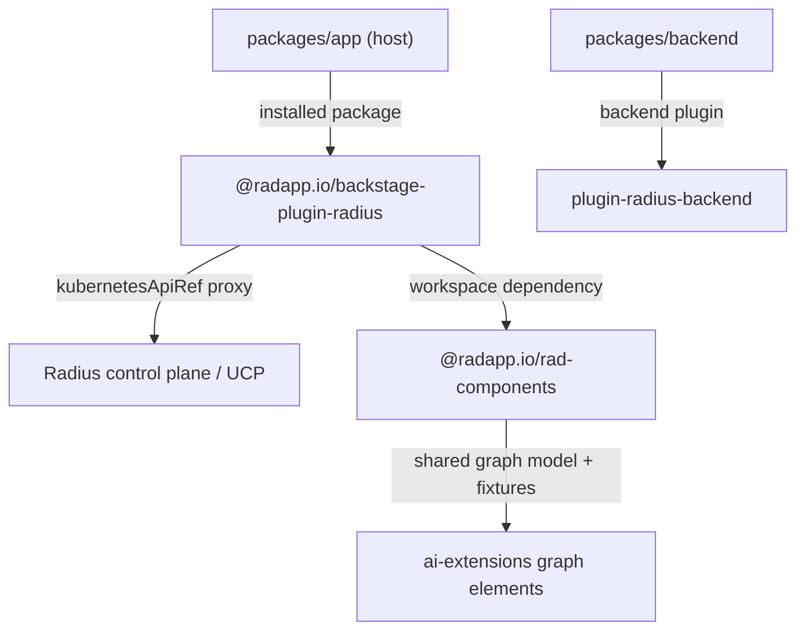

# Radius Dashboard test plan

- **Author**: Nicole James (@nicolejms)
- **Date**: 2026-09
- **Status**: Draft
- **Related**: [`radius-project/ai-extensions` canvas test plan](https://github.com/radius-project/ai-extensions/blob/main/docs/design/2026-08-radius-canvas-test-plan.md),
  [canvas test architecture](https://github.com/radius-project/ai-extensions/blob/main/docs/design/2026-08-radius-canvas-test-architecture.md)

## Purpose

Two changes are landing on the dashboard at the same time:

1. **Graph consistency.** Adopt the application-graph elements already proven in `ai-extensions`
   (`packages/adapter-canvas/src/browser/graph/*`) so a resource renders with the same label, icon,
   type formatting, status badge, and layout wherever a user sees it — Copilot canvas or dashboard.
2. **Plugin-first architecture.** Ship the Radius UI as a **published Backstage plugin**. The native
   dashboard (`packages/app`) becomes a thin host that consumes that plugin the same way any third
   party would, including when it runs inside the Radius control plane.

Both changes rewrite code that today has no meaningful regression net. This plan establishes that
net first, then extends it to cover the plugin boundary the rearchitecture creates.

This document tracks delivery, required checks, and exact requirements. Start with the current
state, then the status table. Use the phase sections for work still to come, and the appendices
when a pull request needs an exact export, route, request, page, fixture, or host case.

## Current state

Measured on the `main` tree at the time of writing.

| Workspace                       | Source files | With a colocated test | Test cases |
| ------------------------------- | -----------: | --------------------: | ---------: |
| `plugins/plugin-radius`         |           50 |                    26 |        122 |
| `plugins/plugin-radius-backend` |            2 |                     1 |          1 |
| `packages/rad-components`       |            9 |                     2 |          2 |
| `packages/app`                  |            9 |                     1 |          1 |
| `packages/backend`              |            1 |                     1 |          1 |
| **Total**                       |       **71** |                **31** |    **127** |

Plus one Playwright spec with one case, which loads the home page and asserts three strings.

The raw counts understate the gap. Three findings matter more:

- **Coverage is concentrated.** 45 of 127 unit cases live in `plugin-radius/src/api/api.test.ts`.
  Fifteen unit test files contain exactly one case, and most of those assert once or twice.
- **The graph is effectively untested.** `AppGraph.test.tsx` renders the sample application and
  asserts that the React Flow attribution link exists. It asserts nothing about nodes, edges, edge
  direction, ordering, or Dagre layout. `initialNodes` contains a deliberate gateway
  direction-correction branch and an operator-precedence-sensitive `order` computation; neither is
  covered. Any graph rework is currently a blind change.
- **No test describes the plugin as a contract.** `plugin.test.ts` asserts `radiusPlugin` is
  defined. Nothing pins the public export surface, the route refs, the extension mount points, the
  `radiusApiRef` id, or the feature-flag name — exactly the things an external consumer depends on
  and that a rearchitecture silently breaks.
- **Forty source files have no colocated test,** including every `packages/app` component,
  `ResourceListPage`, `ResourceLayout`, `OverviewTab`, `DetailsTab`, `RecipeListPage`,
  `RecipeTable`, and the `resources/resource.ts` domain model. See Appendix F.

There is no coverage threshold in CI. `yarn test:all` runs with `--coverage` but no floor, so
coverage can fall to zero without failing a build.

## Current status

| Phase | Name                                | Status      | Outcome                                                                                        |
| ----- | ----------------------------------- | ----------- | ---------------------------------------------------------------------------------------------- |
| 0     | Record the behavior                 | Not started | Public exports, route table, request table, page inventory, and a coverage floor are written down |
| 1     | Harden existing behavior            | Not started | Every shipped page, table, tab, and domain rule has a real test before it is rearchitected       |
| 2     | Plugin contract                     | Not started | The published package surface is pinned and breaking it fails a pull request                     |
| 3     | Graph parity                        | Not started | Dashboard and canvas produce the same graph model from the same fixtures                         |
| 4     | Host integration                    | Not started | `packages/app` consumes the plugin as an installed package, not as workspace source              |
| 5     | Permanent CI gates                  | Not started | Coverage floors, contract checks, and packaging checks are required for merge and publish        |
| 6     | Real browser behavior               | Not started | Every page and the graph are exercised in Chromium, with keyboard and accessibility coverage     |
| 7     | Visual baselines and reliability    | Not started | Reviewed screenshots and scheduled checks for empty, partial, and failing data                   |
| 8     | Control-plane qualification         | Not started | The published plugin loads in the control-plane dashboard image before release                   |

Phases 0–2 must complete before the rearchitecture merges. Phase 3 may run in parallel with
Phase 2. Phases 4–5 land with the rearchitecture. Phases 6–8 follow it.

## Rules for every change

- Add focused tests with the production change. Manual checks do not replace automated tests.
- Use the simplest test that can reproduce the failure, then add a wider test only when the failure
  crosses a real boundary.
- Record behavior **before** changing it. A refactor pull request that also changes assertions is
  not a refactor; split it.
- Keep tests local and repeatable. No live clusters, no personal kubeconfig, no real Radius control
  plane, no network fetches, no public CDN assets.
- Test the plugin through its **public entry point** (`@internal/plugin-radius`), not through deep
  relative paths, wherever the test is asserting consumer-visible behavior. Deep imports are
  allowed only for genuinely internal helpers.
- Assert on accessible roles and names, not on CSS classes, Material-UI internals, or React Flow
  internals. The graph rework will change internals; it must not change what a user can perceive.
- Unexpected Kubernetes proxy calls fail the test. A mocked API never returns a default success for
  a request the test did not declare.
- Show external failures as failures. If the cluster, proxy, or resource provider cannot be
  reached, the UI must surface an error state and a test must assert it.
- Close servers, timers, browser contexts, and Storybook processes after success or failure.
- Preserve the public export list, route refs, extension mount points, `radiusApiRef` id, feature
  flag name, and request table in Appendix A unless a separate approved change says otherwise.

## Required checks

| Check                     | Required when                                                                        | What it protects                                                        |
| ------------------------- | ------------------------------------------------------------------------------------ | ----------------------------------------------------------------------- |
| Focused unit tests        | Every behavior change                                                                | Rules, parsing, aggregation, error handling, and state transitions       |
| Component render tests    | Any page, tab, table, card, or icon changes                                          | Loading, empty, populated, and error states, and accessible names        |
| Plugin contract tests     | Exports, routes, extensions, apiRefs, feature flags, or package metadata change      | Silent breakage for anyone consuming the published plugin               |
| Graph model tests         | Any graph normalization, node, edge, layout, status, or legend change                | Node identity, edge direction, ordering, layout, and status presentation |
| Graph parity tests        | The shared graph model or its fixtures change                                        | Divergence between the canvas and the dashboard                          |
| API request tests         | A request path, API version, resource type, merge, or fallback rule changes          | Wrong path, wrong version, dropped duplicates, and swallowed failures    |
| Backend plugin tests      | The backend plugin, its routes, or its registration changes                          | Broken registration, missing route, and unhandled errors                 |
| Packaging tests           | Build config, entry points, `files`, dependencies, or peer dependencies change       | Missing code, bundled peer deps, and a package that cannot be installed  |
| Host integration tests    | `packages/app` wiring, route bindings, or plugin consumption changes                 | A host that compiles but cannot mount or navigate the plugin             |
| Chromium behavior tests   | Browser behavior changes after Phase 6 begins                                        | Real navigation, focus, graph interaction, and rendering                 |
| Accessibility and keyboard| An interactive page or graph state changes after Phase 6 begins                      | Unusable controls, poor focus order, missing names, and WCAG             |
| Screenshot review         | A selected stable visual state changes after Phase 7 begins                          | Layout, clipping, theme, graph, and status presentation                  |
| Control-plane check       | Before release after Phase 8 qualification                                           | Installation, plugin discovery, proxy reachability, and page load        |

Tests that do not open a browser do not retry. Browser checks may retry once to collect useful
failure information, but the original failure stays visible and a retry-only pass is recorded as
flaky. Setting a check aside requires a linked issue, an owner, a narrow scope, and a clear end
condition.

## Standard local check

Run the affected focused tests while working. Before completing a source change, run:

```console
yarn install --immutable
yarn tsc
yarn lint:all
yarn format:check
yarn test:all
yarn build:all
yarn test:e2e
```

CI is authoritative for packaging, container, and control-plane checks.

## Test architecture

### Layers

| Layer | Name              | Runner                      | Scope                                                                     |
| ----- | ----------------- | --------------------------- | ------------------------------------------------------------------------- |
| L1    | Pure logic        | Jest (node)                 | Resource IDs, type equivalence, recipe aggregation, graph model and layout |
| L2    | Component render  | Jest + RTL + `@backstage/test-utils` | Pages, tabs, tables, cards, icons, error and empty states        |
| L3    | Plugin contract   | Jest (node)                 | Exports, route refs, extensions, apiRef, feature flags, package metadata   |
| L4    | Host integration  | Jest + RTL, plus a packaged-install fixture | `packages/app` mounting the plugin; backend plugin registration |
| L5    | Browser           | Playwright (Chromium)       | Navigation, graph interaction, keyboard, accessibility                     |
| L6    | Visual            | Storybook + Playwright      | Reviewed screenshots of stable states                                      |

### Boundaries the rearchitecture creates

The rearchitecture turns one implicit boundary into three explicit ones. Each gets its own layer so
a failure lands at the smallest honest scope.



- **Host boundary.** `packages/app` may only use the plugin's public entry point. A test enforces
  that no `packages/app` source imports a deep path inside the plugin.
- **Plugin boundary.** The plugin's public surface is a contract. Appendix A is the source of truth
  and a test compares the real exports against it.
- **Graph boundary.** Graph normalization moves into a pure, framework-free module in
  `rad-components`, mirroring the `ai-extensions` model. Rendering consumes the model; tests target
  the model.

### Why the graph model must be extracted first

`AppGraph.tsx` currently mixes normalization, layout, and rendering, and keeps module-level mutable
state (a single shared `Dagre.graphlib.Graph` reused across every call to `getLayoutedElements`).
That shared instance accumulates nodes and edges across renders, which is both a correctness risk
and untestable in isolation. Phase 3 extracts normalization and layout into pure functions with no
module-level state, which is what makes GU-01–GU-18 possible.

## Phases

### Phase 0: record the behavior

Write down what ships today, then make it enforceable. No production behavior changes in this
phase.

Deliverables:

- Appendix A filled in from the real tree: public exports, route refs and paths, extension mount
  points, `radiusApiRef` id, feature flag names, the Kubernetes proxy request table, and the page
  inventory.
- A committed coverage baseline and a `jest.coverageThreshold` per workspace set **at the measured
  baseline**, so coverage can only go up.
- Graph fixtures extracted from `sampledata.ts` into named JSON fixtures (Appendix E) covering the
  shapes the graph must handle.

Completion evidence: `yarn test:all` fails if coverage drops; Appendix A matches the tree; CU-00
and PU-00 snapshot the current surface.

### Phase 1: harden existing behavior

Close the twenty-four substantive gaps in Appendix F and deepen the fifteen one-case smoke tests.
Cover the domain logic and every shipped page in loading, empty, populated, and error states.

Priority order, highest regression risk first:

1. `resources/resource.ts`, `resourceId.ts`, `resourceTypes.ts` — the domain model every page reads.
2. `ResourceListPage`, `ResourceLayout`, `OverviewTab`, `DetailsTab`, `ApplicationResourcesTab`,
   `EnvironmentResourcesTab` — the untested spine of resource navigation.
3. `RecipeListPage`, `RecipeTable` — untested rendering over already-tested aggregation.
4. `ApplicationListInfoCard`, `EnvironmentListInfoCard` — the two exported cards a consumer can
   embed without a route.
5. `packages/app` `Root`, `HomePage`, `LearnCard`, `CommunityCard`, `SupportCard`.
6. `plugin-radius-backend/src/index.ts` registration.

Every page test must assert the error path. Today no page test asserts what a user sees when the
Kubernetes proxy returns a non-OK response, yet `makeRequest` throws on every such response.

Completion evidence: RU-01–RU-14, CU-01–CU-26, and BE-01–BE-05 pass; every substantive file
in Appendix F has a direct test; coverage floors are raised to the new measured values.

### Phase 2: plugin contract

Make the published package a tested contract before anything consumes it as one.

- Assert the exact public export list, and that it is sorted and free of accidental additions.
- Assert every route ref id and path, every extension's name and mount point, the `radiusApiRef`
  id, and the feature flag name.
- Assert the plugin's api factory builds a working `RadiusApi` from a mock `kubernetesApiRef`.
- Assert package metadata: `backstage.role`, entry points, `files`, `sideEffects`, that React and
  `react-router-dom` stay peer dependencies, and that no `@internal/*` or workspace-only dependency
  leaks into `dependencies`.
- Assert the built artifact: run `backstage-cli package build` and check the emitted `dist` exports
  match the source entry point and that type declarations resolve.

Completion evidence: PU-01–PU-14 pass; renaming an export, changing a route path, or moving a
peer dependency into `dependencies` fails a pull request.

### Phase 3: graph parity

Extract normalization and layout from `AppGraph.tsx` into a pure model in `rad-components`,
mirroring the `ai-extensions` graph model, then prove the two produce the same result.

- Port the model functions that decide user-visible output: resource id and label resolution, type
  and display-type formatting, icon selection, deploy-status badge kind and accessible name, and
  managed-cluster detection.
- Keep the dashboard's existing edge semantics under test **before** replacing them, including the
  gateway inbound/outbound correction and the `order`/`rank` seeding, so any change is a deliberate,
  reviewed change rather than a side effect.
- Share fixtures. The same fixture JSON files live in both repositories at a documented path, and a
  parity test asserts the dashboard model's output for each fixture matches a committed expectation
  record generated from the canvas model. Fixture drift fails the check.
- Remove the module-level Dagre graph. A layout test asserts that laying out graph A then graph B
  yields the same result as laying out graph B alone.

Completion evidence: GU-01–GU-18 pass; parity fixtures produce identical models in both
repositories; `AppGraph.tsx` contains rendering only; no module-level mutable graph state remains.

### Phase 4: host integration

Turn `packages/app` into a plain consumer and prove it.

- A host test mounts the app with the plugin bound through Backstage's route binding and navigates
  to each page, asserting the page heading. This is the test that catches a mount point or route
  binding that compiles but does not resolve.
- An import-boundary test asserts no file under `packages/app/src` imports a path inside the plugin
  other than its package entry point.
- A packaged-install check builds the plugin with `yarn workspace ... run build && npm pack`,
  installs the tarball into a scratch Backstage app fixture, and asserts the fixture builds and
  renders one plugin page. This is the only check that catches a missing file in `files`, a missing
  runtime dependency, or a broken `dist` entry point.
- A backend host test asserts `packages/backend` starts with the Radius backend plugin registered
  and serves `/api/radius/health`.

Completion evidence: HU-01–HU-09 pass; the scratch fixture builds from the tarball with no
workspace resolution; removing a file from `files` fails the check.

### Phase 5: permanent CI gates

Combine the checks the earlier phases introduced into required gates.

- Coverage thresholds per workspace, ratcheted to the Phase 1 and Phase 3 values.
- Contract, packaging, and packaged-install checks required for pull requests and for publishing.
- The publish workflow runs the packaged-install check against the exact artifact it will publish.
- CI uploads coverage and failure traces as artifacts; logs contain no kubeconfig or token values.

Completion evidence: all suites run without a live cluster or registry credentials, and each gate
is marked required on the default branch.

### Phase 6: real browser behavior

Expand Playwright from one home-page case to the workflows in Appendix C. Cover navigation to all
eight pages, resource drill-down and breadcrumb return, graph rendering and node interaction,
resource-type detail, recipes, the feature-flagged catalog path, keyboard operation, and
accessibility. Run against controlled fixture data served by a stubbed proxy, not a real cluster.
Prove that a proxy failure surfaces a visible error rather than an empty page.

Completion evidence: E2E-01–E2E-16 pass without a cluster or personal kubeconfig, and traces are
saved on failure.

### Phase 7: visual baselines and reliability

Add the reviewed screenshots in Appendix D from Storybook, covering graph states in both themes,
plus scheduled checks for empty data, partial data, slow responses, and repeated navigation.
Screenshot changes require a stated product reason and human review.

Completion evidence: baselines are stable across three consecutive scheduled runs, and retry-only
passes are recorded as flaky.

### Phase 8: control-plane qualification

Run HOST-01–HOST-06 against the built container image with the published plugin installed, in a
disposable cluster with a disposable Radius install. Confirm plugin discovery, proxy reachability,
page load, and clean failure when the control plane is absent. The harness must distinguish a
test-system failure from a product failure and must prove cleanup.

Complete when every host case passes before release. Skipped or simulated runs do not count.

## Test data and safety

- Test data is small, readable, fixed, and uses obvious placeholder names (`demo-app`, `demo-env`,
  `demo-group`). No customer names, cluster names, or real resource IDs.
- No kubeconfig, cluster credential, or control-plane endpoint is read by a unit, component, or
  contract test. `KubernetesApi` is always a declared mock.
- A request the test did not declare fails the test.
- Browser tests serve fixture data from a local stub on an OS-assigned port bound to `127.0.0.1`.
- Vendor assets (React Flow styles, fonts) are served locally; no CDN fetches.
- Saved traces and logs are scrubbed of environment values before upload.

## Open decisions

1. **Published package name and scope.** `@radapp.io/backstage-plugin-radius` is assumed. The
   contract tests in Appendix A pin the name, so this must be settled before Phase 2 closes.
2. **Where the shared graph model lives.** Options: duplicate the model in `rad-components` with a
   parity test (assumed here), or extract a third package both repositories depend on. Parity tests
   are written so either choice satisfies them.
3. **Whether `rad-components` stays a separate published package** or folds into the plugin. If it
   folds, Appendix A gains its exports and Phase 2 covers them.
4. **Backstage new-frontend-system support.** If the plugin must also expose `createFrontendPlugin`
   extensions, Phase 2 doubles: contract tests must cover both the legacy and the new surface.
5. **Coverage floor targets.** This plan ratchets from the measured baseline. Absolute targets in
   Appendix G are proposed, not agreed.

## Appendices

### Appendix A: compatibility inventory

Filled in during Phase 0 and asserted by PU-01–PU-06. The lists below are the current tree and
are the values the contract tests must pin unless an approved change updates them.

#### Public exports of `plugins/plugin-radius`

Plugin and extensions: `radiusPlugin`, `ApplicationListPage`, `EnvironmentListPage`,
`EnvironmentPage`, `RecipeListPage`, `ResourceListPage`, `ResourcePage`, `ResourceTypesListPage`,
`ResourceTypeDetailPage`.

Route refs: `applicationListPageRouteRef`, `environmentListPageRouteRef`,
`environmentPageRouteRef`, `recipeListPageRouteRef`, `resourceListPageRouteRef`,
`resourceTypesListPageRouteRef`, `resourceTypeDetailPageRouteRef`, `resourcePageRouteRef`.

Components: `RadiusLogo`, `RadiusLogomarkReverse`, `ApplicationIcon`, `EnvironmentIcon`,
`ResourceIcon`, `RecipeIcon`, `ApplicationListInfoCard`, `EnvironmentListInfoCard`.

Other: `featureRadiusCatalog` (value `radius-catalog`).

Not currently exported but depended on by the host in practice — confirm intent in Phase 2:
`radiusApiRef` (id `radius-api`), `rootRouteRef`, `RadiusApi` and `RadiusApiImpl`.

#### Public exports of `packages/rad-components`

`AppGraph`, `ResourceNode`, `parseResourceId`, and the types `AppGraphData` and `ResourceId`.

#### Kubernetes proxy request table

Every request the plugin issues, asserted by RU-08–RU-14:

| Operation             | Path shape                                                                  | API version                       |
| --------------------- | --------------------------------------------------------------------------- | --------------------------------- |
| Resource by id        | `/apis/api.ucp.dev/v1alpha3{id}?api-version=…`                              | Best version for the parsed type  |
| List by type          | `/planes/radius/local[/resourceGroups/{g}]/providers/{type}?api-version=…`  | Best version for the type         |
| List applications     | As above for `Applications.Core/applications` and `Radius.Core/applications`| Best version per type             |
| List environments     | As above for `Applications.Core/environments` and `Radius.Core/environments`| Best version per type             |
| List resource groups  | `/planes/radius/local/resourceGroups`                                       | `2023-10-01-preview`              |
| List group resources  | `/planes/radius/local/resourceGroups/{g}/resources`                         | `2023-10-01-preview`              |
| List providers        | `/planes/radius/{plane}/providers`                                          | `2023-10-01-preview`              |
| Resource type detail  | `/planes/radius/{plane}/providers/{ns}/resourceTypes/{type}`                | `2023-10-01-preview`              |

Fixed behaviors the tests must pin: the `2023-10-01-preview` fallback when version discovery fails;
the `Microsoft.Resources/deployments` skip in group listing; de-duplication by `id` when merging
equivalent types; throwing the first rejection only when **every** equivalent-type request fails;
and the `fixupResource` back-fill of `environment` from the owning application.

#### Page inventory

Applications list, Environments list, Environment detail (overview, details, resources tabs),
Resources list, Resource detail (overview, details, application tabs), Resource types list,
Resource type detail, Recipes list.

### Appendix B: unit and contract requirements

#### Domain and API: RU-01–RU-14

| ID    | Requirement                                                                                  |
| ----- | -------------------------------------------------------------------------------------------- |
| RU-01 | `parseResourceId` returns plane, group, type, and name for well-formed ids                    |
| RU-02 | `parseResourceId` returns null for malformed, empty, and partially formed ids                 |
| RU-03 | Resource type equivalence maps `Applications.Core/*` and `Radius.Core/*` in both directions   |
| RU-04 | An unknown resource type yields no equivalents and takes the single-type path                 |
| RU-05 | `resource.ts` accessors handle a resource with absent, empty, and partial `properties`        |
| RU-06 | Recipe aggregation groups by type and name, and is stable for duplicate entries               |
| RU-07 | Recipe aggregation tolerates an environment with no recipes                                   |
| RU-08 | Each operation in the request table issues exactly the declared path and version              |
| RU-09 | Version discovery failure falls back to `2023-10-01-preview` and does not throw               |
| RU-10 | Equivalent-type merge de-duplicates by `id` and preserves first-seen order                    |
| RU-11 | A partial failure across equivalent types returns the successful results                      |
| RU-12 | A total failure across equivalent types throws the first rejection                            |
| RU-13 | A non-OK proxy response throws an error containing the status and body                        |
| RU-14 | No clusters available throws a distinct, user-actionable error                                |

#### Components: CU-01–CU-26

One requirement per shipped page, tab, table, and card, each covering loading, empty, populated,
and error states, and the accessible name of its heading and primary controls. CU-00 records the
current rendered output of every page as a baseline before Phase 1 changes anything.

#### Plugin contract: PU-01–PU-14

| ID    | Requirement                                                                                   |
| ----- | --------------------------------------------------------------------------------------------- |
| PU-01 | The public export list matches Appendix A exactly; extra or missing exports fail               |
| PU-02 | Every route ref has the declared id and path                                                   |
| PU-03 | Every routable extension has the declared name and mount point                                 |
| PU-04 | `radiusApiRef` has id `radius-api` and its factory depends only on `kubernetesApiRef`          |
| PU-05 | The api factory returns a `RadiusApi` that issues a declared request against a mock            |
| PU-06 | The feature flag list is exactly `radius-catalog`                                              |
| PU-07 | `package.json` declares `backstage.role: frontend-plugin` and the expected entry points        |
| PU-08 | React, React DOM, and `react-router-dom` are peer dependencies, not dependencies               |
| PU-09 | No `@internal/*` or workspace-only package appears in `dependencies` of the published package  |
| PU-10 | `files` includes everything the entry point resolves at runtime                                |
| PU-11 | `sideEffects: false` holds — importing the entry point performs no observable side effect      |
| PU-12 | A built `dist` exposes the same named exports as the source entry point                        |
| PU-13 | Emitted type declarations resolve with `tsc --noEmit` from a consumer fixture                  |
| PU-14 | Each lazily imported extension component resolves without throwing                             |

#### Backend plugin: BE-01–BE-05

| ID    | Requirement                                                                 |
| ----- | --------------------------------------------------------------------------- |
| BE-01 | `createRouter` serves `GET /health` with `{ status: 'ok' }`                  |
| BE-02 | An unknown path returns 404 rather than a hanging request                    |
| BE-03 | `createBackendPlugin` registers with id `radius` and the declared deps       |
| BE-04 | `init` mounts the router on `httpRouter` and logs initialization once        |
| BE-05 | A router construction failure surfaces as a startup error, not a silent skip |

#### Graph: GU-01–GU-18

| ID    | Requirement                                                                                        |
| ----- | -------------------------------------------------------------------------------------------------- |
| GU-01 | A resource yields one node keyed by its resource id                                                 |
| GU-02 | Node label and display type match the shared model for every fixture in Appendix E                  |
| GU-03 | Icon selection matches the shared model, including the unknown-type fallback                        |
| GU-04 | Deploy-status badge kind and accessible name match the shared model for every status                |
| GU-05 | Managed-cluster detection matches the shared model, including detection via output resources        |
| GU-06 | An outbound connection yields an edge from the connection target to the resource                    |
| GU-07 | An inbound connection yields an edge from the resource to the connection target                     |
| GU-08 | An inbound connection to a gateway is corrected to outbound (records the current correction)        |
| GU-09 | A connection with an unparseable id is skipped without dropping the node or other edges             |
| GU-10 | Edge ids are unique and stable across repeated model builds of the same graph                       |
| GU-11 | A self-referential connection does not produce a duplicate or self-looping node                     |
| GU-12 | A connection to a resource absent from the graph does not crash the model                           |
| GU-13 | Node ordering and rank seeding are deterministic for a fixed input                                  |
| GU-14 | Layout is pure: laying out graph A then B equals laying out B alone (no shared Dagre state)         |
| GU-15 | Layout assigns every node a finite position and preserves node count and edge count                 |
| GU-16 | An empty graph renders an empty state with an accessible message, not a blank canvas                |
| GU-17 | A graph with one node and no connections renders that node                                          |
| GU-18 | Parity: for every Appendix E fixture, the model output equals the committed canvas expectation      |

#### Host integration: HU-01–HU-09

| ID    | Requirement                                                                                  |
| ----- | -------------------------------------------------------------------------------------------- |
| HU-01 | The host app mounts with the plugin and renders without error                                 |
| HU-02 | Navigating to each of the eight pages renders that page's heading                             |
| HU-03 | Every external route binding the host declares resolves to a real route ref                   |
| HU-04 | The sidebar exposes each plugin entry with its accessible name                                |
| HU-05 | No file under `packages/app/src` imports a deep path inside the plugin                        |
| HU-06 | The plugin tarball installs into a scratch Backstage app with no workspace resolution         |
| HU-07 | The scratch app builds and renders one plugin page from the installed package                 |
| HU-08 | `packages/backend` starts with the Radius backend plugin registered                           |
| HU-09 | The started backend serves `/api/radius/health`                                               |

### Appendix C: browser workflows, E2E-01–E2E-16

Home page loads; sidebar navigation to each of the eight pages; applications list to application
detail; environments list to environment detail and across its three tabs; resources list to
resource detail and across its tabs; breadcrumb return from a nested resource; resource types list
to resource type detail and API version selection; recipes list rendering aggregated recipes; graph
renders nodes and edges for the fixture application; selecting a graph node reveals its details;
graph controls zoom and fit; a proxy failure shows a visible error state on each list page; the
`radius-catalog` feature flag toggles the catalog path; full keyboard traversal of the sidebar and
one list page; axe scan with no serious or critical violations on each page; and reload preserves
the current route.

### Appendix D: visual baselines

Graph with a multi-tier application, light and dark themes; graph with a single node; graph with an
empty application; a node in each deploy status; resource table populated and empty; environment
detail overview; resource type detail; and the home page. Captured from Storybook, reviewed by a
human, and re-baselined only with a stated product reason.

### Appendix E: shared graph fixtures

Fixtures live at `packages/rad-components/src/__fixtures__/graph/` and mirror the canvas fixture
set by filename:

`empty.json`, `single-node.json`, `container-to-database.json`, `gateway-inbound.json`,
`multi-tier.json`, `unparseable-connection.json`, `missing-target.json`, `self-reference.json`,
`managed-cluster.json`, `deploy-status-matrix.json`, `unknown-type.json`, `duplicate-ids.json`.

Each fixture has a committed expectation record. GU-18 compares the dashboard model against it, and
a drift check fails when a fixture exists in one repository but not the other.

### Appendix F: source files with no colocated test

Forty of seventy-one source files. Sixteen are barrel `index.ts` files, covered indirectly by
PU-01 and CU-00. The remaining twenty-four need a direct test.

`packages/app` — `apis.ts`, `index.tsx`, `components/Root/Root.tsx`,
`components/home/HomePage.tsx`, `components/home/LearnCard.tsx`,
`components/home/CommunityCard.tsx`, `components/home/SupportCard.tsx`.

`packages/rad-components` — `graph.ts`, `resourceId.ts`, `sampledata.ts`.

`plugins/plugin-radius` — `routes.ts`, `features.ts`, `resources/resource.ts`,
`components/applications/ApplicationListInfoCard.tsx`,
`components/environments/EnvironmentListInfoCard.tsx`,
`components/environments/EnvironmentResourcesTab.tsx`, `components/recipes/RecipeListPage.tsx`,
`components/recipes/RecipeTable.tsx`, `components/resources/ApplicationResourcesTab.tsx`,
`components/resources/DetailsTab.tsx`, `components/resources/OverviewTab.tsx`,
`components/resources/ResourceLayout.tsx`, `components/resources/ResourceListPage.tsx`.

`plugins/plugin-radius-backend` — `index.ts` (the plugin registration, not a barrel).

Barrels with no direct test: `packages/app/src/components/Root/index.ts`;
`rad-components` `index.ts`, `components/index.ts`, `components/appgraph/index.ts`,
`components/resourcenode/index.ts`; `plugin-radius` `index.ts`, `api/index.ts`,
`resources/index.ts`, and the six `components/*/index.ts` files.

Note that `rad-components/src/resourceId.ts` is untested: the existing `resourceId.test.ts` covers
the separate copy in `plugin-radius/src/resources/`. The graph consumes the `rad-components` copy,
so RU-01 and RU-02 must target that one.

### Appendix G: proposed coverage floors

Ratcheted from the Phase 0 baseline; the values below are the Phase 5 targets, not day-one gates.

| Workspace                       | Statements | Branches | Functions | Lines |
| ------------------------------- | ---------: | -------: | --------: | ----: |
| `plugins/plugin-radius`         |        90% |      80% |       90% |   90% |
| `plugins/plugin-radius-backend` |        95% |      85% |       95% |   95% |
| `packages/rad-components`       |        95% |      90% |       95% |   95% |
| `packages/app`                  |        80% |      70% |       80% |   80% |

`rad-components` carries the highest floor because the graph model is pure and is the shared
contract with the canvas.
