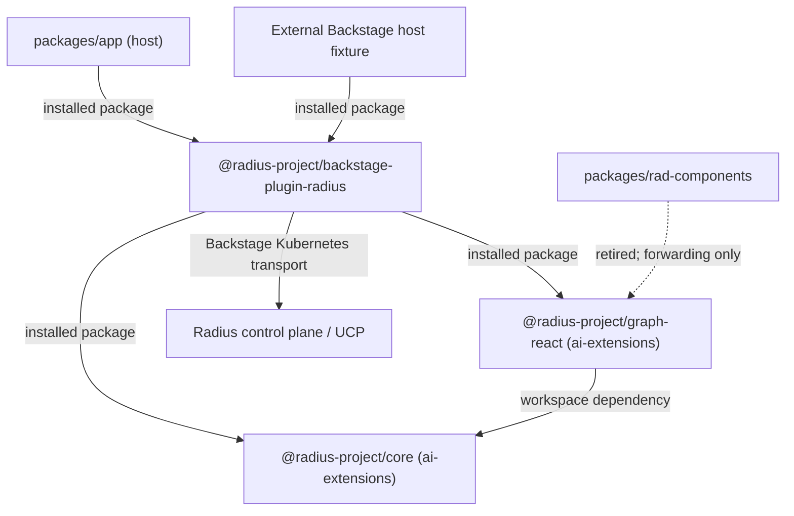

# Radius Dashboard test plan

- **Author**: Nicole James (@nicolejms)
- **Date**: 2026-09
- **Status**: Draft
- **Companion design**: [Radius Dashboard as a distributable Backstage plugin](./2026-09-radius-backstage-plugin.md)
- **Related**: [`radius-project/ai-extensions` canvas test plan](https://github.com/radius-project/ai-extensions/blob/2c789d2e2a309d94e4164a1719c64dda580be36c/docs/design/2026-08-radius-canvas-test-plan.md),
  [canvas test architecture](https://github.com/radius-project/ai-extensions/blob/2c789d2e2a309d94e4164a1719c64dda580be36c/docs/design/2026-08-radius-canvas-test-architecture.md)

## Purpose

The [companion design](./2026-09-radius-backstage-plugin.md) decides the architecture: common
domain logic and graph rendering are owned and published by `radius-project/ai-extensions`
(`@radius-project/core`, `@radius-project/graph-react`), and the Backstage product plugin is
productized and published from this repository (`@radius-project/backstage-plugin-radius`). Two
consequences drive this test plan:

1. **Graph consistency is achieved by deletion, not duplication.** `packages/rad-components` is
   retired as an implementation owner. Its renderer and layout are consolidated into
   `graph-react` alongside the Canvas renderer, and the dashboard consumes that package. The design
   states that duplicated implementations are not an acceptable compatibility mechanism, so this
   plan does **not** test dashboard-side parity against a second copy of the model. It tests that
   the frozen pre-extraction behavior survives the switch and that no parallel implementation
   remains.
2. **The plugin becomes a published contract.** `packages/app` stops being a privileged consumer of
   workspace source and becomes one host among several, alongside an external Backstage host
   fixture.

Both changes rewrite code that today has no meaningful regression net. This plan establishes that
net first, freezes it as a reviewed baseline **before** any extraction, then extends it to the
plugin contract, the installed artifact, and the host boundary.

This document tracks delivery, required checks, and exact requirements. Start with the current
state, then the status table. Use the phase sections for work still to come, and the appendices
when a pull request needs an exact export, route, request, page, fixture, or host case.

The design's own "Test plan" section states the required suites at the program level across both
repositories. This document is the dashboard-side execution plan for them: it enumerates the
dashboard requirements, their IDs, and their order. Where the two disagree, the design wins and
this plan is corrected.

## Current state

Measured by running the suite, not estimated: `yarn test:all --coverageReporters=json-summary`
against the tree at the time of writing. Test-case counts are pre-Phase-0 (31 suites, 127 cases);
coverage percentages are the Phase 0 baseline.

| Workspace                       | Source files | With a colocated test | Test cases |
| ------------------------------- | -----------: | --------------------: | ---------: |
| `plugins/plugin-radius`         |           50 |                    26 |        122 |
| `plugins/plugin-radius-backend` |            2 |                     1 |          1 |
| `packages/rad-components`       |            9 |                     2 |          2 |
| `packages/app`                  |            9 |                     1 |          1 |
| `packages/backend`              |            1 |                     1 |          1 |
| **Total**                       |       **71** |                **31** |    **127** |

Measured coverage at that same point, which is what the Phase 0 floors are derived from:

| Workspace                       | Statements | Branches | Functions |  Lines |
| ------------------------------- | ---------: | -------: | --------: | -----: |
| `plugins/plugin-radius`         |     54.77% |   31.09% |    40.80% | 55.16% |
| `plugins/plugin-radius-backend` |     62.50% |      n/a |    50.00% | 71.43% |
| `packages/rad-components`       |     80.00% |   59.09% |    73.33% | 77.27% |
| `packages/app`                  |     75.00% |    0.00% |     0.00% | 78.79% |
| `packages/backend`              |      0.00% |      n/a |       n/a |  0.00% |
| **Total**                       | **56.95%** |**31.82%**|**42.03%** |**57.35%**|

`packages/app` reported 75% of statements with 0% of branches and 0% of functions. That is the
signature of coverage produced by module loading rather than by testing: the files are imported, so
their top level is recorded, but nothing inside them is ever called. Statement coverage was not
evidence of tested behavior there. Phase 1 closed it: the workspace now measures
93.51/100.00/83.33/92.86, and `packages/backend` moved from 0% to 100%.

Progression as the plan is executed, re-measured after each phase increment:

| Workspace                       | Baseline | After 0 and 3 | After Tier A | After first Phase 1 pages | After Phase 1 components | After Phase 1 complete | After Phase 2 |
| ------------------------------- | -------: | ------------: | -----------: | ------------------------: | -----------------------: | ---------------------: | ------------: |
| `plugins/plugin-radius`         |   54.77% |        58.42% |       58.42% |                    61.22% |                   69.19% |                 72.70% |    **73.79%** |
| `plugins/plugin-radius-backend` |   62.50% |        62.50% |       62.50% |                    62.50% |                   62.50% |                 93.75% |        93.75% |
| `packages/rad-components`       |   80.00% |        81.33% |       86.52% |                    86.52% |                   86.52% |                 86.52% |    **95.08%** |
| `packages/app`                  |   75.00% |        75.00% |       75.00% |                    75.00% |                   75.00% |                 93.51% |        93.51% |
| `packages/backend`              |    0.00% |         0.00% |        0.00% |                     0.00% |                    0.00% |                100.00% |       100.00% |
| Suites / cases                  |   31/127 |        33/159 |       34/260 |                    36/272 |                   43/331 |                 53/427 |    **54/460** |

Statement coverage only; the enforced floors in Appendix G carry all four metrics.

Plus two Playwright specs with thirteen cases: the home-page smoke case, eight direct real-renderer
cases, and four dashboard-host journeys using deterministic Kubernetes/UCP interception.

The raw counts understate the gap. Three findings matter more:

- **Coverage is concentrated.** 45 of 127 unit cases live in `plugin-radius/src/api/api.test.ts`.
  Fifteen unit test files contain exactly one case, and most of those assert once or twice.
- **The graph is effectively untested.** `AppGraph.test.tsx` renders the sample application and
  asserts that the React Flow attribution link exists. It asserts nothing about nodes, edges, edge
  direction, ordering, or Dagre layout. `initialNodes` contains a deliberate gateway
  direction-correction branch and an operator-precedence-sensitive `order` computation; neither is
  covered. Any graph rework is currently a blind change.
- **No test describes the plugin as a contract.** `plugin.test.ts` asserts `radiusPlugin` is
  defined. Nothing pins the public export surface, the route refs, the extension mount points, the
  `radiusApiRef` id, or the feature-flag name — exactly the things an external consumer depends on
  and that a rearchitecture silently breaks.
- **Forty source files had no colocated test,** including every `packages/app` component,
  `ResourceListPage`, `ResourceLayout`, `OverviewTab`, `DetailsTab`, `RecipeListPage`,
  `RecipeTable`, and the `resources/resource.ts` domain model. Phase 1 has now closed every one of
  them that ships behavior; only `packages/app/src/index.tsx`, the barrels, and `setupTests.ts`
  remain deliberately without direct tests. See Appendix F.

There was no coverage threshold in CI: `yarn test:all` ran with `--coverage` but no floor, so
coverage could fall to zero without failing a build. Phase 0 closed this; see
"Where coverage floors must live" for why the obvious placement does not work.

## Current status

| Phase | Name                                | Repository | Status      | Outcome                                                                       |
| ----- | ----------------------------------- | ---------- | ----------- | ------------------------------------------------------------------------------ |
| 0     | Record the behavior                 | dashboard  | Done        | Public exports, route table, request table, page inventory, and a coverage floor are written down |
| 1     | Harden existing behavior            | dashboard  | Done        | Every shipped page, table, tab, card, host component, backend-plugin lifecycle, and domain rule has a real test before it is rearchitected. All thirteen `plugin-radius` components, both host workspaces, the backend plugin, and the declaration modules are covered; `packages/backend` no longer carries a coverage exemption |
| 2     | Freeze the pre-extraction baseline  | dashboard  | Done        | Real-renderer graph journeys, deterministic host journeys, connection/error characterization, and all fourteen graph records are frozen |
| 3     | Plugin contract and packaging       | dashboard  | In progress | Source exports, registration metadata, manifests, and coverage-policy shape are pinned; runtime wiring and built/packed consumer evidence remain |
| 4     | Consume shared packages             | dashboard, needs `ai-extensions` releases | Not started | The plugin uses `core` and `graph-react`; no parallel implementation remains |
| 5     | Host integration and installed artifact | dashboard | Not started | Both hosts mount the plugin from packed tarballs with no source aliases                      |
| 6     | Permanent CI gates                  | both       | Not started | Coverage floors, contract, packaging, and the consumer pin are required for merge and publish    |
| 7     | Accessibility, visual, reliability  | dashboard  | Not started | Keyboard and axe coverage, reviewed screenshots, and scheduled failure-mode checks               |
| 8     | Release qualification               | both       | Not started | The published plugin loads in the control-plane image and in an external Backstage host          |
| 9     | Migrate the test corpus to `Radius.*` | dashboard, tracks `radius` releases | Not started | Tests and fixtures describe the resource-type model the product is moving to, not the legacy one |

Every phase is executed in `radius-project/dashboard`. The repository column records what each phase
depends on, not where the work happens.

Only Phase 4 is blocked on `ai-extensions`, because that is where dashboard replaces its own
implementations with the published `core` and `graph-react` packages. Phases 6 and 8 span both
repositories because the consumer-pin gate is defined in `ai-extensions` CI while the pin, the
journey implementation it invokes, and the release checks live here.

Phase 3 in particular is **not** developed in `ai-extensions`. The design assigns the Backstage
product to dashboard: `ai-extensions` owns and publishes `@radius-project/core` and
`@radius-project/graph-react`, while dashboard owns and publishes
`@radius-project/backstage-plugin-radius`. Phase 3 hardens `plugins/plugin-radius` in this
repository into that published package, so it touches no shared code and waits on no upstream
release.

Phases 0–2 must complete **before** any extraction begins; the design makes a frozen, reviewed
real-renderer baseline a prerequisite, not a follow-up. Phase 3 may run in parallel with Phase 2,
and is the only pre-extraction stream that is not gated on the graph consolidation landing upstream.
Phase 4 is the extraction itself and is gated on Phase 2's records. Phases 5–8 follow it.

Phase 9 is sequenced separately and deliberately: it is the only phase whose timing is an open
question rather than a dependency. See open decision 8.

## Rules for every change

- Add focused tests with the production change. Manual checks do not replace automated tests.
- Use the simplest test that can reproduce the failure, then add a wider test only when the failure
  crosses a real boundary.
- Record behavior **before** changing it. A refactor pull request that also changes assertions is
  not a refactor; split it.
- Keep tests local and repeatable. No live clusters, no personal kubeconfig, no real Radius control
  plane, no network fetches, no public CDN assets.
- Test the plugin through its **public entry point** (today `@internal/plugin-radius`, after Phase 3
  `@radius-project/backstage-plugin-radius`), not through deep relative paths, wherever the test is
  asserting consumer-visible behavior. Deep imports are allowed only for genuinely internal helpers.
- Assert on accessible roles and names, not on CSS classes, Material-UI internals, or React Flow
  internals. The graph rework replaces all of those internals; it must not change what a user can
  perceive. Classify every graph test by tier and say so in the file.
- Never assert graph behavior against a test double for the renderer. A graph suite that passes
  with the renderer removed is not a graph suite.
- Unexpected Kubernetes proxy calls fail the test. A mocked API never returns a default success for
  a request the test did not declare.
- Show external failures as failures. If the cluster, proxy, or resource provider cannot be
  reached, the UI must surface an error state and a test must assert it.
- Close servers, timers, browser contexts, and Storybook processes after success or failure.
- Preserve the public export list, route refs, extension mount points, `radiusApiRef` id, feature
  flag name, and request table in Appendix A unless a separate approved change says otherwise.

## Required checks

| Check                     | Required when                                                                        | What it protects                                                        |
| ------------------------- | ------------------------------------------------------------------------------------ | ----------------------------------------------------------------------- |
| Focused unit tests        | Every behavior change                                                                | Rules, parsing, aggregation, error handling, and state transitions       |
| Component render tests    | Any page, tab, table, card, or icon changes                                          | Loading, empty, populated, and error states, and accessible names        |
| Plugin contract tests     | Exports, routes, extensions, apiRefs, feature flags, or package metadata change      | Silent breakage for anyone consuming the published plugin               |
| Graph invariant tests     | Any graph normalization, node, edge, layout, or rendering change                     | Structural truths that must hold regardless of implementation           |
| Graph semantic tests      | Any graph rendering, labelling, or interaction change                                | What a user can see, name, and operate in the graph                     |
| Graph record diff         | The graph implementation is replaced, extracted, or consolidated                     | Unintended behavior change hidden inside an intended one                |
| API request tests         | A request path, API version, resource type, merge, or fallback rule changes          | Wrong path, wrong version, dropped duplicates, and swallowed failures    |
| Backend plugin tests      | The backend plugin, its routes, or its registration changes                          | Broken registration, missing route, and unhandled errors                 |
| Packaging tests           | Build config, entry points, `files`, dependencies, or peer dependencies change       | Missing code, bundled peer deps, and a package that cannot be installed  |
| Host integration tests    | `packages/app` wiring, route bindings, or plugin consumption changes                 | A host that compiles but cannot mount or navigate the plugin             |
| Chromium behavior tests   | Any graph, page, or navigation behavior changes from Phase 2 onward                  | Real navigation, focus, graph interaction, and rendering                |
| Accessibility and keyboard| An interactive page or graph state changes after Phase 2 begins                      | Unusable controls, poor focus order, missing names, and WCAG            |
| Installed artifact check  | Package contents, dependencies, styles, or build inputs change                       | A package that builds here but cannot be installed anywhere else        |
| Screenshot review         | A selected stable visual state changes after Phase 7 begins                          | Layout, clipping, theme, graph, and status presentation                 |
| Release qualification     | Before release after Phase 8                                                         | Installation, discovery, connection setup, reachability, and page load  |

Tests that do not open a browser do not retry. Browser checks may retry once to collect useful
failure information, but the original failure stays visible and a retry-only pass is recorded as
flaky. Setting a check aside requires a linked issue, an owner, a narrow scope, and a clear end
condition.

## Standard local check

Run the affected focused tests while working. Before completing a source change, run:

```console
yarn install --immutable
yarn tsc
yarn lint:all
yarn format:check
yarn test:all
yarn build:all
yarn test:e2e
```

CI is authoritative for packaging, container, and control-plane checks.

### Known flakiness in the existing suite

Five `plugin-radius` page suites — `EnvironmentListPage`, `ApplicationListPage`,
`ResourceTypesListPage`, `ResourceTypeDetailPage`, and `ResourcePage` — exceed Jest's default 5000 ms
per-test timeout when the repo-wide run executes workspaces in parallel on a loaded machine. Each
passes reliably in isolation, so this is a timing property of the harness, not a defect in the code
under test.

This matters more than a normal flake because it interacts with the coverage floors: a timed-out
suite executes less code, so the run can fail on a threshold rather than on the timeout, pointing
the reader at the wrong cause. That was observed during Phase 0 — branches reported 30.72% against a
31% floor purely because seven suites had timed out.

It was recorded rather than fixed while Phases 0–2 froze behavior, because raising `testTimeout`
during the reference window would change the harness being used as evidence. Phase 1 re-examined it
after the page suites were rewritten: the actual CI command, `yarn test:all` at the default worker
count, passed all **53 suites / 427 cases** in **38.257 seconds** on the completed Phase 1 tree. That
downgrades open decision 7 from an active blocker to an environment-specific guardrail; #360 stays
open because the original failure occurred only under loaded parallel execution and one clean run
does not prove the contention mode is gone.

The diagnostic remains `yarn test:all --maxWorkers=2`. If a future default-worker run fails while
the reduced-parallelism run passes, the difference identifies contention rather than a product or
coverage regression. The repository's standard local coverage command keeps `--maxWorkers=2` for
reproducibility, while CI continues to exercise its configured default.

## Test architecture

### Tooling

No new test framework is introduced. The existing runners are:

| Concern                | Tool                                                          |
| ---------------------- | ------------------------------------------------------------- |
| Unit and component     | Jest 30 with the jsdom environment                            |
| Rendering and queries  | React Testing Library, `@testing-library/jest-dom`, `user-event` |
| Backstage harnesses    | `@backstage/test-utils`                                       |
| HTTP boundary          | `msw`                                                         |
| Canvas APIs under jsdom | `jest-canvas-mock`                                           |
| Browser                | Playwright 1.62, Chromium                                     |
| Visual                 | Storybook, screenshotted through Playwright                   |

Two properties of this setup shape the plan.

**The Backstage CLI owns the Jest configuration.** There is no `jest.config.js` and no `jest` key in
any workspace `package.json` today; `backstage-cli repo test` supplies the config, transform, and
environment. Coverage floors are therefore expressed as a `jest` key the CLI merges, not as a
hand-written config that would fight it.

#### Where coverage floors must live

This is the one non-obvious result of Phase 0, and getting it wrong produces a gate that silently
enforces nothing.

CI runs `yarn test:all`, which is `backstage-cli repo test --coverage`. That command runs each
workspace as a Jest **project**, and Jest rejects `coverageThreshold` inside a project config:

```
Option "coverageThreshold" is not supported in an individual project configuration.
```

It prints that as a warning and continues, so a per-workspace floor looks correct in review, passes
CI, and never fails a build. Confusingly, the same per-workspace floor *does* work when a single
workspace is run on its own, which makes a local spot-check agree with an expectation that CI does
not share.

Floors therefore live in the **root** `package.json`, as `coverageThreshold` path groups:

```jsonc
"jest": {
  "coverageThreshold": {
    "./plugins/plugin-radius/src/": { "statements": 58, "branches": 31, "functions": 41, "lines": 57 },
    "./packages/rad-components/src/": { "statements": 81, "branches": 63, "functions": 73, "lines": 78 }
    // ...
  }
}
```

Two consequences follow from Jest's semantics:

- A file matched by a path group is **removed** from the `global` group. Once every source
  directory has a group, `global` measures nothing, reports 0%, and fails the build for a reason
  unrelated to coverage. There is deliberately no `global` entry.
- Because `global` is gone, a newly added workspace would be unguarded by default. `PU-23` closes
  that hole by requiring an exact `./<workspace>/src/` group or a recorded exemption. A threshold
  on one component subdirectory does not protect the rest of the workspace.

An exemption is used where a floor would be zero — `packages/backend` is 0% covered, and a floor of
zero is not a floor. The exemption carries the reason and is removed when Phase 1 adds the first
real test.

The enforcement mechanism is itself verified by a negative test rather than assumed: raising one
group's floor to 99 must fail the run naming that exact group. `PU-20`–`PU-25` then keep the
configuration in the shape that works. PU-32–PU-34 reject partial-directory groups, zero,
negative, non-finite, out-of-range, and missing required percentages. Optional branch/function
floors, when present, must also be positive.

These are configuration-shape guards, not a historical ratchet: lowering a positive threshold
to another positive value does not fail them. Review must reject unjustified decreases; automated
comparison against the base revision is still a Phase 6 deliverable.

Jest is kept for the duration of this plan, and that is a deliberate choice rather than inertia.
Backstage does not offer a supported Vitest path, so adopting Vitest means leaving the Backstage
build system for tests and maintaining per-workspace configuration that has to be re-aligned on
every CLI upgrade. More importantly, a runner migration is incompatible with the mechanism this plan
depends on: Phases 0–2 freeze current behavior so that the extraction can be diffed against it, and
changing the runner inside that window makes every failure ambiguous between an extraction fault and
a migration artifact. The migration also does not address the risk that motivates this work, because
the tests that cover the graph run in Playwright, which is runner-agnostic. Revisit it as a separate
change once the baseline is frozen and Phase 4 is complete, or sooner if the Backstage CLI gains
supported Vitest support. Nothing here depends on Jest specifically; it depends on not changing
runners mid-extraction.

**`jest-canvas-mock` is present because React Flow calls canvas APIs that jsdom does not implement.**
A stubbed canvas can satisfy a render assertion without laying anything out, which is why the graph
tiers that must not be fooled — Tier B and Tier C — run in real Chromium rather than under Jest.
jsdom stays useful for the request boundary and for states that contain no graph.

**The two repositories do not share a runner.** `ai-extensions` uses Vitest; dashboard uses Jest.
`graph-react` will therefore be authored and tested under Vitest upstream and consumed under Jest
here, so its published artifact crosses a runner, module-format, and transform boundary on the way
in. That seam is what the installed-artifact requirements (IA-01–IA-08) and the consumer pin
(CP-01–CP-05) exist to cover; passing tests upstream are not evidence that the package works in this
host. The boundary follows from ownership, not from tooling preference, so converting dashboard to
Vitest would not remove it — and testing a dependency with the same runner its author used is weaker
evidence, not stronger, because it can hide packaging and interop faults.

### Layers

| Layer | Name              | Runner                      | Scope                                                                     |
| ----- | ----------------- | --------------------------- | ------------------------------------------------------------------------- |
| L1    | Pure logic        | Jest (node)                 | Resource IDs, type equivalence, recipe aggregation, domain use cases       |
| L2    | Component render  | Jest + RTL + `@backstage/test-utils` | Pages, tabs, tables, cards, icons, error and empty states        |
| L3    | Plugin contract   | Jest (node)                 | Exports, route refs, extensions, apiRef, feature flags, package metadata   |
| L4    | Host integration  | Jest + RTL, plus a packed-install fixture | Both hosts mounting the plugin from tarballs               |
| L5    | Browser           | Playwright (Chromium)       | Real-renderer journeys, graph interaction, keyboard, accessibility          |
| L6    | Record diff       | Playwright + a normalizer   | The graph record for each fixture, diffed against the frozen baseline      |
| L7    | Visual            | Storybook + Playwright      | Reviewed screenshots of stable states                                      |

The graph spans L5 and L6 rather than L1. Once the renderer is owned by `graph-react`, a
dashboard-side pure-model test would be testing someone else's package; what the dashboard must
keep proving is that the rendered result is still correct in its own host.

### Boundaries the rearchitecture creates

The rearchitecture turns one implicit boundary into several explicit ones, and moves two of them
into another repository. Each gets its own layer so a failure lands at the smallest honest scope.



- **Host boundary.** Neither host may reach inside the plugin. PB-04 enforces it for
  `packages/app`; the external fixture proves it for everyone else.
- **Plugin boundary.** The plugin's public surface is a contract. Appendix A is the source of truth
  and PU-01 compares the real exports against it.
- **Shared-package boundary.** `core` and `graph-react` are consumed as published artifacts, not
  workspace source. IA-03 proves the resolved tree actually uses them.
- **Graph boundary.** The graph implementation leaves this repository. What stays here is the
  evidence that the dashboard still renders correctly: the frozen journeys and the record diff.

### What the graph rework breaks, and why it matters

`AppGraph.tsx` currently mixes normalization, layout, and rendering, and keeps module-level mutable
state — a single shared `Dagre.graphlib.Graph` reused across every call to `getLayoutedElements`,
which accumulates nodes and edges across renders. That state is both a correctness risk and the
reason the current code cannot be tested in isolation. It is also being deleted, which is why this
plan spends its effort on behavior that survives the deletion rather than on the code that does not.

### Graph test taxonomy

The graph is the hardest thing in this plan to test, because the consolidation deliberately
replaces the node objects, the edge objects, the layout engine inputs, and the rendered markup.
Any test that asserts the *shape* of those objects is guaranteed to break and will teach us
nothing when it does. Every graph test is therefore classified by whether it is **allowed to
break**, and that classification is written in the test file.

| Tier | Kind                  | Asserts                                                                | Allowed to change?                            |
| ---- | --------------------- | ---------------------------------------------------------------------- | --------------------------------------------- |
| A    | Invariant             | Structural truths independent of representation                        | **No.** A break is a regression.              |
| B    | Semantic / observable | What a user perceives: accessible names, relationships, operability    | **No**, except by approved product change.    |
| C    | Record diff           | A normalized projection of the whole rendered graph                    | **Yes**, but only via a declared manifest.    |
| D    | Visual baseline       | Reviewed screenshots of selected stable states                         | **Yes**, with a stated product reason.        |
| E    | Implementation unit   | Internals of the current model and layout                              | **Deleted** with the code it describes.       |

#### Tier A — invariants

Properties that must hold for any correct graph implementation, expressed without naming a single
internal field. These are written once and are expected to survive the extraction untouched. They
are the primary regression net.

Examples: every resource yields exactly one node; every retained connection yields exactly one
edge; every edge endpoint resolves to a node that exists; node ids are unique; the same input
produces the same output twice in a row; rendering graph A then graph B equals rendering graph B
alone; every node receives a finite position; no two node bounding boxes overlap.

#### Tier B — semantic and observable

What the product actually promises. Asserted through accessible roles and names and through the
rendered output, never through React Flow or Dagre internals. A user can find a node by its
resource name; a connection between two named resources is represented; zoom and fit controls are
operable; the empty graph states that it is empty; a failed graph states that it failed.

These are the tests the design requires to exist **before** extraction, driven in a real browser
against the real renderer rather than a test double. Today `ApplicationTab.test.tsx` replaces
`AppGraph` with a double, so no such coverage exists.

#### Tier C — record diff, and how we verify we changed what we expected

This is the mechanism that answers the question directly. Snapshotting React Flow's node objects
would produce an unreadable diff full of incidental churn. Instead, each fixture is rendered and
reduced by a single normalization function to a **graph record**: a sorted, stable, semantic
projection.

A record contains, per node, the resource id, the displayed label, the displayed type, the icon
identity, the status badge and its accessible name, and a **quantized** position bucket rather than
raw pixel coordinates. It contains, per edge, the resolved source and target ids and the direction.
It deliberately omits colours, class names, element nesting, transform matrices, and anything else
that is presentation detail rather than meaning.

The records are generated from the current implementation and committed in Phase 2, before any
extraction. The extraction pull request regenerates them and CI diffs old against new. Then:

- **A difference that is not listed in the expected-change manifest fails the check.**
- The manifest is a committed file. Each entry names the fixture, the record field, the old value,
  the new value, and the reason. A reviewer approves the manifest, not a wall of snapshot churn.
- Entries whose reason is "consolidating on the Canvas renderer" are legitimate. Entries that
  cannot be explained are the bugs this whole exercise exists to catch.
- The manifest is emptied at the end of each extraction phase, so it never becomes a permanent
  allowlist.

Because the position bucket is quantized, an equivalent layout does not produce a diff, but a node
that moves to a different region of the graph does.

#### Tier D — visual baselines

Screenshots cover what the record deliberately discards: colour, spacing, clipping, and theme.
Reviewed by a human, re-baselined only with a stated product reason. See Appendix D.

#### Tier E — implementation units

Tests that describe the current `initialNodes`, `getLayoutedElements`, and `ResourceNode`
internals. They are valuable now and are **expected to be deleted**, not migrated, when the code
they describe moves to `graph-react`. The design is explicit that tests move with extracted code
and that dashboard test implementations are not copied into `ai-extensions`. Deleting a Tier E test
requires that the behavior it protected is covered by a Tier A, B, or C test that stays here.

#### Not blessing existing defects

Characterization records capture what the code does today, including what it does wrong. The design
requires that the frozen baseline not bless existing defects. Each known defect is recorded in the
baseline **and** tagged `KNOWN-DEFECT` with a linked issue, which marks its record fields as
expected to change. Three are known already: the shared module-level Dagre graph; the gateway
inbound-to-outbound correction in `initialNodes`, which compensates for an upstream direction bug;
and the divergence where resource reads select the first cluster while the graph request selects
the last. A `KNOWN-DEFECT` field that does **not** change during extraction is also reported, so a
defect cannot be silently carried forward.

`KNOWN-DEFECT` tests are characterization pins, not correctness invariants, even when colocated
with Tier A tests. Fixing a linked defect must replace its pin with the desired-behavior regression
test in the same reviewed change. For example, fixing #355 replaces GU-08's inequality with
equality between isolated and sequential layouts. Record the issue, old/new behavior, and affected
fixture fields in the expected-change manifest when graph records are available. This narrow
exception never permits weakening unrelated topology, rendering, or interaction assertions.

## Phases

### Phase 0: record the behavior — **done**

Write down what ships today, then make it enforceable. No production behavior changes in this
phase.

Deliverables:

- Appendix A filled in from the real tree: public exports, route refs and paths, extension mount
  points, `radiusApiRef` id, feature flag names, the Kubernetes proxy request table, and the page
  inventory.
- A committed coverage baseline and a `coverageThreshold` set **at the measured baseline**, so
  coverage can only go up. These live in the **root** `package.json` as path groups; per-workspace
  floors are silently ignored by the repo-wide run CI executes. No standalone Jest config is
  introduced. See "Where coverage floors must live".
- Graph fixtures extracted from `sampledata.ts` into named JSON fixtures (Appendix E) covering the
  shapes the graph must handle. **Deferred to Phase 2**, where the records that consume them are
  built; extracting fixtures with no consumer would freeze a shape nothing reads.

What executing this phase changed beyond the deliverables:

- The plugin's dead duplicate of `resourceId.ts` was deleted and its test moved to the package it
  actually imported from. Recording behavior surfaced a file that no longer had any.
- Threshold enforcement was verified with a negative test rather than assumed, which is what
  exposed the project-config trap.

Completion evidence: `yarn test:all` fails if coverage drops, demonstrated by raising one group's
floor and observing the named failure; Appendix A matches the tree; PU-20–PU-25 and PU-31–PU-35
keep the configuration in the only shape that enforces anything.

### Phase 1: harden existing behavior — **done**

Close the twenty-four substantive gaps in Appendix F and deepen the fifteen one-case smoke tests.
Cover the domain logic and every shipped page in loading, empty, populated, and error states.

Priority order, highest regression risk first:

1. `resources/resource.ts`, `resourceId.ts`, `resourceTypes.ts` — the domain model every page reads.
   `resourceId.ts` is **done**: the existing suite is now tagged RU-01 (well-formed ids) and RU-02
   (rejected ids) against the live `rad-components` implementation, including two `KNOWN-DEFECT`
   cases recording inputs it wrongly rejects (names containing `.` or `_`, and resource types
   containing a digit). Both are legal Radius names. `resource.ts` (RS-01–RS-14) and
   `resourceTypes.ts` are also covered.
2. `ResourceListPage`, `ResourceLayout`, `OverviewTab`, `DetailsTab`, `ApplicationResourcesTab`,
   `EnvironmentResourcesTab` — the untested spine of resource navigation.
3. `RecipeListPage`, `RecipeTable` — untested rendering over already-tested aggregation.
4. `ApplicationListInfoCard`, `EnvironmentListInfoCard` — the two exported cards a consumer can
   embed without a route.
5. `packages/app` `Root`, `HomePage`, `LearnCard`, `CommunityCard`, `SupportCard`.
6. `plugin-radius-backend/src/service/router.ts` registration and router behavior. Its `index.ts`
   is a barrel, not the registration itself.

Every page test must assert the error path. Today no page test asserts what a user sees when the
Kubernetes proxy returns a non-OK response, yet `makeRequest` throws on every such response.

**Done so far.** Beyond `resourceId.ts` above, the pages that were at or near 0% statement coverage
now have suites, all of which assert the error path:

- `RecipeListPage` (RE-01–RE-08). The aggregation already had unit tests, but nothing exercised the
  asynchronous half of the feature: the pack ids live on the environment and each pack is fetched
  separately, so the fan-out, the `Promise.allSettled` tolerance of an unreachable pack, the
  de-duplication of a pack referenced by two environments, and the environment selector were all
  uncovered.
- `ResourceListPage` (RL-01–RL-04). The page is a thin shell, but it is the only place
  `ResourceTable` renders **without** a resource type, which selects the
  Type/Application/Environment/Status column set rather than the environment one. That column set
  had no test.
- `ResourceTypeDetailPage` (RT-01–RT-30). This was the single largest gap in the repository: 2,693
  lines at roughly 20% statements. The existing three tests never left the Overview tab, so the
  entire schema interpretation was unexercised. The new cases walk the Properties and Output
  Properties tabs and pin the type formatting (`$ref` to last segment, `items.type` to `T[]`,
  `items.$ref` to `Ref[]`, bare `array`, `additionalProperties` to `map`, untyped to `object`),
  requiredness, read-only filtering in both directions, the upper/lower-case `Schema` fallbacks, the
  recursive `definitions` discovery, and the descending version ordering. RT-28–RT-29 use real
  route parameters and request-sensitive stubs to cover different namespaces/types and refetching
  after navigation. RT-30 preserves repeated property names by API version and parent path rather
  than overwriting them in a name-keyed map.
- `ApplicationListInfoCard` (AC-01–AC-08) and `EnvironmentListInfoCard` (EC-01–EC-08). Priority 4
  above: the two components a host can embed **without** a route, so they are published surface
  rather than internal detail, and neither had any test.
- The resource-navigation spine from priority 2: `OverviewTab` (OT-01–OT-07), `DetailsTab`
  (DT-01–DT-03), `ApplicationResourcesTab` (AR-01–AR-03), `EnvironmentResourcesTab` (EV-01–EV-03),
  and `ResourceLayout` (LY-01–LY-04).

**Four defects surfaced while writing these**, all filed and pinned: #361, #362, #363, and the
wider blast radius of #352. See "Tracked defects".

Three traps are worth recording, because in each case the obvious assertion passes or fails for a
reason unrelated to the behavior under test.

`ResponseErrorPanel` renders its message twice, in the summary heading and again in the expanded
detail list, so `getByText` fails there with "found multiple elements". Assert on all matches.

`LinkButton` renders an anchor with `role="button"`, not `role="link"`, so a `getByRole('link')`
query for an action button finds nothing while the correct href is sitting in the DOM.

Most importantly: a name appearing on the page is not evidence it appears in the list. The
application's own name is in the breadcrumbs *and* in the Application column of every row it owns;
an environment's name is in the Environment column of each of its resources. Whole-page and even
whole-table queries therefore cannot distinguish "the parent is wrongly listed as its own child"
from "the rows correctly say which parent they belong to". AR-03 and EV-03 read the Name column
specifically. Both originally passed against the wrong evidence. Their parent fixtures must also
have matching membership properties: with empty properties, the ordinary membership predicate
already excludes the parent and a missing explicit self-ID filter remains invisible.

This moved `plugins/plugin-radius` from 61.22% to **69.19%** statements, 46.23% to **58.79%**
functions, and 33% to **46.74%** branches, and the floors are raised accordingly.

**Closing increment.** The remaining Appendix F files are now covered. In `plugin-radius`:
`RecipeTable` (RK-01–RK-10, including the empty, populated, and per-resource-type-row cases and the
recipe-name-to-source mapping), `routes.ts` (RO-01–RO-07), `features.ts` (FF-01–FF-05), and
`resources/resource.ts` (RS-01–RS-14). In the hosts: `packages/app`'s `Root`, `HomePage`, the three
home cards, and `apis.ts` (RR, HP, LC, CC, SC, AP), and `packages/backend`'s entry point
(BK-01–BK-06). Together with the lower layer's RT-28–RT-30 and stricter page assertions, that took
`plugin-radius` to **72.70%** statements, `packages/app` from
75.00/0.00/0.00/78.79 to **93.51/100.00/83.33/92.86**, and `packages/backend` from 0% to **100%**,
which let its coverage exemption be deleted and replaced by a measured floor (PU-31).
The backend plugin registration and lifecycle are now pinned by BE-01–BE-05, taking
`plugin-radius-backend` from 62.50/n/a/50.00/71.43 to **93.75/n/a/100/100**.

Three things the closing increment had to work around, none of them defects in the code under test.
`resources/resource.ts` emits no JavaScript, so RS is written as compile-time characterization:
exact-type and optional-key helpers assert the intended model property rather than accepting any
unrelated TypeScript error. When #365 is fixed, RS-14 is deleted and replaced with assertions for
the corrected model rather than inverted into a permanent defect assertion. `packages/backend`'s
entry point is nothing but `backend.add(import(…))`, which the CLI's
default SWC options leave as a native dynamic import that Jest's CJS runtime refuses to execute;
the workspace therefore carries a documented `jest.transform` override. And Backstage appends a
visually hidden `", Opens in a new window"` to the accessible name of every external link, so the
home-card href assertions match on a prefix rather than an exact string.

**Outstanding:** the cluster-selection divergence (#356), which Phase 2 covers with the connection
regression cases rather than a colocated unit test.

Completion evidence: RU-01–RU-14, every component prefix listed in Appendix B, and BE-01–BE-05
pass; every substantive file in Appendix F has a direct test or is a barrel/infrastructure file
covered indirectly; coverage floors are raised to the new measured values.

### Phase 2: freeze the pre-extraction baseline — **done**

The design requires real-renderer journeys before any graph or domain implementation moves. This
phase is the reason the extraction can be reviewed at all, and it is the phase most likely to be
skipped under schedule pressure. Nothing in Phase 4 may start until this is frozen.

- Add dashboard-owned browser journeys that drive the **real** renderer and the real stylesheet
  against deterministic fake Kubernetes and UCP responses. No `AppGraph` test double.
- Cover list-to-application navigation for both `Applications.Core` and `Radius.Core`, visible
  named nodes and edges, non-overlapping layout, zoom and fit, selection and detail behavior,
  theme and CSS loading, direct-link refresh, and the existing graph error and timeout states.
- Generate and commit the graph records for every Appendix E fixture.
- Add the connection regression cases now, while the old behavior is still observable: two
  clusters whose first and last ordering disagree, a connection change during in-flight work, and
  partial failure.
- Triage the baseline. Tag each `KNOWN-DEFECT` with a linked issue rather than blessing it.
- Prove the suite is real: GU-20 requires that removing the renderer or the stylesheet makes the
  journeys fail.

The Appendix E fixtures live at `packages/rad-components/src/__fixtures__/graph/`. The model-level
portions of GU-01–GU-10 run against them through `buildGraphModel`; the browser-level portions run
the real `AppGraph` and React Flow stylesheet from Storybook, and the host journeys mount that same
renderer through the real application list, resource detail route, and App Graph tab. No graph test
replaces `AppGraph` with a test double.

GU-02 compares exact source/target multisets against fixture-owned expectations, not a count
derived from the builder or its parser. GU-02a demonstrates that redirected, reversed, missing,
and extra edges fail those assertions, including count-preserving duplicates in the multi-tier
graph. This is model-level assertion sensitivity, not the pending GU-20 real-renderer/CSS check.

They are written against `buildGraphModel` in `packages/rad-components/src/graphModel.ts` rather
than against `initialNodes` directly. That indirection is the point: Tier A must survive extraction
unchanged (apart from reviewed linked-defect replacements), so it must not name the implementation
being extracted. Phase 4 repoints that one adapter at the shared package and the invariants keep running.

The semantic normalizer is `packages/rad-components/src/graphRecord.ts`. It emits only sorted node
and edge meaning: ids, labels, types, the currently absent icon/status semantics, quantized
positions, resolved endpoints, and direction. All fourteen records are committed under
`src/__fixtures__/graph-records/`; `graph-expected-changes.md` is empty. GU-22 rejects undeclared
record changes, GU-23 reports unchanged known-defect fields as carried forward, and GU-24 keeps the
manifest empty between extraction phases.

The direct renderer spec at `packages/rad-components/e2e-tests/appGraph.test.ts` covers true
component unmount/remount determinism and scheduled-work cleanup, the renderer's existing
accessible node text and endpoint-derived edge names, non-overlap, mouse and keyboard controls,
both application namespaces, light and dark hosts, the current blank empty state, the current
missing details interaction, and GU-20 sensitivity against both a stub and removed stylesheet.
`packages/app/e2e-tests/radiusGraph.test.ts` drives list-to-detail navigation for
`Applications.Core` and `Radius.Core`, direct-link refresh, unavailable upstream, and timeout
through deterministic intercepted Kubernetes proxy responses. GU-17 injects a Dagre failure at
the real component boundary under Jest; using a browser-only product hook solely to force an
otherwise unreachable layout exception would change the product being characterized.

CN-01–CN-08 and ER-01–ER-10 now pin the current connection and failure behavior. In particular,
CN-03/CN-04 preserve #356's first-cluster/last-cluster disagreement, CN-05 pins the absence of any
selected-connection input through which cancellation could occur, CN-06 records the global filter
key, and ER-08 records the silent partial-inventory result. A separate application-navigation case
proves late results are ignored but the superseded network request is not cancelled. Each incorrect
behavior is linked below rather than being normalized into the baseline.

Writing the invariants immediately found four defects that no existing test could have caught,
which is the argument for doing this before the extraction rather than after:

- `initialNodes` **mutates its input**, rewriting `connection.direction` in place. A caller that
  renders the same graph object twice gets different input the second time (GU-05b).
- An **unparseable connection id is not skipped**. The parse result only gates the direction
  rewrite; the edge-building loop that follows runs over every connection regardless, so the
  connection becomes an edge to a node that does not exist and the dependency vanishes from the
  diagram silently (GU-05a).
- A **connection to a resource absent from the graph** produces the same dangling edge (GU-04).
- A **self-referential connection** produces a self-loop (GU-06a), and **duplicate resource ids**
  produce duplicate node ids, one of which React Flow silently discards.

The module-level Dagre graph is now pinned too (GU-08). Detecting it required `jest.isolateModules`:
the leaked state lives in a module-level binding, so the first layout in a test file pollutes every
later one and there is no clean measurement left to compare against. A naive version of this test
passes while the defect is present.

Completion evidence: GU-01–GU-24, CN-01–CN-08, and ER-01–ER-10 pass; all records are
committed; GU-20 demonstrates the suite cannot pass against a stub or without the stylesheet.
The repository run is 54 suites / 460 cases, and the Playwright run is 2 specs / 13 cases.

### Phase 3: plugin contract and packaging — **in progress**

Make the published package a tested contract before anything consumes it as one. This phase is
dashboard-owned and independent of `ai-extensions`; it can start before any shared package exists.

Implemented source-level evidence:

- PU-01–PU-10 pin current public exports, route-ref ids and parameter names, the root route map,
  extension display names, the `radiusApiRef` id, factory registration, and the feature flag.
  They do not execute the factory, resolve lazy components, or exercise extension mount points.
- PU-11–PU-19 inspect source manifests: package role, declared built entry points, file allowlist,
  side-effects declaration, peer dependencies, current name, and publication/license decisions.
  PU-17 records `workspace:^` as source wiring, not as a defect: Yarn rewrites it during packing.
  These assertions do not establish that files exist in a tarball or dependencies can be installed.
- PU-20–PU-25 and PU-32–PU-34 enforce coverage configuration shape, complete source-directory
  groups, and positive percentage floors. They do not enforce a historical no-decrease ratchet.

Remaining evidence required to complete the contract and publication work:

- Assert route paths and extension mount points through host routing, and lazy component resolution
  (PU-28 and Phase 5 host journeys).
- Invoke the registered factory with a mock `kubernetesApiRef` and exercise the resulting
  `RadiusApi`, including its request contract.
- Assert packed metadata under the approved public name `@radius-project/backstage-plugin-radius`:
  `backstage.role`, entry points, `files`, `sideEffects`, that React and `react-router-dom` stay
  peer dependencies, and that no `@internal/*` or `workspace:` dependency survives packing.
- Assert the built artifact (PU-26/PU-27): build the package and check the emitted `dist` exports
  match the source entry point and that declarations resolve from a consumer fixture.
- Implement PB-01–PB-05. The plugin may import `core` and `graph-react`; nothing in
  the plugin may import Canvas or another adapter's private source; browser code imports
  browser-safe subpaths rather than a root barrel.
- Resolve the license discrepancy before publishing. The repository root declares **no** license at
  all, the `LICENSE` file is Apache-2.0, `plugin-radius` and `plugin-radius-backend` declare
  Apache-2.0, and `rad-components` declares **ISC** and is **not** private — making it the one
  package in the repository that is currently publishable and the one that disagrees with the
  repository license. `PU-18` records this state so it is resolved deliberately rather than
  discovered at publish time. Preservation of moved-code notices remains PU-30 work.

Completion requires the runtime-wiring checks above plus PU-26–PU-28, PU-30, and PB-01–PB-05.
Boundary checks involving shared packages land with Phase 4; clean installed-consumer evidence
lands in Phase 5. Neither is complete today. Existing checks detect changed source exports,
route-ref ids/parameters, peer-dependency placement, coverage-policy weakening, and selection of the
Sucrase Jest transform, but are not published-plugin qualification.

### Phase 4: consume shared packages and remove duplicates

This is the extraction. The plugin switches to `@radius-project/core` and
`@radius-project/graph-react`, and the superseded dashboard implementations are deleted.

- Regenerate the graph records and diff them against the Phase 2 baseline. Every difference must
  map to an entry in `graph-expected-changes.md`; an unexplained difference fails the check.
- Tier A and Tier B correctness requirements must pass **unchanged** unless a separately approved
  behavior change explicitly revises the requirement. `KNOWN-DEFECT` characterization pins are
  the narrow exception described above: replace a pin with a desired-behavior test when fixing
  its linked issue, with reviewed expected-change evidence. Never preserve a defect to keep a pin green.
- Delete, do not migrate, the Tier E implementation unit tests for code that moved. Each deletion
  cites the Tier A, B, or C requirement that now covers the behavior.
- Assert zero remaining parallel implementations of the resource-ID parser, the graph request
  policy, the layout, and the renderer. Phase 0 already removed the plugin's dead copy of
  `resourceId.ts`, so one implementation remains in `rad-components`; Phase 4 collapses that to an
  import of `core`.
- If `rad-components` keeps its exports for compatibility, assert it is a pure forwarding wrapper:
  no layout, no renderer, no domain logic, and no independent React Flow or Dagre dependency.
- Report any `KNOWN-DEFECT` field that did not change, so a defect is not carried forward silently.

Completion evidence: GU-22–GU-24 pass; the manifest is emptied and reviewed; no duplicate parser,
layout, or renderer remains; `AppGraph.tsx` either forwards or is gone.

### Phase 5: host integration and the installed artifact

Prove both hosts consume the same packed artifact, with no workspace resolution anywhere.

- A host test mounts `packages/app` with the plugin bound through route bindings and navigates to
  each page. This catches a mount point that compiles but does not resolve.
- An import-boundary test asserts no file under `packages/app/src` imports a path inside the plugin
  other than its package entry point.
- Build and pack the plugin and its common dependencies, install the tarballs into a clean external
  Backstage fixture with no source aliases, then compile declarations, build, load CSS, register
  the plugin, and exercise real host routes against fake upstream data.
- Prove resolution, not just success: both direct and transitive imports resolve to the candidate
  tarballs, no `rad-components` implementation satisfies an import, peer React is not duplicated,
  and the candidate CSS is present in the build output and loaded in the browser.
- Cover nested mounting and a non-root app base path, and both the legacy and the approved new
  frontend entry points.
- Run the same journey implementation in both hosts through host-specific setup. No copied pages,
  graph, or test implementations.

Completion evidence: HU-01–HU-12, IA-01–IA-08, and RX-01–RX-03 pass; removing a file from
`files` or substituting a toy graph fails the gate.

### Phase 6: permanent CI gates

Combine the checks the earlier phases introduced into required gates.

- Coverage thresholds per workspace, ratcheted to the Phase 1 and Phase 4 values, plus the
  design's rule that changed code is meaningfully covered and no baseline is lowered.
- Contract, packaging, installed-artifact, and record-diff checks required for pull requests and
  for publishing.
- Maintain the **supported consumer pin**: a reviewed immutable dashboard commit plus lockfile,
  toolchain, and host configuration that `ai-extensions`'s mandatory common-code consumer CI checks
  out. Dashboard owns keeping that pin current and keeping the shared journey implementation
  runnable from outside this repository.
- The publish workflow runs the installed-artifact check against the exact artifact it will publish,
  and publishes in dependency order after the cross-consumer gates pass.
- CI uploads coverage and bounded failure traces; logs contain no kubeconfig or token values.

Completion evidence: CP-01–CP-05 pass; all suites run without a live cluster or registry
credentials; each gate is required on the default branch.

### Phase 7: accessibility, visual baselines, and reliability

- Keyboard-only traversal of the sidebar, one list page, and the graph controls and details, with
  focus restoration and loading and error announcements.
- Axe scan with no serious or critical violations on every page, in light and dark themes.
- Accessible presentation of resource information that does not depend on reading the graph.
- The reviewed screenshots in Appendix D.
- Scheduled checks for empty data, partial data, slow responses, connection switching under load,
  repeated navigation, and simultaneous graphs.

Completion evidence: E2E-01–E2E-20 and the Appendix D baselines pass; baselines are stable
across three consecutive scheduled runs; retry-only passes are recorded as flaky.

### Phase 8: release qualification

Run HOST-01–HOST-08 against the built container image with the published plugin installed, and
against the external Backstage host fixture, in a disposable cluster with a disposable Radius
install. Confirm plugin discovery, connection configuration, proxy reachability, page load, and
clean, actionable failure when the control plane is absent or access is forbidden. The harness must
distinguish a test-system failure from a product failure and must prove cleanup.

Complete when every host case passes before release. Skipped or simulated runs do not count.

### Phase 9: migrate the test corpus from `Applications.Core` to `Radius.*`

Almost the entire test corpus is written against the legacy `Applications.Core` namespace. That was
correct when it was written and is becoming wrong. This phase moves it.

Scope of the problem, measured by `git grep -c`: `Applications.` appears in **40 files** across
`plugins/plugin-radius` and `packages/rad-components`, including every graph fixture added in
Phase 2, `sampledata.ts`, and 57 occurrences in `api.test.ts` alone. `Radius.` appears in 15. The
dashboard's own UI already leans the other way — `ResourceTypesTable.tsx` sets
`EXCLUDED_NAMESPACES = ['Applications.', 'Microsoft.']`, so the resource types page deliberately
hides the namespace nearly all of our tests are written in.

**One correction to the premise, which changes the urgency but not the direction.** As of the
research done for this plan, `Applications.Core` is **not formally deprecated**. There is no
announcement, issue, or release note declaring it deprecated and no stated removal release; the
`Applications.*` providers are still registered out of the box in
`deploy/manifest/built-in-providers/self-hosted/`; the Dapr integration documentation states the
legacy types "remain supported" for that integration and there is no `Radius.Dapr` namespace at all;
and the `Radius.*` types are still **preview-gated** behind `--preview` / `RADIUS_PREVIEW=true`. The
v0.59 release notes say only that `Radius.Core` "will eventually replace the existing
`Applications.Core` types". There is also **no migration guide** in the docs.

So this is not a deadline-driven migration. It is driven by the fact that we are about to freeze a
behavioral baseline and then rearchitect against it, and freezing a baseline that describes only the
legacy model bakes legacy assumptions into the thing that is supposed to detect regressions.

**It is not a namespace rename, and planning it as one will fail.** `Radius.Core` contains only five
first-class types — `applications`, `environments`, `recipePacks`, `terraformSettings`,
`bicepSettings`. Everything else became a **user-defined resource type** registered from a YAML
manifest, spread across `Radius.Compute`, `Radius.Data`, `Radius.Security`, `Radius.Messaging`,
`Radius.Storage`, and `Radius.AI`. Some legacy types have no successor at all.

| Legacy type                                | New type                        | Notes                                                          |
| ------------------------------------------ | ------------------------------- | -------------------------------------------------------------- |
| `Applications.Core/applications`           | `Radius.Core/applications`      | Clean rename; `properties.extensions` removed                    |
| `Applications.Core/environments`           | `Radius.Core/environments`      | Properties differ substantially, see below                       |
| `Applications.Core/containers`             | `Radius.Compute/containers`     | `properties.container` (single) becomes `properties.containers` (map) |
| `Applications.Core/gateways`               | `Radius.Compute/routes`         | Renamed **and** re-modeled                                       |
| `Applications.Core/httpRoutes`             | **removed, no successor**       | Removed in v0.28; services are part of container rendering       |
| `Applications.Core/secretStores`           | `Radius.Security/secrets`       | Name-level match only; different shape                           |
| `Applications.Core/volumes`                | `Radius.Compute/persistentVolumes` | Name-level match only; legacy was Azure-KeyVault-oriented     |
| `Applications.Core/extenders`              | **no successor identified**     | Superseded by user-defined types; unverified                     |
| `Applications.Datastores/redisCaches`      | `Radius.Data/redisCaches`       | Clean rename                                                     |
| `Applications.Datastores/mongoDatabases`   | `Radius.Data/mongoDatabases`    | Clean rename                                                     |
| `Applications.Datastores/sqlDatabases`     | `Radius.Data/sqlServerDatabases` | Inferred, and contradicted by a stale in-repo example           |
| `Applications.Messaging/rabbitMQQueues`    | `Radius.Messaging/rabbitMQ`     | Note the dropped `Queues` suffix                                 |
| `Applications.Dapr/*`                      | **no successor**                | Dapr still requires the legacy types; keep this fixture coverage  |

The last row matters for scope: this phase is not "delete every `Applications.*` fixture". Dapr
coverage must stay on the legacy types, so the corpus ends up deliberately mixed, and the tests need
to say which namespace they are exercising and why.

What actually differs, and therefore what the fixtures must change:

- **Resource ids.** The overall shape is unchanged, but three real forms break the current parser.
  Type names may contain **digits** (`Radius.Data/neo4jDatabases`); the normative rule is
  `^[a-z][A-Za-z0-9]+$`, against our `[a-zA-Z]+`. Namespaces may contain digits too, normatively
  `^[A-Z][A-Za-z0-9]+\.[A-Z][A-Za-z0-9]+$`. And globally-scoped recipe packs produce ids with **no
  `resourceGroups` segment at all** — `/planes/radius/local/providers/Radius.Core/recipePacks/kubernetes-pack`
  — which our regex requires unconditionally. This is the same parser as the one already failing on
  `.` and `_`; the two should be fixed together, and the character classes should be taken from
  `pkg/cli/manifest/validation.go` rather than guessed again.
- **API versions are per-type, not per-namespace.** `Applications.*` is uniformly
  `2023-10-01-preview`; most `Radius.*` types are `2025-08-01-preview`, but
  `Radius.Data/neo4jDatabases` is `2025-09-11-preview`, and a user-defined type may carry any
  `^\d{4}-\d{2}-\d{2}(-preview)?$` value. No fixture or test may hardcode a single global
  api-version, and `ApplicationTab`'s `2023-10-01-preview` fallback needs a test for what happens
  when the dynamic lookup fails against a `Radius.*` type.
- **Environments.** `properties.compute` is gone; the Kubernetes namespace moved to
  `properties.providers.kubernetes.namespace`. `properties.recipes` is gone, replaced by
  `properties.recipePacks`. `properties.providers` changed shape, not just contents — legacy
  `azure: { scope }` became `azure: { subscriptionId, resourceGroupName?, identity? }`, and
  `kubernetes` is a new key. `recipeConfig` split into separate `terraformSettings` and
  `bicepSettings` resources referenced by id, and `extensions` is gone. Our
  `EnvironmentProperties` interface models the union of both and should be split.
- **Connections.** The legacy `iam` field is gone. Every `Radius.*` type inherits a frozen base
  schema carrying `application`, `environment`, `connections`, and `codeReference`.
- **The graph response gained a required field.** `Radius.Core/applications/getGraph` returns
  `connections[].kind`, a required enum of `Connection` or `Dependency`, plus optional `icons` and
  `resources[].iconHash`. The request body is no longer empty — it accepts `includeIcons` and
  `dependsOnEdges`. The upstream wire-change note calls out consumers keying off the enum shape and
  **names the dashboard**. Our graph model has no concept of edge kind today, so this is a real
  feature gap, not just a fixture rename.

Work items:

- **NS-01** Every fixture and test declares the namespace it exercises. No test silently assumes one.
- **NS-02** The Appendix E graph fixtures gain `Radius.*` counterparts. `both-namespaces.json`
  already covers the mixed case and stays.
- **NS-03** `sampledata.ts` is corrected and re-namespaced. It currently declares
  `type: 'Applications.Core/container'` — **singular** — while its own id says `containers`. Nothing
  caught that, and it means the container branch in `initialNodes` has never been exercised by the
  sample data, because that branch compares against the plural string.
- **NS-04** The two hardcoded namespace couplings in `AppGraph.tsx` are made namespace-aware: the
  layout `order` check against `Applications.Core/containers`, and the gateway direction correction
  against `Applications.Core/gateways`. Under the new model these are `Radius.Compute/containers`
  and `Radius.Compute/routes`, so both silently stop applying — a container is laid out as if it
  were a leaf, and the gateway direction workaround stops firing. Whether the workaround is even
  still needed against the new graph API must be checked, not assumed.
- **NS-05** `getEquivalentTypes` covers only applications and environments. Extend it, or replace it,
  using the mapping above — and record the types that deliberately have no equivalent.
- **NS-06** `parseResourceId` accepts digits in type and namespace segments and ids with no
  resource group. Shares a fix with the existing parser defect.
- **NS-07** The graph model carries `connections[].kind`, and a fixture covers a `Dependency` edge.
- **NS-08** `EnvironmentProperties` is split into legacy and current shapes rather than a union, so
  a test cannot accidentally assert against a field combination that no real payload produces.
- **NS-09** At least one fixture uses a **user-defined** resource type in a non-`Radius.` namespace,
  since that is the central case of the new model and nothing in our corpus exercises it.
- **NS-10** Dapr fixtures stay on `Applications.*` with a comment explaining why.

**Sequencing.** This phase must not run during Phases 1 and 2. Those phases freeze current behavior,
and re-namespacing the corpus mid-freeze would change the fixtures and the expected records at the
same time as the implementation changes underneath them, which is exactly the ambiguity the
baseline exists to prevent. It also should not be folded into Phase 4, for the same reason in
reverse: extraction and re-namespacing would land together and no diff would be attributable.

The natural slot is **after Phase 4's record diff is green**, as a deliberate Tier C
expected-change event with its own `graph-expected-changes.md` entry. Alternatively it runs before
Phase 1 if the team decides the legacy baseline is not worth freezing at all — but that decision has
to be made now, not discovered later, because every fixture added in the meantime increases the
cost.

**Prerequisite:** confirm with maintainers whether the dashboard is expected to support the
`Radius.*` types before they leave preview. If yes, this moves ahead of Phase 7. See open decision 8.

Completion evidence: NS-01–NS-10 pass; the record diff for the re-namespaced corpus is reviewed and
its expected-change manifest is emptied afterwards; no test outside the Dapr fixtures asserts
against an `Applications.*` type without a stated reason.

## Tracked defects

Every `KNOWN-DEFECT` assertion in this repository is recorded here with the issue that owns it, so a
frozen baseline never silently blesses a defect. A characterization test tagged `KNOWN-DEFECT`
asserts what the code does **today**, not what it should do — so each one is expected to fail when
its issue is fixed, and that failure is the signal the fix landed, not a regression.

| Issue | Defect                                                                    | Pinned by            |
| ----- | ------------------------------------------------------------------------- | -------------------- |
| #35   | Graph nodes do not expose resource-type icon identity                     | GU-21, GU-23         |
| #41   | Selecting a graph node does not reveal dismissible resource details       | GU-18                |
| #89   | Graph nodes do not expose deployment status                               | GU-21, GU-23         |
| #352  | `parseResourceId` rejects legal names and types; `ResourceLink` then throws | RU-02, AC-08, EC-08  |
| #353  | Graph silently drops connections whose target cannot be resolved            | GU-04, GU-05a        |
| #354  | `initialNodes` mutates the graph payload it is given                        | GU-05b               |
| #355  | Graph layout state leaks between applications via a module-level Dagre graph | GU-08                |
| #356  | Cluster selection disagrees between `RadiusApi` and the graph request        | CN-03, CN-04         |
| #357  | Graph builder does not validate resources: self-loops and duplicate node ids | GU-06a               |
| #358  | Publication/consumer blockers: private package, placeholder name, `radiusApiRef` unexported; source `workspace:^` alone is not a blocker | PU-10, PU-16, PU-19 |
| #359  | `rad-components` declares ISC while the repository is Apache-2.0             | PU-18                |
| #360  | Five page suites can time out under loaded parallel execution and misreport as coverage failures | Phase 1 default-worker recheck; open guardrail |
| #361  | A resource type with no description shows placeholder container documentation | RT-07                |
| #362  | `ResourceLayout` renders literal `undefined/undefined: undefined` off-route  | LY-04                |
| #363  | The output-properties tab hides read-only nested properties and shows writable ones | RT-27         |
| #364  | "Join us on Discord" navigates to the dashboard home page instead of Discord | CC-05, CC-06        |
| #365  | `Resource.systemData` is required and typed `Record<string, never>`, so every fixture must be cast | RS-14 |
| #366  | The Sucrase Jest transform's cache key ignores `instrument`, so an override that selects it reports 0% while its tests pass | PU-35 guardrail; fix is upstream |
| #367  | Partial namespace failures are silently presented as complete inventory      | ER-08                |
| #368  | Connection context is implicit, unscoped, and not consistently cancellable   | CN-02, CN-05–CN-08, ER-01, ER-02 |
| #369  | The graph has no explicit empty state or degraded layout-failure state        | GU-15, GU-17         |
| #370  | The graph request error state has no retry action                             | GU-16                |

Six notes on reading this table.

`#356` is pinned before the graph request moves: the same two-cluster list is passed to both paths,
and the test proves `RadiusApi` chooses the first while `ApplicationTab` chooses the last. The
divergence can therefore be shown to have been preserved or deliberately fixed during extraction
rather than disappearing with the old call site.

`#352` is pinned in three places because it fails at three depths. `RU-02` records the inputs the
parser rejects; `AC-08` and `EC-08` record what a user actually sees, which is neither a bad link
nor a bad row but a blank card reporting `Cannot read properties of null (reading 'scrollWidth')`.
The parse failure never reaches the surface, so a test that only covered the parser would leave the
real symptom unrecorded.

`#361` and `#363` are both consequences of the same structure: `ResourceTypeDetailPage` is 2,693
lines containing two near-duplicate eleven-hundred-line tab bodies that are meant to differ by one
boolean. Pinning them individually is worth doing, but the duplication is the defect that generates
defects.

`#360` is a harness defect rather than a product defect, which is why it is carried as an open
decision rather than as a `KNOWN-DEFECT` assertion. It is listed here anyway because its failure
mode is misattribution: it surfaces as a coverage-threshold failure naming an unrelated path group.

`#364` and `#365` are the two defects Phase 1's closing increment found, and they illustrate why
characterization is done before rearchitecture rather than after. `#364` is a one-character defect
— `to=""` on a `LinkButton` — that renders a plausible-looking enabled button pointing at `/`, so
it survives visual review; CC-05 pins the wrong href and CC-06 pins the missing "opens in a new
window" hint that the two working cards have. `#365` is a type defect: `systemData` is declared
required and `Record<string, never>`, meaning "an object with no properties", so no honest value
satisfies it and every fixture in the repository casts around it. RS-14 now asserts the exact
property type and requiredness, so it fails for the intended model change rather than for any
unrelated TypeScript error. When #365 is fixed, the defect assertion is deleted and replaced with
coverage of the corrected optional, open-valued field.

`#366` is recorded the way `#360` is: a harness defect with no `KNOWN-DEFECT` assertion pinning it,
because there is no product behavior to characterize. It differs from every other row in two ways
that the row itself has to state, or it misleads. **It cannot be fixed in this repository** — the
defective `getCacheKey` is in the published `@backstage/cli-module-test-jest`, and
`@backstage/cli/config/jestSucraseTransform.js` is a 27-line re-export shim, so the fix has to land
in `backstage/backstage`. And **this repository's exposure is currently zero** — the CLI builds its
transform map entirely from `jestSwcTransform`, nothing here selects Sucrase, and the
`packages/backend` override uses SWC.

It is tracked anyway because it is armed by a plausible future edit rather than by existing code,
and the edit is one a maintainer is actively likely to make: Sucrase lowers `import()` to `require`
unconditionally, which is exactly what a Backstage backend entry point needs to be testable, so it
is the first override that appears to work. It then reports 0% on a file whose tests pass — which
under the Phase 6 merge gate surfaces as a threshold failure naming a path group that is green,
where the obvious response of lowering the floor is precisely wrong.

## Test data and safety

- Test data is small, readable, fixed, and uses obvious placeholder names (`demo-app`, `demo-env`,
  `demo-group`). No customer names, cluster names, or real resource IDs.
- No kubeconfig, cluster credential, or control-plane endpoint is read by a unit, component, or
  contract test. `KubernetesApi` is always a declared mock.
- A request the test did not declare fails the test.
- Browser tests serve fixture data from a local stub on an OS-assigned port bound to `127.0.0.1`.
- Vendor assets (React Flow styles, fonts) are served locally; no CDN fetches.
- Saved traces and logs are scrubbed of environment values before upload.

## Decisions taken from the design

These were open when this plan was first drafted and are now settled by the companion design. They
are recorded here because they changed what this plan tests.

1. **Ownership.** Shared domain logic and graph rendering are owned and published by
   `ai-extensions` as `@radius-project/core` and `@radius-project/graph-react`. The Backstage plugin
   is published from this repository as `@radius-project/backstage-plugin-radius`. All three names
   are subject to npm scope confirmation, so PU-19 pins whatever name ships.
2. **No duplicate graph model.** The design rejects duplicated implementations as a compatibility
   mechanism. This plan therefore tests a frozen baseline and a reviewed record diff instead of
   cross-repository parity fixtures.
3. **`rad-components` is retired** as an implementation owner. At most it survives as a forwarding
   wrapper with no layout, renderer, or domain logic, which PU-29 and Phase 4 assert.
4. **React.** The dashboard stays on React 18. `graph-react` is qualified independently on 18 and
   19, so this plan carries a React matrix requirement (RX-01–RX-03) but no host upgrade.
5. **Frontend system.** Both the legacy and the approved new frontend entry points are in scope,
   so contract and host tests cover both surfaces.
6. **The Radius backend plugin is out of the initial distribution.** It is a health-only scaffold
   and is not registered in the running backend. BE-01–BE-05 now provide maintenance coverage for
   its router and lifecycle, but remain explicitly outside the release gates.

## Open decisions

1. **Coverage floor targets.** This plan ratchets from the measured baseline. The absolute targets
   in Appendix G are proposed, not agreed. The design's stronger rule — meaningful coverage of
   changed code, never lowering an existing baseline — governs where the two differ.
2. **License.** Verified during Phase 0 and worse than first described: the repository root declares
   no license, the `LICENSE` file is Apache-2.0, the two plugins declare Apache-2.0, and
   `rad-components` declares ISC while not being private — so the only currently publishable
   package is the one that disagrees with the repository. Maintainers must confirm the license for
   the moved code before publication; `PU-18` records the present state and fails if it drifts.
3. **Where the shared journey implementation lives** so that `ai-extensions`'s mandatory consumer
   CI can run it against the supported consumer pin without copying test code. CP-03 assumes it is
   invoked from the dashboard commit itself.
4. **Quantization bucket size for graph record positions.** Too coarse hides a real layout
   regression; too fine produces churn on every harmless change. Calibrate in Phase 2 against the
   Appendix E fixtures.
5. **Whether to move dashboard from Jest to Vitest, after Phase 4.** Deferred rather than rejected.
   Deciding it requires knowing whether the Backstage CLI has gained supported Vitest support by
   then, and the decision should be made against a frozen baseline so the migration itself can be
   verified. It must not be taken while extraction is in flight.
6. **The published package names.** The design marks `@radius-project/core`,
   `@radius-project/graph-react`, and `@radius-project/backstage-plugin-radius` as subject to npm
   scope confirmation. Phase 3 asserts the plugin's name in package metadata, and the
   installed-artifact and consumer-pin requirements reference all three, so confirm the scope before
   those assertions are written rather than renaming them afterward.
7. **Whether to raise `testTimeout` for the five slow page suites.** They exceed Jest's 5000 ms
   default under parallel load while passing in isolation (see "Known flakiness in the existing
   suite"). Raising the timeout makes the gate trustworthy; it also hides that a single page render
   takes seconds, which is worth understanding before it is masked. The recommendation is to leave
   it until Phase 1 rewrites those suites, and to treat any CI occurrence before then as a
   fix-immediately signal.
8. **When the corpus moves to `Radius.*`, and whether the dashboard must support those types while
   they are still preview-gated.** Phase 9 argues the slot is after Phase 4's record diff is green,
   but the alternative — moving before Phase 1 and never freezing a legacy baseline at all — is
   cheaper if maintainers expect `Applications.*` to be unsupported sooner than the plan assumes.
   The research behind Phase 9 found no formal deprecation, no removal release, and no migration
   guide, so this cannot be resolved from the public record and needs a maintainer answer. Deciding
   late is the expensive option, because every fixture added in the meantime is written twice.

## Appendices

### Appendix A: compatibility inventory

Filled in during Phase 0 and asserted by PU-01–PU-09. The lists below are the current tree and
are the values the contract tests must pin unless an approved change updates them.

#### Public exports of `plugins/plugin-radius`

Plugin and extensions: `radiusPlugin`, `ApplicationListPage`, `EnvironmentListPage`,
`EnvironmentPage`, `RecipeListPage`, `ResourceListPage`, `ResourcePage`, `ResourceTypesListPage`,
`ResourceTypeDetailPage`.

Route refs: `applicationListPageRouteRef`, `environmentListPageRouteRef`,
`environmentPageRouteRef`, `recipeListPageRouteRef`, `resourceListPageRouteRef`,
`resourceTypesListPageRouteRef`, `resourceTypeDetailPageRouteRef`, `resourcePageRouteRef`.

Components: `RadiusLogo`, `RadiusLogomarkReverse`, `ApplicationIcon`, `EnvironmentIcon`,
`ResourceIcon`, `RecipeIcon`, `ApplicationListInfoCard`, `EnvironmentListInfoCard`.

Other: `featureRadiusCatalog` (value `radius-catalog`).

Not currently exported but depended on by the host in practice — confirm intent in Phase 2:
`radiusApiRef` (id `radius-api`), `rootRouteRef`, `RadiusApi` and `RadiusApiImpl`.

#### Public exports of `packages/rad-components`

`AppGraph`, `ResourceNode`, `parseResourceId`, and the types `AppGraphData` and `ResourceId`.

This package is retired as an implementation owner in Phase 4. Inventory external consumers of the
`@radapp.io/rad-components` identity before migration; if the exports must survive, they become
forwarding wrappers over `graph-react` and PU-15 asserts they contain no logic.

#### Kubernetes proxy request table

Every request the plugin issues, asserted by RU-08–RU-14:

| Operation             | Path shape                                                                  | API version                       |
| --------------------- | --------------------------------------------------------------------------- | --------------------------------- |
| Resource by id        | `/apis/api.ucp.dev/v1alpha3{id}?api-version=…`                              | Best version for the parsed type  |
| List by type          | `/planes/radius/local[/resourceGroups/{g}]/providers/{type}?api-version=…`  | Best version for the type         |
| List applications     | As above for `Applications.Core/applications` and `Radius.Core/applications`| Best version per type             |
| List environments     | As above for `Applications.Core/environments` and `Radius.Core/environments`| Best version per type             |
| List resource groups  | `/planes/radius/local/resourceGroups`                                       | `2023-10-01-preview`              |
| List group resources  | `/planes/radius/local/resourceGroups/{g}/resources`                         | `2023-10-01-preview`              |
| List providers        | `/planes/radius/{plane}/providers`                                          | `2023-10-01-preview`              |
| Resource type detail  | `/planes/radius/{plane}/providers/{ns}/resourceTypes/{type}`                | `2023-10-01-preview`              |

Fixed behaviors the tests must pin: the `2023-10-01-preview` fallback when version discovery fails;
the `Microsoft.Resources/deployments` skip in group listing; de-duplication by `id` when merging
equivalent types; throwing the first rejection only when **every** equivalent-type request fails;
and the `fixupResource` back-fill of `environment` from the owning application.

#### Page inventory

Applications list, Environments list, Environment detail (overview, details, resources tabs),
Resources list, Resource detail (overview, details, application tabs), Resource types list,
Resource type detail, Recipes list.

### Appendix B: unit and contract requirements

#### Domain and API: RU-01–RU-14

| ID    | Requirement                                                                                  |
| ----- | -------------------------------------------------------------------------------------------- |
| RU-01 | `parseResourceId` returns plane, group, type, and name for well-formed ids — **done**         |
| RU-02 | `parseResourceId` returns `undefined` for malformed, empty, and partially formed ids — **done** |
| RU-03 | Resource type equivalence maps `Applications.Core/*` and `Radius.Core/*` in both directions   |
| RU-04 | An unknown resource type yields no equivalents and takes the single-type path                 |
| RU-05 | `resource.ts` accessors handle a resource with absent, empty, and partial `properties`        |
| RU-06 | Recipe aggregation groups by type and name, and is stable for duplicate entries               |
| RU-07 | Recipe aggregation tolerates an environment with no recipes                                   |
| RU-08 | Each operation in the request table issues exactly the declared path and version              |
| RU-09 | Version discovery failure falls back to `2023-10-01-preview` and does not throw               |
| RU-10 | Equivalent-type merge de-duplicates by `id` and preserves first-seen order                    |
| RU-11 | A partial failure across equivalent types returns the successful results                      |
| RU-12 | A total failure across equivalent types throws the first rejection                            |
| RU-13 | A non-OK proxy response throws an error containing the status and body                        |
| RU-14 | No configured connection produces setup guidance, not an empty successful list                |

RU-14 replaces the current behavior deliberately. Today `selectCluster()` returns the first cluster
it finds and the graph request in `ApplicationTab` uses a different one; Phase 0 records that
divergence and Phase 2 adds CN-01–CN-08 as the regression cases that make the fix reviewable.

#### Connections: CN-01–CN-08

| ID    | Requirement                                                                                   |
| ----- | --------------------------------------------------------------------------------------------- |
| CN-01 | A single configured connection is selected automatically — **done**                            |
| CN-02 | Multiple configured connections require an explicit selection; none is auto-picked — **done, KNOWN-DEFECT** |
| CN-03 | Two clusters whose first and last ordering disagree resolve to the same connection everywhere — **done, KNOWN-DEFECT** |
| CN-04 | Resource reads and the graph request use the same selected connection — **done, KNOWN-DEFECT** |
| CN-05 | Changing connection cancels in-flight work and rejects late responses from the superseded one — **done, KNOWN-DEFECT** |
| CN-06 | Cache keys, filter persistence, and links are connection-scoped; same-named apps do not collide — **done, KNOWN-DEFECT** |
| CN-07 | Plane selection is explicit rather than assuming `radius/local` — **done, KNOWN-DEFECT**        |
| CN-08 | An invalid or removed connection selection produces an actionable error, not a blank page — **done, KNOWN-DEFECT** |

#### Error states: ER-01–ER-10

The design requires these to be distinguishable, and requires that loading, empty, partial, stale,
and error are separate UI states. One requirement each: no configured connection, invalid
selection, unauthenticated, forbidden, not found, unsupported API version, malformed payload,
partial inventory, timeout, and unavailable upstream.

ER-08 is the one that matters most: a partial inventory must be shown as partial with a retry, and
failed discovery must never be reported as "no resources". Authorization failures are not retried
and never trigger an automatic cluster switch.

#### Package boundaries: PB-01–PB-05

| ID    | Requirement                                                                          |
| ----- | ------------------------------------------------------------------------------------ |
| PB-01 | The plugin imports only the public entry points of `core` and `graph-react`           |
| PB-02 | No plugin file imports Canvas or another adapter's private source                     |
| PB-03 | Browser code imports browser-safe subpaths, never a root barrel that reads `process`  |
| PB-04 | No file under `packages/app/src` imports a path inside the plugin beyond its entry    |
| PB-05 | No dashboard package re-declares a contract that `core` owns                          |

#### Installed artifact: IA-01–IA-08

| ID    | Requirement                                                                                      |
| ----- | ------------------------------------------------------------------------------------------------ |
| IA-01 | Packed tarballs install into a clean fixture with no workspace or source aliases                  |
| IA-02 | Declarations compile and the frontend and backend build from the installed packages               |
| IA-03 | Direct and transitive imports resolve to the candidate tarballs, not a released or local copy     |
| IA-04 | No surviving `rad-components` implementation satisfies a graph import                             |
| IA-05 | Peer React is not duplicated in the resolved tree                                                 |
| IA-06 | Candidate CSS is present in the build output and is loaded in the browser                         |
| IA-07 | The plugin registers and real host routes serve pages against fake upstream data                  |
| IA-08 | The gate exercises built output, never a dev server, and never a mocked `core` or `graph-react`   |

#### React matrix: RX-01–RX-03

| ID    | Requirement                                                                       |
| ----- | --------------------------------------------------------------------------------- |
| RX-01 | The dashboard resolves exactly one React 18 copy after installing the plugin       |
| RX-02 | `graph-react` journeys pass on React 18 as consumed by the dashboard               |
| RX-03 | A React 19 result for the isolated library is never reported as host qualification |

#### Consumer pin: CP-01–CP-05

| ID    | Requirement                                                                                       |
| ----- | ------------------------------------------------------------------------------------------------- |
| CP-01 | The supported consumer pin names an immutable commit, lockfile digest, toolchain, and host matrix  |
| CP-02 | The pinned commit builds and its journeys pass from a clean isolated checkout                      |
| CP-03 | The journey implementation is invokable by `ai-extensions` CI without copying dashboard test code  |
| CP-04 | Updating the pin requires the new commit to pass the same gate                                     |
| CP-05 | A stale pin older than the agreed window fails a scheduled check                                   |

#### Components: per-file prefixes

Originally scoped as a single `CU-01–CU-26` block. In implementation that proved unreadable: a flat
range gives no hint which file a failing id belongs to, and renumbering one component shifts every
later id. Component requirements therefore use a **two-letter prefix per source file**, numbered
from 01 within that file. The requirement itself is unchanged — one case per shipped page, tab,
table, and card, covering loading, empty, populated, and error states, plus the accessible name of
its heading and primary controls.

| Prefix | Source file under test                                  | Implemented |
| ------ | ------------------------------------------------------- | ----------- |
| RE     | `components/recipes/RecipeListPage.tsx`                  | RE-01–RE-06 |
| RK     | `components/recipes/RecipeTable.tsx`                     | RK-01–RK-10 |
| RL     | `components/resources/ResourceListPage.tsx`              | RL-01–RL-07 |
| RT     | `components/resourcetypes/ResourceTypeDetailPage.tsx`    | RT-01–RT-30 |
| AC     | `components/applications/ApplicationListInfoCard.tsx`    | AC-01–AC-08 |
| EC     | `components/environments/EnvironmentListInfoCard.tsx`    | EC-01–EC-08 |
| EV     | `components/environments/EnvironmentResourcesTab.tsx`    | EV-01–EV-03 |
| OT     | `components/resources/OverviewTab.tsx`                   | OT-01–OT-07 |
| DT     | `components/resources/DetailsTab.tsx`                    | DT-01–DT-03 |
| AR     | `components/resources/ApplicationResourcesTab.tsx`       | AR-01–AR-03 |
| LY     | `components/resources/ResourceLayout.tsx`                | LY-01–LY-04 |
| RS     | `resources/resource.ts`                                  | RS-01–RS-14 |
| RO     | `routes.ts`                                              | RO-01–RO-07 |
| FF     | `features.ts`                                            | FF-01–FF-05 |

The same scheme covers the two host workspaces, which are not part of the
plugin but ship in the same repository and are rearchitected by the same work:

| Prefix | Source file under test                                  | Implemented |
| ------ | ------------------------------------------------------- | ----------- |
| RR     | `packages/app` `components/Root/Root.tsx`                | RR-01–RR-06 |
| HP     | `packages/app` `components/home/HomePage.tsx`            | HP-01–HP-07 |
| LC     | `packages/app` `components/home/LearnCard.tsx`           | LC-01–LC-07 |
| CC     | `packages/app` `components/home/CommunityCard.tsx`       | CC-01–CC-07 |
| SC     | `packages/app` `components/home/SupportCard.tsx`         | SC-01–SC-06 |
| AP     | `packages/app` `apis.ts`                                 | AP-01–AP-04 |
| BK     | `packages/backend` `src/index.ts`                        | BK-01–BK-06 |

`EV` rather than `ER` for `EnvironmentResourcesTab`, because `ER-01–ER-10` is already reserved above
for cross-cutting error states. New component suites take the next free two-letter prefix and must
not reuse one listed in this appendix.

Three of these prefixes cover files that are not components in the rendering sense — `RS` is a
types-only module, and `RO`, `FF`, and `AP` are declaration lists. They are numbered in the same
scheme because they are the same kind of requirement: one file, one suite, ids that name it. `RS` in
particular is the only suite in the repository whose assertions are largely **compile-time**: the
module emits no JavaScript, so coverage cannot see it and a render test cannot reach it. Exact-type
and optional-key assertions fail `yarn tsc` when a declared contract changes.

#### Plugin contract and coverage policy

PU-01–PU-25 and PU-31–PU-35 are implemented (`plugin.test.ts`, `packaging.test.ts`,
`coveragePolicy.test.ts`). PU-26–PU-30 are outstanding Phase 4/5 requirements that depend on a
built or installed artifact.

| ID    | Requirement                                                                                   |
| ----- | --------------------------------------------------------------------------------------------- |
| PU-01 | The plugin exposes the id consumers register against (`radius`)                                |
| PU-02 | The public export list matches Appendix A exactly; extra or missing exports fail               |
| PU-03 | Every route ref has the declared id                                                            |
| PU-04 | Every route ref declares the parameters callers must supply                                    |
| PU-05 | The root route ref is bound into the plugin route map                                          |
| PU-06 | `radiusApiRef` has id `radius-api`                                                             |
| PU-07 | Exactly one api factory is registered, bound to `radiusApiRef`                                 |
| PU-08 | The feature flag list is exactly `radius-catalog`                                              |
| PU-09 | Every routable page is exposed as a named extension                                            |
| PU-10 | KNOWN-DEFECT: `radiusApiRef` is not reachable from the entry point, so hosts cannot override it |
| PU-11 | `package.json` declares `backstage.role: frontend-plugin`                                      |
| PU-12 | `files` is `dist` only, and `publishConfig` points at built entry points                       |
| PU-13 | `sideEffects: false` holds, so hosts can tree-shake the package                                |
| PU-14 | React, React DOM, and `react-router-dom` are peer dependencies, not dependencies               |
| PU-15 | The declared React peer range covers React 18, which both hosts run                            |
| PU-16 | KNOWN-DEFECT: the package is `private` and cannot be published                                 |
| PU-17 | The source manifest declares the graph workspace dependency; packing/installability is not inferred |
| PU-18 | KNOWN-DEFECT: the repository, plugin, and graph package disagree on license                    |
| PU-19 | The package name is pinned pending npm-scope confirmation                                      |
| PU-20 | Coverage floors are defined in the root config, where the repo-wide run honors them            |
| PU-21 | No workspace declares a floor the repo-wide run would silently ignore                          |
| PU-22 | No `global` group exists, which would measure the files no path group claims                   |
| PU-23 | Every workspace has an exact complete source-directory group or a recorded exemption           |
| PU-24 | Every floor points at an existing workspace source directory, not a narrower path               |
| PU-25 | Statements and lines are required; every declared floor is a finite percentage greater than zero and at most 100 |
| PU-26 | A built `dist` exposes the same named exports as the source entry point                        |
| PU-27 | Emitted type declarations resolve with `tsc --noEmit` from a consumer fixture                   |
| PU-28 | Each lazily imported extension component resolves without throwing                             |
| PU-29 | If `rad-components` retains exports, it forwards only: no layout, renderer, or domain logic    |
| PU-30 | The published manifest declares the agreed license and preserves notices for moved code        |
| PU-31 | The exemption list is empty, so every workspace carries a measured floor rather than a note |
| PU-32 | Narrowing a group to one component directory is detected as an unguarded workspace              |
| PU-33 | Zero, negative, non-finite, and greater-than-100 percentages are rejected                        |
| PU-34 | Missing mandatory floors and zero optional floors are rejected                                 |
| PU-35 | No workspace selects the Sucrase Jest transform whose cache key ignores instrumentation          |

#### Backend plugin: BE-01–BE-05

| ID    | Requirement                                                                 |
| ----- | --------------------------------------------------------------------------- |
| BE-01 | `createRouter` serves `GET /health` with `{ status: 'ok' }`                  |
| BE-02 | An unknown path returns 404 rather than a hanging request                    |
| BE-03 | `createBackendPlugin` registers with id `radius` and the declared deps       |
| BE-04 | `init` mounts the router on `httpRouter` and logs initialization once        |
| BE-05 | A router construction failure surfaces as a startup error, not a silent skip |

#### Graph: GU-01–GU-24

Each requirement is tagged with its tier from the graph test taxonomy. Tier A and B correctness
requirements remain stable during extraction; the linked-defect replacement exception above
applies to characterization pins, not unrelated invariants. Tier C changes only through the
expected-change manifest.

| ID    | Tier | Requirement                                                                                        |
| ----- | ---- | -------------------------------------------------------------------------------------------------- |
| GU-01 | A    | Every resource yields one node — **done**; unique ids remain a separate duplicate-id defect pin     |
| GU-02 | A    | Retained connections exactly match fixture-owned source/target multisets — **done**; invalid/self connections are separate defect pins |
| GU-02a | A   | Redirected, reversed, missing, and extra edges fail the topology assertions — **done**              |
| GU-03 | A    | Every edge endpoint resolves to a node present in the same graph — **done**                         |
| GU-04 | A    | A connection to a resource absent from the graph is dropped or stubbed, never left dangling — **done, KNOWN-DEFECT** |
| GU-05 | A    | An unparseable connection does not drop its owning node — **done**                                |
| GU-05a | A   | Unparseable connections should be skipped; today's dangling edge is a **KNOWN-DEFECT pin**, not desired behavior |
| GU-05b| A    | Building the model does not mutate the caller's graph — **done, KNOWN-DEFECT**                      |
| GU-06 | A    | A self-referential connection produces no duplicate node and no self-loop — **done, KNOWN-DEFECT**  |
| GU-07 | A    | Building the same fixture twice yields the same model — **done**, including rendered remount determinism |
| GU-08 | A    | Rendering graph A then graph B produces the same result as rendering graph B alone — **done, KNOWN-DEFECT** |
| GU-09 | A    | Every node receives a finite position and no two node bounding boxes overlap — **done**                  |
| GU-10 | A    | Node identities and edge relationships survive layout and rendering — **done**                        |
| GU-11 | A    | Unmounting and remounting with the same data produces the same record and leaks no timers — **done** |
| GU-12 | B    | A node is findable by its resource name through its accessible name — **done**                       |
| GU-13 | B    | A connection between two named resources is represented in the rendered output — **done**            |
| GU-14 | B    | Zoom, fit, and the graph controls are operable by mouse and by keyboard — **done**                   |
| GU-15 | B    | An empty application renders an explicit empty state with an accessible message, not a blank canvas — **done, KNOWN-DEFECT** |
| GU-16 | B    | A graph request failure renders a retryable error state, not an empty successful graph — **done, KNOWN-DEFECT** |
| GU-17 | B    | A layout failure renders an explicitly degraded but usable presentation, not overlapping nodes — **done, KNOWN-DEFECT** |
| GU-18 | B    | Selecting a node reveals its details, and focus is restored when the details close — **done, KNOWN-DEFECT** |
| GU-19 | B    | The graph renders correctly in light and dark themes with the shared stylesheet loaded — **done**    |
| GU-20 | B    | Removing the real renderer or its stylesheet makes GU-12, GU-13, and GU-19 fail — **done**           |
| GU-21 | C    | Each Appendix E fixture produces its committed graph record — **done**                               |
| GU-22 | C    | Every record difference in an extraction pull request maps to an expected-change manifest entry — **done** |
| GU-23 | C    | A `KNOWN-DEFECT` record field that does not change during extraction is reported as carried forward — **done** |
| GU-24 | C    | The manifest is empty at the end of each extraction phase — **done**                                 |

GU-20 is the meta-test. Without it, a graph suite can pass against a stub and prove nothing, which
is the exact failure mode the current `ApplicationTab.test.tsx` has today.

#### Host integration: HU-01–HU-12

| ID    | Requirement                                                                                  |
| ----- | -------------------------------------------------------------------------------------------- |
| HU-01 | The host app mounts with the plugin and renders without error                                 |
| HU-02 | Navigating to each of the eight pages renders that page's heading                             |
| HU-03 | Every external route binding the host declares resolves to a real route ref                   |
| HU-04 | The sidebar exposes each plugin entry with its accessible name                                |
| HU-05 | Navigation uses route refs, with no hard-coded root paths                                     |
| HU-06 | The plugin mounts under a nested route, not only at the app root                              |
| HU-07 | The plugin works under a non-root app base path                                               |
| HU-08 | The plugin mounts through both the legacy and the approved new frontend entry points          |
| HU-09 | The external Backstage fixture mounts the plugin using host-owned authentication              |
| HU-10 | A forbidden host response surfaces an access error rather than an empty list                  |
| HU-11 | The same journey implementation runs in both hosts via host-specific setup only               |
| HU-12 | `packages/backend` starts and serves `/api/radius/health` (maintenance only, not a gate)      |

### Appendix C: browser workflows, E2E-01–E2E-20

Home page loads; sidebar navigation to each of the eight pages; applications list to application
detail; environments list to environment detail and across its three tabs; resources list to
resource detail and across its tabs; breadcrumb return from a nested resource; resource types list
to resource type detail and API version selection; recipes list rendering aggregated recipes; graph
renders real named nodes and edges for each fixture application; selecting a graph node reveals its
details and restores focus on close; graph zoom and fit by mouse and keyboard; direct-link refresh
into a nested resource and into the graph; connection switch during an in-flight request; visible
partial failure with a working retry; a proxy failure shows a retryable error on each list page;
the `radius-catalog` feature flag toggles the catalog path; full keyboard traversal of the sidebar
and one list page; axe scan with no serious or critical violations per page in both themes; both
application namespaces render; and the external host fixture runs the same journeys under a nested
mount.

### Appendix D: visual baselines

Graph with a multi-tier application, light and dark themes; graph with a single node; graph with an
empty application; a node in each deploy status; resource table populated and empty; environment
detail overview; resource type detail; and the home page. Captured from Storybook, reviewed by a
human, and re-baselined only with a stated product reason.

### Appendix E: graph fixtures and records

Fixtures live at `packages/rad-components/src/__fixtures__/graph/` until extraction, then move with
the plugin's graph journeys. Each is small, fixed, and uses placeholder names:

`empty.json`, `single-node.json`, `container-to-database.json`, `gateway-inbound.json`,
`multi-tier.json`, `unparseable-connection.json`, `missing-target.json`, `self-reference.json`,
`managed-cluster.json`, `deploy-status-matrix.json`, `unknown-type.json`, `duplicate-ids.json`,
`both-namespaces.json`, `large-fan-out.json`.

Each fixture has a committed **graph record** produced by one normalization function shared by
every graph test. A record holds, per node: resource id, displayed label, displayed type, icon
identity, status badge kind and accessible name, and a quantized position bucket. Per edge:
resolved source id, resolved target id, and direction. It holds nothing else — no colours, class
names, element nesting, or raw coordinates.

The records are frozen under `packages/rad-components/src/__fixtures__/graph-records/` and diffed
in Phase 4 against `packages/rad-components/src/__fixtures__/graph-expected-changes.md`. The
manifest is currently empty. Fixtures tagged `KNOWN-DEFECT` declare the record fields expected to
change through `knownGraphDefects` in `graphRecord.ts`; GU-23 reports any such field carried forward
unchanged.

### Appendix F: source files with no colocated test

At the start of Phase 1, forty of seventy-one source files. Sixteen are barrel `index.ts` files,
covered indirectly by PU-01 and CU-00. Twenty-four needed a direct test; the Phase 1 increments have
since closed all of them.

`packages/app` — all closed: `apis.ts` (AP), `components/Root/Root.tsx` (RR),
`components/home/HomePage.tsx` (HP), `components/home/LearnCard.tsx` (LC),
`components/home/CommunityCard.tsx` (CC), `components/home/SupportCard.tsx` (SC). `index.tsx`
remains untested by design: it boots the real application against a real DOM and a real config, so a
test of it is an integration harness rather than a unit test. The L5 journeys cover what it wires.

`packages/rad-components` — `graph.ts`, `sampledata.ts`. Both are now exercised by the Phase 2
fixture and Tier A invariant suites rather than by a colocated file.

`plugins/plugin-radius` — all closed: `components/recipes/RecipeListPage.tsx` (RE),
`components/recipes/RecipeTable.tsx` (RK), `components/resources/ResourceListPage.tsx` (RL),
`components/applications/ApplicationListInfoCard.tsx` (AC),
`components/environments/EnvironmentListInfoCard.tsx` (EC),
`components/environments/EnvironmentResourcesTab.tsx` (EV),
`components/resources/OverviewTab.tsx` (OT), `components/resources/DetailsTab.tsx` (DT),
`components/resources/ApplicationResourcesTab.tsx` (AR),
`components/resources/ResourceLayout.tsx` (LY), `routes.ts` (RO), `features.ts` (FF), and
`resources/resource.ts` (RS). `setupTests.ts` is test infrastructure, not shipped code: it is
executed by every suite in the workspace and has no behavior of its own to assert.

`plugins/plugin-radius-backend` — closed: `service/router.ts` (BE-01–BE-05) covers health, 404,
plugin registration and dependencies, router mounting and logging, and startup failure
propagation. `index.ts` is a barrel and is covered indirectly through the package contract.

`packages/backend` — closed: `src/index.ts` (BK). Covering it required a per-workspace
`jest.transform` override, recorded in `packages/backend/package.json`: the CLI compiles
`backend-plugin` packages with SWC `module.ignoreDynamic`, which leaves `import()` native, and Jest's
CJS runtime then throws `A dynamic import callback was invoked without --experimental-vm-modules`
the moment the entry point is loaded. Dropping `ignoreDynamic` lowers the six `backend.add(import(…))`
calls to `require`, which the runtime can service. The Sucrase transform also works, and is the more
obvious choice because it lowers `import()` unconditionally — but its `getCacheKey` ignores Jest's
`instrument` flag, so a cached uninstrumented compile from an earlier `--coverage=false` run is
reused and the file silently reports 0% while its tests pass. Use SWC. Nothing in this repository
selects Sucrase today, so the exposure is zero until someone writes an override that reaches for it;
the trap is recorded as #366, and the fix belongs upstream in `backstage/backstage` because the
defective `getCacheKey` lives in `@backstage/cli-module-test-jest`.

Barrels with no direct test: `packages/app/src/components/Root/index.ts`;
`rad-components` `index.ts`, `components/index.ts`, `components/appgraph/index.ts`,
`components/resourcenode/index.ts`; `plugin-radius` `index.ts`, `api/index.ts`,
`resources/index.ts`, and the six `components/*/index.ts` files; and
`plugin-radius-backend/src/index.ts`.

Resolved in Phase 0. The duplication was the inverse of what was first recorded here: all eleven
consumers import `parseResourceId` from `@radapp.io/rad-components`, while the plugin's
`resources/resourceId.ts` had **no** importers, was not re-exported by `resources/index.ts`, showed
0% coverage, and was byte-identical to the `rad-components` copy — dead code. It was deleted, and
`resourceId.test.ts` was moved to `rad-components`, which is where it always pointed: it imported
from the package, not from the file beside it, so it never tested the copy it sat next to. RU-01 and
RU-02 now target the live implementation.

### Appendix G: coverage floors

Two sets of numbers. The **enforced** floors are live in the root `package.json` today, rounded
down from measured coverage. A result below a configured floor fails; a smaller regression within
that rounding margin may pass. The **target** floors and automated no-decrease ratchet are Phase 6
work. See "Where coverage floors must live" for why these are root path groups rather than
per-workspace config and why the current shape guard is not a historical ratchet.

Enforced today (measured after Phase 0, Phase 3 source checks, the full Phase 1 suites, and the
Phase 2 graph-record and connection/error characterization suites; `n/a` means the metric has no
data in that workspace, and an omitted value means a floor would be zero and therefore
meaningless):

| Workspace                       | Statements | Branches | Functions | Lines |
| ------------------------------- | ---------: | -------: | --------: | ----: |
| `plugins/plugin-radius`         |        73% |      55% |       67% |   73% |
| `plugins/plugin-radius-backend` |        93% |      n/a |      100% |  100% |
| `packages/rad-components`       |        95% |      93% |       94% |   94% |
| `packages/app`                  |        93% |     100% |       83% |   92% |
| `packages/backend`              |       100% |      n/a |      100% |  100% |

The `plugin-radius` floors moved from 61/33/46/60 to 69/46/58/68, then to 70/50/61/70, then to
72/54/64/72 for Phase 1, and now to 73/55/67/73 for the connection and error-state
characterization. Each raise is committed alongside the tests that earned it, so a floor is never
aspirational.

`packages/rad-components` now measures 95.08/93.75/94.59/94.59 after the record normalizer,
manifest validation, layout-failure characterization, and real-renderer accessibility semantics.
Its intended Storybook documentation boundary is enforced at the root: Jest treats
`coveragePathIgnorePatterns` as regular expressions, so the old workspace entry
`<rootDir>/**/__docs__/*` did not exclude anything during the repository run. The corrected root
`/__docs__/` boundary excludes stories and examples, not shipped graph code, and the floor is
raised to the measured result.

The backend plugin floor moved from 62/n/a/50/71 to 93/n/a/100/100 when BE-01–BE-05 replaced the
single health-check smoke test with router, registration, lifecycle, and failure-path coverage.

`packages/app` previously carried no branch or function floor because both measured 0%: its
statement coverage came from module loading, not from tests. Phase 1 closed that — the workspace is
now 93.51/100/83.33/92.86, and the 0%-branch-and-function signature of load-only coverage is gone.
The 100% branch floor is honest but narrow: the workspace contains exactly one branch counter
across the source set Backstage supplies through `collectCoverageFrom`, so the floor says "the one
branch stays covered", not "all future branches will be". It is set at the measured value like every
other floor, and the first uncovered branch someone adds will fail the run — which is the intended
behavior, not a trap to relax. The deliberately untested `packages/app/src/index.tsx` is already in
the statement and line denominator at 0/3, but contains no branch counters; it cannot make the
branch floor impossible to satisfy unless its implementation itself gains a branch, at which point
that new behavior needs a test or an explicit coverage-boundary decision.

`packages/backend` was previously **exempt**, recorded in `coveragePolicy.test.ts` with its
justification. Phase 1 gave it a test (BK-01–BK-06) and a measured floor, so the exemption was
removed and the exemption list is now empty. PU-31 asserts that it stays empty, which forces a
future exemption to be argued for in the pull request that adds it rather than accumulating quietly.

Phase 6 targets, not day-one gates. The design's rule takes precedence where they differ:
meaningful coverage of changed code, and never lowering an existing baseline in either repository.

| Workspace                       | Statements | Branches | Functions | Lines |
| ------------------------------- | ---------: | -------: | --------: | ----: |
| `plugins/plugin-radius`         |        90% |      80% |       90% |   90% |
| `plugins/plugin-radius-backend` |        95% |      85% |       95% |   95% |
| `packages/app`                  |        80% |      70% |       80% |   80% |

`packages/rad-components` has no target: it is retired in Phase 4, and a forwarding
wrapper with no logic is covered by PU-29 rather than by a coverage floor. Graph coverage moves to
`graph-react` in `ai-extensions` and is governed by that repository's floors; the dashboard's
remaining graph evidence is the L5 journeys and the L6 record diff, which are pass/fail rather than
percentage gates.
