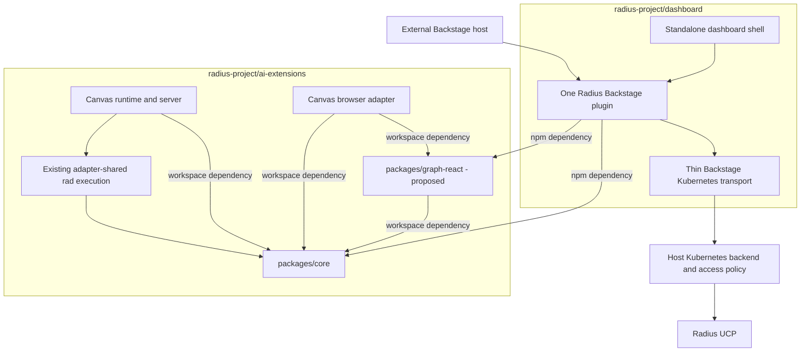

# Radius Dashboard as a distributable Backstage plugin

- **Author**: Nicole James (@nicolejms), with Copilot
- **Date**: 2026-09
- **Status**: Draft
- **Companion test plan**: [Radius Dashboard test plan](./2026-09-dashboard-plugin-test-plan.md)

This design is maintained in `radius-project/dashboard`. Common libraries and components remain owned by `radius-project/ai-extensions`; relocating the document does not change the package ownership or delivery plan.

## Overview

**Recommendation: host and publish all common Radius libraries and components in `radius-project/ai-extensions`, while productizing and releasing the existing Backstage plugin from `radius-project/dashboard`.** The dashboard is already a branded Backstage application. Its Radius pages currently live in `plugins/plugin-radius`, and its React graph currently lives in `packages/rad-components`. Consolidate that graph with Canvas's richer renderer in a new `packages/graph-react` package in `ai-extensions`; do not create a second Backstage implementation. The missing work is external-consumer readiness, common-library extraction, host configuration, compatibility, and publication, not an initial Backstage port.

Minimizing duplication is a release requirement. The standalone dashboard and an external Backstage installation must consume the same plugin. Radius Canvas and that plugin must consume common graph contracts, transformations, and rendering components where their behavior overlaps. Extraction is complete only when existing callers use the shared implementation and the superseded implementation is removed; publishing a library alongside unchanged copies does not satisfy this requirement.

This document proposes a coordinated, two-repository delivery plan. It does not implement or publish the plugin. The recommendation preserves the existing dashboard workspace and Canvas architecture rather than moving an entire application or introducing another runtime. Keep dashboard on React 18 for this delivery, qualify the shared graph independently on React 18 and 19, and make real dashboard consumer journeys a prerequisite to extraction and a required gate on common-code changes.

## Terms and definitions

| Term                   | Meaning                                                                                                                                                   |
|------------------------|-----------------------------------------------------------------------------------------------------------------------------------------------------------|
| Dashboard              | The standalone Backstage application in `radius-project/dashboard`, including its branded shell and container deployment.                                 |
| Radius plugin          | The existing Backstage-aware Radius pages, API registration, routes, and cards in the dashboard repository.                                               |
| Canvas                 | The Radius canvas extension for the GitHub Copilot app, implemented by `packages/adapter-canvas` and distributed in the Copilot plugin artifact.          |
| UCP                    | The Radius control-plane API reached by the dashboard through the Backstage Kubernetes proxy and Kubernetes aggregated API prefix.                        |
| Connection             | An explicit configured Kubernetes cluster plus Radius plane identity; not a browser-supplied URL or the first discovered cluster.                         |
| Shared graph           | Common resource/edge contracts and rendering primitives, with distinct live, modeled, planned, deployed-projection, and diff semantics.                   |
| Productization         | Turning an internal plugin into versioned packages that unrelated Backstage hosts can install without copying source or adopting the dashboard's shell.   |
| Supported consumer pin | A reviewed immutable dashboard commit plus lockfile, toolchain, and host configuration used by required compatibility CI; not a moving `main` checkout.   |
| Candidate artifact     | Compiled core/graph-react tarballs built from one identified common-code PR revision for isolated consumer qualification, not a package published to npm. |

## Objectives

> **Issue Reference:** No tracking issue is assigned to this proposal.

### Goals

- Deliver the current dashboard's read/inspect functionality as an installable Backstage plugin, without requiring the standalone dashboard container.
- Maintain one implementation of the Radius Backstage product pages for both standalone and embedded installations.
- Consolidate overlapping graph behavior across the dashboard and Canvas into common libraries/components owned and published by `ai-extensions`, with explicit host adapters.
- Support host-owned authentication, explicit connection selection, nested mounting, light/dark themes, and actionable failure states.
- Ship compiled packages, public contracts, installation documentation, release automation, and installed-artifact integration coverage.
- Preserve existing Canvas behavior, single-extension packaging, source-reference handling, and deployment workflows during extraction.
- Prevent a common-code PR from merging when its packed artifacts break the supported dashboard consumer, rather than finding the break only during a later dependency update.

### Non-goals

- Porting Canvas modeling, deployment, environment creation, credential management, or deletion into the first Backstage release. These are not features of the current dashboard.
- Embedding a dashboard iframe, copying the frontend into `ai-extensions`, or creating another standalone backend service.
- Rewriting all pages into a universal UI framework. Both dashboard distributions are Backstage hosts and can share Backstage-aware pages directly.
- Automatic catalog ingestion, Scaffolder actions, entity-level Radius authorization, or Red Hat Developer Hub dynamic-plugin packaging in the first release.
- Changing existing Radius control-plane APIs or treating a live graph as a source/Bicep graph.
- Upgrading the complete dashboard to React 19, adopting React Flow 12 without a demonstrated need, or broadly refreshing dashboard dependencies. A full React 19 host migration is a separate future project.

### User scenarios (optional)

#### User story 1

A platform operator installs Radius packages into an existing Backstage deployment, configures approved Radius connections using the host's Kubernetes integration and identity policy, and mounts the plugin under `/radius`. No guest-auth override, copied page source, or separate dashboard deployment is required.

#### User story 2

A developer browses applications, environments, resources, recipes, and resource types, opens an application's live graph, and follows resource links without leaving the selected connection. A graph rendering fix is implemented once and reaches the standalone dashboard, embedded plugin, and Canvas through their shared component dependency.

## User experience (if applicable)

The plugin provides a routable Radius area containing the existing five list experiences and their detail pages. Preserve resource overview/JSON views, application resources and graph, environment metadata/recipes/resources, recipe-pack aggregation, and resource-type schema documentation. Existing home cards remain optional extensions. Host navigation, sign-in, user settings, branding, and the app-wide theme stay with the host.

Add an explicit connection selector when more than one approved connection exists. A single configured connection can be selected automatically; multiple connections must not silently select the first or last cluster. Persist filters with connection-scoped keys. Include connection identity in links and data cache keys so similarly named applications cannot collide.

**Sample input:** An operator mounts Radius at `/radius` and configures a connection named `production` referring to a host-defined Kubernetes cluster and the `radius/local` plane.

**Sample output:** A developer opens Radius, selects `production`, opens an application, and sees its live graph and linked resources. A missing connection produces setup guidance; forbidden access produces an access error; an unavailable control plane produces a retryable failure, not an empty successful list.

The current dashboard graph only supplies name/type nodes, edges, layout, and zoom controls. Canvas-specific source links, deployment badges, output-resource projection, and diff styling must remain supported in the shared graph library without being enabled by default in the dashboard.

## Design

### High-level design

Co-locate common domain logic and reusable UI in `ai-extensions`; keep Backstage-specific product code in dashboard:

- **`ai-extensions` owns shared UI-independent logic:** evolve `packages/core` into a deliberately published dependency with narrow subpath exports. It contains common resource identity, graph contracts, normalization, and extracted Radius domain use cases.
- **`ai-extensions` owns common React components:** introduce `packages/graph-react` (proposed package name `@radius-project/graph-react`) and consolidate Canvas's graph renderer with the useful parts of dashboard's existing `rad-components`. This becomes the one graph component implementation, with no Backstage or Copilot dependency.
- **`dashboard` owns the Backstage product:** keep the existing Radius plugin as the single Backstage product UI. It consumes the published core and graph packages instead of maintaining shared implementations.
- **Each host owns its integration:** dashboard app composition, Backstage authentication/Kubernetes transport, and Canvas SDK/loopback/source-opening behavior remain adapters.

Package dependencies form a directed acyclic graph: core has no adapter dependency; graph-react depends on core; the plugin depends on both; Canvas depends on both and its Node adapter. Core and components never depend on the plugin or Canvas. Canvas uses workspace dependencies so shared contracts, components, and its integration can change atomically in `ai-extensions`. Dashboard consumes versioned npm packages; `ai-extensions` has no production dependency on a dashboard-owned package. Checking out dashboard in isolated compatibility CI is a test dependency, not an exception to production ownership.

#### Review baseline and findings

The dashboard review is pinned to [`8a04d30`](https://github.com/radius-project/dashboard/commit/8a04d30c35cd95fa4eb65a48ee1a36157f2091cb), committed September 8, 2026. The original ai-extensions draft baseline is [`9c86b40`](https://github.com/radius-project/ai-extensions/commit/9c86b4005f67010c5559bb24433a56fa6f4893d4). Backstage compatibility research used its official documentation and release [`v1.54.6`](https://github.com/backstage/backstage/releases/tag/v1.54.6), not a claim that either Radius application already supports that release. Findings below are read-only source/dependency assessments, not executed migration trials or successful build/test results.

| Area                | Observed implementation                                                                                                                                                                                            | Delivery consequence                                                                                                   |
|---------------------|--------------------------------------------------------------------------------------------------------------------------------------------------------------------------------------------------------------------|------------------------------------------------------------------------------------------------------------------------|
| Dashboard frontend  | Existing `createPlugin`, API factories, routable extensions, route refs, and cards; standalone app imports the plugin's pages. [D1], [D2]                                                                          | Release and adapt this plugin rather than build another one.                                                           |
| Dashboard backend   | Running backend registers Kubernetes/auth/catalog and other Backstage plugins. The Radius backend scaffold only has a health route and is not registered. [D3], [D11]                                              | Do not publish a health-only backend as though it supplies Radius functionality.                                       |
| Radius reads        | `RadiusApiImpl` delegates to `KubernetesApi.proxy`, supports `Applications.Core` and `Radius.Core`, and performs resource-group/resource fan-out. [D4]                                                             | Extract common domain operations, retain a thin Kubernetes transport adapter, and bound concurrency.                   |
| Graph retrieval     | `ApplicationTab` makes its own `getGraph` POST with a ten-second abort timeout. API calls choose the first cluster; graph code chooses the last. [D4], [D5]                                                        | Move graph retrieval behind the same explicit connection-aware API as resource reads.                                  |
| Graph UI            | Dashboard uses React Flow 11 and `@dagrejs/dagre`; Canvas uses React Flow 11 and `dagre`, with a richer renderer. [D6], [A1]                                                                                       | Consolidate the actual renderer and layout, not just similarly named types.                                            |
| Duplicated code     | Dashboard has duplicate resource-ID parsers and repeated graph interfaces. Canvas also has separate graph resource/view types. [D7], [A2]                                                                          | Establish canonical contracts with source-specific adapters; remove copies as callers migrate.                         |
| Host coupling       | Hard-coded root navigation, `radius/local` assumptions, guest-auth standalone configuration, and first-cluster selection. [D2], [D4], [D8]                                                                         | Use route refs, explicit connection context, and the host's authentication configuration.                              |
| Packaging           | Dashboard plugin manifests use private `@internal/*` names; `ai-extensions`'s core/shared packages are private source exports ignored by Changesets. [D9], [A3]                                                    | Neither current packaging scheme is sufficient for public npm consumers.                                               |
| React compatibility | Dashboard is locked to React/DOM 18.3.1 with React type resolutions on 18; Backstage dependencies and MUI v4 block a simple supported React 19 host upgrade. [D13], [D14], [B6], [M1]                              | Keep dashboard 18; independently qualify shared graph 18/19.                                                           |
| Test evidence       | ApplicationTab covers requests/errors/timeouts and both namespaces but mocks AppGraph; graph test checks attribution; browser smoke checks three home cards, including in container CI. [D10], [D15], [D16], [D17] | Add real-renderer dashboard journeys before extraction; existing green checks alone cannot establish migration safety. |

The products have different data sources. The dashboard reads the live Radius control plane. Canvas builds modeled graphs using `rad`, computes graph diffs, and projects deployment status from workflow artifacts onto modeled topology. [`applicationGraphToResources`](https://github.com/radius-project/ai-extensions/blob/2c789d2e2a309d94e4164a1719c64dda580be36c/packages/core/src/graph/appgraph.ts) requires valid modeled diff hashes; [`projectDeployedGraph`](https://github.com/radius-project/ai-extensions/blob/2c789d2e2a309d94e4164a1719c64dda580be36c/packages/core/src/graph/deployed.ts) deliberately retains modeled topology. Neither is a drop-in live-UCP graph adapter.

### Architecture diagram

This diagram shows the proposed ownership and dependencies, not packages already shipped. Arrows mean "depends on"; cross-repository package dependencies are resolved at build time, not through a new network service.



### Detailed design

#### Option 1: Common libraries in ai-extensions; Backstage plugin in dashboard

Publish core and the new graph-react component package from `ai-extensions`. Consolidate both existing graph implementations in `ai-extensions`, and make Canvas a workspace consumer. Keep the existing Backstage plugin in dashboard and make it a consumer of the published common libraries.

##### Advantages

Co-locates shared domain contracts, the richer Canvas graph implementation, and Canvas integration for atomic changes. Preserves existing Backstage build, app, plugin, and container ownership. Both Backstage distributions share one UI without introducing a Backstage release toolchain in `ai-extensions` or making Canvas depend on dashboard-owned components.

##### Disadvantages

Requires moving dashboard graph code and its relevant tests/notices into a new package in `ai-extensions`, adding React component library packaging, and coordinating dashboard consumer updates. Existing rad-components consumers may need temporary forwarding exports and a deprecation period.

#### Option 2: Move the plugin and common UI into ai-extensions

Transfer canonical plugin/component ownership into new workspace packages in `ai-extensions`; change dashboard into an external package consumer and remove its former implementations.

##### Advantages

Co-locates shared core, UI, and adapters, enabling atomic graph changes. Can eventually provide one repository for all Radius integrations.

##### Disadvantages

Requires a coordinated source transfer, Backstage build/TSX tooling, a host fixture, new npm publication, and migration of existing dashboard ownership and release dependencies. The current repository's plugin discovery and publishing are designed for Copilot artifacts, not npm Backstage packages. Merely copying the plugin would directly violate the duplication requirement.

#### Proposed option

**Choose Option 1.** Common-library ownership and Backstage-plugin ownership are separate decisions. Hosting common code in `ai-extensions` lets core, graph components, and Canvas evolve together; dashboard remains a consumer through published contracts. Keeping the already implemented Backstage plugin in dashboard avoids moving its host-specific tooling. The earlier proposal to retain common components in dashboard favored migration convenience over the stronger long-term shared-library boundary and is superseded.

#### Canonical ownership and extraction map

Names of new exports below are proposals, not claims about existing APIs.

| Source today                                                                                   | Canonical destination                                                                                                               | Required consumer migration                                                                                                          |
|------------------------------------------------------------------------------------------------|-------------------------------------------------------------------------------------------------------------------------------------|--------------------------------------------------------------------------------------------------------------------------------------|
| Dashboard's two `resourceId.ts` files and resource/graph interfaces                            | `packages/core`, proposed Radius domain exports                                                                                     | Both dashboard packages use one parser and contracts; temporary forwarding exports contain no logic.                                 |
| Radius API compatibility, recipe aggregation, schema interpretation mixed into dashboard pages | `packages/core`, proposed Radius domain use cases behind a typed transport port                                                     | Plugin pages call the common use cases; UI does not import parsers from a visual package.                                            |
| Graph request in `ApplicationTab` and resource requests in `RadiusApiImpl`                     | One shared Radius client/use-case boundary plus Backstage transport adapter                                                         | All reads use the same explicit connection, version policy, timeout/cancellation, and error contract.                                |
| Canvas graph model/build/layout plus dashboard graph layout                                    | `ai-extensions/packages/core` for domain semantics; proposed `packages/graph-react` in `ai-extensions` for graph view models/layout | One layout implementation and tested compatibility handling; neither host retains a separate graph builder with equivalent behavior. |
| Canvas node/view/details/legend and dashboard `AppGraph`/`ResourceNode`                        | Proposed `ai-extensions/packages/graph-react`, with typed data, callbacks, and view options                                         | Dashboard plugin consumes the npm package; Canvas consumes the workspace package; shell-specific source opening stays in Canvas.     |
| Dashboard Backstage pages, tables, recipe/type detail UI                                       | Existing Radius frontend plugin                                                                                                     | Standalone app and external host consume exactly the same exports.                                                                   |
| Canvas workflows, managed binaries, worktree access, local auth, SDK lifecycle                 | Existing Canvas and shared Node adapters                                                                                            | No transplantation into a browser plugin or the dashboard client.                                                                    |

The graph migration is incremental but mandatory before stable release. Establish meaningful real-renderer dashboard journeys first. Then extract contracts and pure transformations; consolidate the React node/edge/details renderer and layout in graph-react in `ai-extensions`; finally replace both consumers and remove the superseded implementations. If dashboard's rad-components has actual external consumers, retain only a temporary compatibility package forwarding to the new library, with a documented removal policy. Avoid rewriting the whole Canvas page: its existing server-rendered shell and inline browser entry simply mount the common graph with injected callbacks. Preserve Canvas behavior through the existing boundary suites.

The dashboard's module-level Dagre graph becomes per-layout/per-instance state. Choose one Dagre implementation after running both graph fixture sets; do not bundle two layout engines permanently. Preserve the legacy gateway-direction workaround only for the input shape that needs it, with a named fixture, rather than applying it to every graph.

Keep React and ReactDOM as compatible peer dependencies of the common component library. Do not bundle a second React into Backstage. Verify the same components under dashboard/Backstage React 18 and Canvas React 19 before declaring both supported. Theme tokens, node presentation, source opening, selection, and details actions are explicit inputs; no Backstage imports, Canvas globals, `/api/open-source` calls, or application-wide CSS resets in the shared graph package.

#### Shared data semantics

Use full resource identity plus connection and plane context, never bare application name, for lookup and caching. Keep live UCP graph inputs separate from modeled `rad` inputs. Model source-specific metadata through explicit variants or optional capabilities: a live graph need not contain a `diffHash`, definition file, or workflow status.

Reuse stable edge normalization and identity handling, but make product-specific projections explicit. Canvas's visualization filtering and modeled-topology deployment projection must not silently hide live dashboard resources or manufacture successful provisioning status. Preserve both application namespaces, recipe packs and legacy recipes, resource-type API versions, and raw status values through common normalization.

Do not introduce another schema engine: extract the dashboard's existing schema interpretation as pure view-model functions. Do not assume Canvas's recipe resolution and dashboard recipe listing are the same operation; share identity and compatible data transformations, not unrelated orchestration.

#### Backstage integration

Retain the current legacy frontend exports while adding a new frontend-system entry built from the same pages, API implementation, and route definitions. Use Backstage's documented `createFrontendPlugin`/extension mechanisms for the new entry; the wrappers may differ, but product logic must not. Do not force the standalone dashboard to migrate frontend systems as a prerequisite. Qualification of each entry is against an explicitly selected supported Backstage host, not an assumption that every baseline supports both wrappers.

Replace every hard-coded internal root link and breadcrumb with route refs or routes resolved relative to the mounted plugin. Verify direct links, refresh, browser history, and a non-root app base path. Keep home cards optional. Catalog entity cards/tabs can follow as thin consumers of this same API, but annotation contracts and catalog ingestion are not prerequisites for dashboard parity.

Use the existing Kubernetes proxy path for the first release, not a new Radius backend merely for symmetry. The host installs and configures the necessary Backstage Kubernetes frontend API and backend plugin explicitly. Export `radiusApiRef`, its interface, and an override seam so hosts can supply a different authorized transport without copying pages.

### API design (if applicable)

The proposed public Radius domain surface includes resource identity/types, `RadiusConnection`, an injected `RadiusTransport` port, and client operations for listing/getting applications, environments, resources, recipes, resource types, and application graphs. Core owns Radius semantics; the adapter owns HTTP implementation, Backstage credentials, cluster access, and response decoding at the transport boundary. New public inputs must be validated rather than exporting the existing permissive Canvas `any` shapes as a stable SDK.

All operations receive explicit connection context and support cancellation. The graph operation uses the same selected cluster and plane as the application's detail request. Preserve the existing upstream graph operation, `POST /apis/api.ucp.dev/v1alpha3/{application-resource-id}/getGraph?api-version=...`; its POST method is a graph query, not deployment permission.

Retain resource-type version discovery and characterize the current `2023-10-01-preview` fallback. Unsupported namespace/version responses may permit compatibility fallback; authentication, authorization, network, and malformed-response failures must not become empty lists. If one supported namespace fails while another succeeds, return an explicitly partial result with a visible warning rather than reporting complete inventory.

Bound resource-list fan-out and support upstream continuation when available; do not claim server pagination where none exists. Add request deduplication, bounded cache lifetimes, and cancellation on connection changes. Cache keys include connection, plane, scope, API version, and authorization context; authorization must be enforced on every retrieval.

#### Contract acceptance checklist

The following are proposed contract obligations; exact export identifiers and serialized result shapes are approved in delivery unit P0 before implementations depend on them.

| Surface and owner                                        | Contract to freeze                                                                                                                                                                        | Acceptance evidence                                                                                                                                                                                            |
|----------------------------------------------------------|-------------------------------------------------------------------------------------------------------------------------------------------------------------------------------------------|----------------------------------------------------------------------------------------------------------------------------------------------------------------------------------------------------------------|
| Browser-safe core domain/graph exports, ai-extensions    | Resource IDs retain plane/group/provider/type/name; source variants distinguish live from modeled/planned/deployed-projection/diff; live input has no modeled-hash precondition.          | A live fixture without hashes renders; malformed modeled hashes still fail at the modeled adapter; both namespaces and identical names in different contexts stay distinct.                                    |
| Core client/transport boundary, ai-extensions            | Typed operation input/output, explicit connection, version policy, cancellation, partial-result/error taxonomy, bounded fan-out; no HTTP client, DOM, SDK, React, or credentials in core. | Fake-port tests assert operations and failures; browser import/build checks reject host and Node runtime leakage; existing modeled workflows remain internal.                                                  |
| Graph component, proposed graph-react in `ai-extensions` | Normalized graph plus explicit presentation/capability inputs; callbacks for selection/details/source actions; scoped CSS export and theme tokens; no data fetch or host navigation.      | Same renderer and declarations qualify with React/DOM and corresponding types on both supported majors; live mode cannot imply deployment success or enable source/diff actions without supplied capabilities. |
| Backstage plugin, dashboard                              | Public API ref/interface/override, legacy and new frontend entries, route refs, optional cards, operator connection schema and required Kubernetes integration.                           | Packed plugin mounts in standalone and external hosts; selected connection/plane reaches resource reads and graph POST; nested direct links and configuration errors work.                                     |

**Proposed configuration shape**, to be documented and schema-validated during implementation:

```yaml
radius:
  connections:
    - id: production
      clusterName: production-cluster
      plane:
        type: radius
        name: local
```

These fields refer to operator-controlled Kubernetes configuration; they do not contain credentials or authorize access. The final schema must be tested against the selected Backstage configuration mechanism. No new public Radius backend REST API is required by this option.

### Implementation details

#### Core package - packages/core

Add narrow domain/graph subpath exports and move the genuinely common logic with its tests. Keep core independent of React, Backstage, HTTP implementations, the filesystem, DOM, and Copilot. Publish compiled JavaScript and declarations for the public surface rather than requiring consumers to transpile `ai-extensions`'s TypeScript source. Keep unrelated modeling/workflow internals out of the new public contract.

Do not perform an unrelated core rewrite. Harden types and errors only where code becomes a shared contract or is changed by extraction, with explicit before/after behavior tests. The browser-safe promise applies to the deliberately exported dependency closure, not the current root barrel.

#### Common React components - packages/graph-react (proposed)

Create this package in `ai-extensions` as the canonical home for shared graph rendering, layout, nodes, edges, details, legends, and scoped styles. Consolidate the existing Canvas graph modules and dashboard's AppGraph/ResourceNode behavior rather than retaining one renderer per host. Move the relevant tests and preserve source attribution and license notices.

Depend on browser-safe core subpaths through a workspace dependency. Accept graph data, presentation options, theme tokens, and callbacks; do not fetch Radius data, import host APIs, or own Backstage routing or Copilot lifecycle. Use ai-extensions' TypeScript, Vitest, and browser conventions, extending configuration for React/TSX and library packaging where needed rather than adopting a second Backstage toolchain.

Build compiled JavaScript, TypeScript declarations, and scoped CSS for npm consumption, with React/ReactDOM externalized as peer dependencies. Canvas consumes the workspace source through its existing build; dashboard consumes published artifacts. Both build paths must exercise the same implementation and exports, without requiring runtime package downloads. Use compatible JSX output/types for both React majors; qualification of this isolated library does not certify a React 19 Backstage app.

#### Canvas adapter - packages/adapter-canvas

Replace duplicated graph internals with a workspace dependency on graph-react, preserving browser entry registration, initialization/teardown, page state, focus, source opening, theme behavior, and modeled/planned/deployed/diff features. Its browser build bundles the common component into the existing self-contained inline scripts.

Preserve the actual current artifact contract described in [plugin packaging and publishing](https://github.com/radius-project/ai-extensions/blob/2c789d2e2a309d94e4164a1719c64dda580be36c/docs/architecture/plugin-packaging-and-publishing.md): local output under `.artifacts/radius`, with `com.github.copilot/extensions/radius/extension.mjs` as the canonical entry inside the published plugin. Do not add runtime fetches of `ai-extensions`'s browser modules or a second plugin bundle.

#### Shared adapter - packages/adapter-shared

No first-release Backstage dependency on managed `rad`/Bicep is needed. Keep graph compilation and process lifecycle in `ai-extensions`. A future modeled/planned Backstage view would reuse this boundary through a deliberately designed backend, not spawn tools from the frontend or import Canvas server routes.

#### Plugin - Copilot radius distribution

The Copilot plugin remains a separate distribution. The original draft calls this `plugins/radius`; the inspected ai-extensions checkout's [manifest](https://github.com/radius-project/ai-extensions/blob/2c789d2e2a309d94e4164a1719c64dda580be36c/extensions/radius/package.json) is in `extensions/radius`. Its manifest, skills, deployment tools, and marketplace discovery do not become a Backstage package. Only the rebuilt Canvas graph implementation and any resulting dependency notices change when that migration lands.

#### Dashboard repository

Keep `plugins/plugin-radius` canonical for Backstage-specific pages and integration. Move common API/domain logic to core in `ai-extensions` and common graph components to graph-react in `ai-extensions`; remove duplicate parsers/interfaces/renderers after switching the plugin to the published packages. Centralize graph networking and make connection/navigation configurable. Retain app branding, container packaging, sign-in, and host configuration in `packages/app` and `packages/backend`.

Retire `packages/rad-components` as an implementation owner. If compatibility requires keeping its exports temporarily, make it a forwarding wrapper over graph-react with no independent layout, renderer, or domain logic. The standalone dashboard and external hosts continue to consume the same Backstage plugin.

The existing [Radius backend scaffold][D11] is not part of the initial public distribution. If later requirements need a Radius-specific authorization gateway, implement it as a thin new-backend-system adapter over the shared domain layer, with a separate approved contract.

#### Build & packaging

Proposed public names are `@radius-project/core` and `@radius-project/graph-react`, published from `ai-extensions`, and `@radius-project/backstage-plugin-radius`, published from dashboard, subject to npm scope ownership confirmation. Inventory external consumers of the existing `@radapp.io/rad-components` identity before migration; provide forwarding exports and a deprecation plan if needed. That compatibility identity must not remain the canonical shared implementation. Do not assume current registry publication merely from repository documentation.

`ai-extensions`'s [core manifest](https://github.com/radius-project/ai-extensions/blob/2c789d2e2a309d94e4164a1719c64dda580be36c/packages/core/package.json) is private, points at source, and requires Node 24; [Changesets config](https://github.com/radius-project/ai-extensions/blob/2c789d2e2a309d94e4164a1719c64dda580be36c/.changeset/config.json) ignores core and uses restricted access. Add an explicit npm library release path for selected public packages: compiled exports/declarations, public access, package file allowlists, dependency rewriting, Changesets participation, provenance, and immutable version publication. Do not route npm libraries through the Copilot-specific `scripts/plugins.mjs` discovery or generated release branches. Keep independent Copilot versioning intact and add Changesets for affected released behavior when implementation lands.

Build and publish core and graph-react through `ai-extensions`'s npm library release path, with independent versioning and dependency-aware Changesets. Graph-react uses core as a workspace dependency locally; packing rewrites it to a published version range. Canvas uses both as workspace dependencies and bundles them into the Copilot artifact, so it does not wait for an external graph-package release to integrate a local change.

Dashboard needs a real plugin publication job rather than only its container build. Build/pack the Backstage plugin with dependencies on the published common libraries and verify the installed tarballs. Publish in dependency order: core in `ai-extensions`, graph-react in `ai-extensions`, then the Backstage plugin in dashboard. Update dashboard's dependency lockfile to qualified versions; release Canvas through its existing pipeline after its local integration gates. Use prerelease versions first, followed by stable releases only after cross-consumer gates pass.

Use pnpm for `ai-extensions` and retain dashboard's existing tooling. Published packages must be consumable without `workspace:`/`catalog:` protocols, repository source aliases, or a required consumer package manager. Verify Backstage CLI packaging and declarations in a host fixture instead of assuming `ai-extensions`'s esbuild output is an npm plugin.

Resolve license metadata before publishing: dashboard's plugin/repository declare Apache-2.0, while the [rad-components manifest][D12] declares ISC. Preserve applicable notices and obtain maintainer confirmation rather than silently relicensing moved code.

### Error handling

Distinguish no configured connection, invalid selection, unauthenticated, forbidden, not found, unsupported API version, malformed payload, partial inventory, timeout, and unavailable upstream. Loading, empty, partial, stale, and error are separate UI states. Never report failed discovery as "no resources."

Cancel view-owned work on unmount or connection changes and reject late responses from superseded selections. Keep layout state isolated across simultaneous graphs; if layout fails, show a usable explicitly degraded presentation rather than overlapping all nodes. Apply bounded read retries only to appropriate transient failures. Do not retry authorization failures or automatically switch clusters.

## Test plan

The dashboard-side execution of this section — phase order, requirement IDs, the graph test tiers,
and the expected-change manifest that makes the graph extraction reviewable — is maintained in the
[companion test plan](./2026-09-dashboard-plugin-test-plan.md). This section states the required
suites; that document states how dashboard delivers them and in what order.

Use existing runner conventions in each repository: Vitest and the current browser/boundary suites in `ai-extensions`; existing dashboard tests as migration seeds. Tests move with extracted code. Shared packages get one canonical behavior suite in `ai-extensions`; dashboard owns its host integration journeys and external-host fixture. Do not copy dashboard test implementations into ai-extensions.

### Establish regression protection before extraction

The existing [ApplicationTab suite][D15] exercises successful graph requests, non-OK responses, thrown errors, and ten-second timeout behavior for both `Applications.Core` and `Radius.Core`, but replaces `AppGraph` with a test double to avoid React Flow/jsdom issues. It protects the request/UI-state boundary, not real nodes, edges, layout, controls, or CSS. The [rad-components graph test][D16] only asserts React Flow attribution. The [Playwright app test][D10] signs in as a guest and checks the Learn More, Join the Community, and Get help with Radius home cards; [CI][D17] also runs it against the built container. Running that smoke test against a container does not add graph coverage.

Before moving graph/domain implementations, add dashboard-owned real-browser journeys that drive the existing plugin and real renderer against deterministic fake Kubernetes/UCP responses. Cover list-to-application navigation, both application namespaces, visible named nodes and edges, non-overlapping layout, zoom/fit, supported selection/detail behavior, theme/CSS loading, direct-link refresh, and the existing graph error/timeout states. Cover the existing resource/environment/recipe/schema paths only to the extent affected by planned domain extraction. Keep request-boundary unit tests; remove neither useful coverage nor the host suite when shared tests move.

Freeze these journeys at a reviewed passing baseline before extraction; do not bless existing defects as desired behavior. Add explicit regression cases for two clusters/planes whose first/last ordering disagrees, connection changes during in-flight work, and partial failure as the connection fix lands. Demonstrate that removing the real renderer or stylesheet makes the relevant journey fail. These are future prerequisites, not claims that this assessment ran any tests.

### Required suites

| Layer                                   | Required evidence                                                                                                                                                                                                                                                                                            |
|-----------------------------------------|--------------------------------------------------------------------------------------------------------------------------------------------------------------------------------------------------------------------------------------------------------------------------------------------------------------|
| Domain unit                             | Full resource identity, dual namespaces, malformed IDs/payloads, live versus modeled graphs, missing hashes, recipe aggregation, schema interpretation, version fallback, explicit partial failures, connection-scoped cache behavior, cancellation and fan-out bounds.                                      |
| Shared graph unit/component             | Deterministic edges/layout, gateway compatibility, simultaneous graphs without state leakage, output-resource handling, source/detail callbacks, all Canvas graph modes, empty/error states, and update/unmount cleanup.                                                                                     |
| Backstage integration                   | Real plugin/API registration with controlled Kubernetes responses; authenticated and forbidden requests; two clusters where the old first/last behavior would disagree; plane selection; GET and graph POST policy; nested routes and non-root app base paths.                                               |
| Browser functional and critical journey | Lists to resource/environment detail to real graph; recipes and resource-type schemas affected by extraction; connection change during requests; visible partial failure/retry; direct-link refresh; dashboard and external-host mounting.                                                                   |
| Accessibility and keyboard              | Light/dark material states, graph controls/details, focus restoration, loading/error announcements, keyboard-only navigation, and accessible non-graph resource information.                                                                                                                                 |
| Installed artifact                      | Install packed public dependencies into a clean Backstage fixture without source aliases; compile declarations, build frontend/backend, load CSS, register the plugin, and exercise real host routes with fake upstream data.                                                                                |
| Canvas regression                       | Existing applicable unit, runtime integration, HTTP integration, built-extension smoke, browser component, browser functional, critical journey, accessibility, and keyboard gates. Scheduled visual/reliability and real-host qualification follow the current test plan, not a newly invented gate status. |

Target 100% meaningful changed-code coverage and never lower existing repository/package baselines. Preserve the Canvas browser coverage floor and use its existing [test architecture](https://github.com/radius-project/ai-extensions/blob/2c789d2e2a309d94e4164a1719c64dda580be36c/docs/design/2026-08-radius-canvas-test-architecture.md) and [test plan](https://github.com/radius-project/ai-extensions/blob/2c789d2e2a309d94e4164a1719c64dda580be36c/docs/design/2026-08-radius-canvas-test-plan.md) to select the exact requirements affected by renderer extraction.

Require package-boundary rules that prohibit core importing hosts, common components importing Backstage/Canvas, and host code importing another adapter's private source. Review the extraction inventory at each phase; final acceptance requires zero remaining parallel implementations of the migrated parser, graph request policy, layout, and graph renderer. Shared runtime contracts may also be exposed by type-only re-exports; duplicated implementations are not an acceptable compatibility mechanism.

Browser consumers must import browser-safe domain/graph subpaths, not the existing core root barrel: the current [Canvas graph builder](https://github.com/radius-project/ai-extensions/blob/2c789d2e2a309d94e4164a1719c64dda580be36c/packages/adapter-canvas/src/browser/graph/build.ts) already avoids the root because it re-exports workflow code that reads `process.env`. Extend the existing browser-safe build checks to the new public dependency graph, including packed consumption, rather than assuming that all core exports are browser-safe.

### Mandatory common-code consumer CI

Every PR that changes public core/graph behavior, component implementation, styles, declarations, exports, dependencies, packing/build inputs, or this gate must run a required dashboard compatibility check in addition to `ai-extensions`'s canonical suites and applicable Canvas gates. A core-only change still packs graph-react against that candidate. Source-only tests in ai-extensions and a future dashboard update PR are insufficient substitutes.

| Step                    | Required execution and evidence                                                                                                                                                                                                                                                                                                                                                |
|-------------------------|--------------------------------------------------------------------------------------------------------------------------------------------------------------------------------------------------------------------------------------------------------------------------------------------------------------------------------------------------------------------------------|
| Identify the run        | Record ai-extensions tested commit/merge SHA, approved workflow revision, dashboard supported commit and lockfile digest, Node/package-manager versions, host matrix, and exact candidate package versions.                                                                                                                                                                    |
| Build and pack          | Build core first, then graph-react; pack compiled JS, declarations and CSS with release-equivalent allowlists. Produce a manifest of package identities and SHA-256 tarball digests. No registry publication or production credentials are needed.                                                                                                                             |
| Install real candidates | Check out the supported dashboard commit into an isolated directory, install its pinned baseline, and replace common dependencies with exact candidate tarballs in a disposable lockfile. Force graph-react's transitive core dependency to the same candidate, rather than silently resolving released core. Do not edit the supported source or committed lockfile in place. |
| Prove resolution        | Inspect the resolved dependency tree and build module/asset provenance: both direct and transitive imports use the identified candidates, no workspace/source aliases or old rad-components implementation satisfy imports, peer React is not duplicated, and the candidate CSS is present in output and loaded in the browser. A mismatch fails before accepting results.     |
| Exercise dashboard      | Run dashboard's typecheck, affected canonical component/integration suites, production build, and its own real-renderer browser journeys against controlled fake upstream data. Never mock core/graph-react or substitute a toy graph in this gate. Exercise the built output, not only a dev server.                                                                          |
| Exercise external host  | From the dashboard-owned fixture, install the packed Radius plugin and candidate common dependencies with the same transitive-resolution checks. Run the shared dashboard journey implementation via host-specific setup against nested mounting and the approved legacy/new frontend entries. No page, graph, or test-implementation copy.                                    |
| Report and gate         | Attach identities, dependency evidence, results, and bounded browser traces/screenshots to the exact tested revision. Build/type/runtime/style/journey failures, missing evidence, skipped/cancelled/timed-out jobs, unavailable consumer checkout, and stale-SHA results all block merge and publication.                                                                     |

The React matrix is deliberately asymmetric: the same shared graph unit/component and packed-library suite runs with React/DOM 18.3.1 and the selected Canvas 19 version (currently 19.2.8 in `ai-extensions`), with matching type majors. Dashboard and external Backstage jobs run on qualified React 18 hosts. Canvas retains its existing React 19 integration gates. Do not run the entire unsupported dashboard on 19 and then advertise it as supported because isolated graph tests pass.

**Trusted execution and artifact identity:** Define the gate and supported-consumer pins in reviewed default-branch CI configuration, with actions/reusable workflows pinned to immutable revisions. Treat PR packages, install scripts, and checked-out code as untrusted executable input. Run candidates on ephemeral isolated runners with read-only access, no cloud/registry/signing secrets, no inherited developer credentials, no privileged self-hosted environment, and no write-capable token exposed to the test process. Do not use `pull_request_target` to execute PR code with privileges. Fetch public dashboard source at the approved immutable commit; never execute a contributor-supplied checkout URL or moving branch as the trusted consumer.

If artifacts cross jobs or repositories, a trusted coordinator verifies producer repository, workflow identity, run ID, tested SHA, artifact ID/digest, and expected package names before dispatching the unprivileged consumer run. A name such as "latest successful artifact" is not sufficient. A separate narrowly scoped reporter may record a check result, but must not execute candidate code or accept an arbitrary claimed success. Bind reports to the tested PR revision and invalidate them on new commits. Maintainer approval for fork runs authorizes isolated execution, not access to secrets.

**Supported revision and update policy:** Before the first shared extraction, merge the dashboard prerequisite journeys and candidate-install seam, then record that immutable dashboard revision as the supported consumer pin in `ai-extensions`. The reviewed source baseline above predates that seam and is not enough. Keep at least the supported standalone dashboard revision and approved external Backstage host fixture/version in the required matrix; add all promised consumer lines before claiming support for them. Dashboard maintainers own host tests and notify shared-library maintainers when the pin must advance. Advance pins only through reviewed PRs that run both the previous and proposed pins with known-good packages; record the new toolchain/lockfile/host matrix and compatibility outcome. Review pins with every dashboard release that changes plugin integration or dependencies. Never silently follow `main`, age out a failure, or loosen the gate to make a common-code PR green.

For intentionally breaking public changes, first agree the version/migration plan and prepare an immutable compatible consumer revision; retain existing supported-line coverage until maintainers explicitly retire that line. The initial extraction may use a reviewed consumer-integration revision before its release, but its identity and candidate-install behavior must be fixed in CI, not supplied ad hoc by each PR.

**Dashboard dependency-update PRs remain gated:** After common packages publish, the actual dashboard update installs exact registry versions with a reviewed lockfile, verifies registry artifact identity/provenance and the graph-to-core resolution, and reruns its build/typecheck, affected component suites, real-renderer journeys, and packed-plugin external-host tests. Candidate qualification does not certify a different lockfile or tarball. Run the existing built-container checks as well; the new journeys must not be replaced by the three-card smoke. If these gates fail, dashboard stays on the last known-good dependency set.

Pull-request tests use local fixtures, fake identities, and no live cloud or inherited credentials. Before stable publication, qualify real supported Radius versions and host configurations in a controlled release environment. Synthetic fixtures alone cannot prove Kubernetes aggregation, real authorization, or UCP version compatibility.

## Security

The plugin inherits the host's sign-in and backend authentication. Do not transplant guest sign-in, `NODE_ENV=development`, local kubectl proxy setup, or standalone service-account permissions into installation defaults.

Connection configuration and hiding UI controls are not authorization. The chosen Kubernetes backend/auth strategy must enforce each user's allowed cluster/Radius scope for both resource reads and the graph POST. The initial access model is explicitly cluster/plane-scoped inspection, not catalog-entity ownership enforcement. Prove direct proxy requests cannot bypass the intended policy. If the target host cannot enforce that model, launch is blocked until an authorized transport or narrow Radius backend gateway is implemented; do not ship browser-only checks.

Keep cluster credentials backend-only. Bind connections to operator-approved cluster identifiers and planes; never proxy arbitrary browser-provided endpoints. Derive the minimum upstream permissions from observed GET and graph-query operations rather than copying broad standalone RBAC or assuming read-only means GET-only.

Validate and safely render resource metadata, Markdown, schema descriptions, graph icons, and source links. Raw JSON views need an explicit sensitive-field policy: preserve inspection where authorized, but do not assume live resource properties contain no secrets. Use trusted asset handling and output-context escaping. Logs, diagnostics, and cached responses must not leak tokens or data across users/connections.

Distribution requires reviewed dependency/license metadata, package provenance, controlled publication credentials, and a rollback/deprecation process. A generic allow-all permission policy is not a production installation recommendation. The mandatory consumer-CI trust boundary above also applies to package lifecycle scripts and browser execution; publication/signing runs only from approved protected revisions, never the untrusted candidate execution job.

## Compatibility (optional)

### React 19 assessment and delivery decision

**A complete dashboard React 19 upgrade is currently a no-go as a simple supported dependency upgrade.** This is a source/dependency finding, not an executed migration failure. Keep dashboard on React 18 for this delivery and qualify common graph components independently for Canvas React 19.

| Evidence at the reviewed revisions                                                                                                                                                                                                                                 | Consequence                                                                                                                                                                                          |
|--------------------------------------------------------------------------------------------------------------------------------------------------------------------------------------------------------------------------------------------------------------------|------------------------------------------------------------------------------------------------------------------------------------------------------------------------------------------------------|
| Dashboard's [release marker][D18] says Backstage 1.49.0, while its [lockfile][D14] resolves `@backstage/app-defaults` 1.7.11, `@backstage/core-components` 0.18.13, and `@backstage/core-plugin-api` 1.12.9. Assessed peer declarations admit React 17/18, not 19. | The release marker alone is not the compatibility matrix; qualify the actual resolved dependency graph.                                                                                              |
| React and ReactDOM are locked to 18.3.1; root [resolutions][D13] constrain `@types/react` and `@types/react-dom` to `^18`.                                                                                                                                         | Changing only runtime React leaves incompatible types and dependency peers; do not use forced resolutions as evidence of support.                                                                    |
| [Official Backstage guidance][B6] explicitly says upgrading Backstage to React 19 is not yet officially supported.                                                                                                                                                 | Treat a full host upgrade as a separate migration dependent on supported Backstage dependencies.                                                                                                     |
| MUI core 4.12.4 is in the resolved dashboard graph. Its [Portal implementation][M1] actually calls `ReactDOM.findDOMNode`, removed in React 19; Modal and other paths use this legacy stack. Backstage also brings MUI v4 transitively.                            | Replacing only Radius-owned MUI imports cannot remove the runtime blocker. A host-wide dependency migration is needed, not only peer widening.                                                       |
| The [app entry][D19] already uses `react-dom/client` and `createRoot`. Root [tsconfig][D20] inherits the classic JSX transform; [EnvironmentOverviewTab][D21] uses global `JSX.Element`.                                                                           | Do not invent a createRoot migration. A future host upgrade still needs automatic JSX-transform and React-19 type cleanup, including inherited build settings.                                       |
| [rad-components][D12] has no production Backstage/MUI dependency; its own peers stop at React 18. React Flow 11.11.4 peers `>=17` admit 19; Testing Library 16.3.3 and Storybook 10.5.10 also admit 19 in the assessed graph. [D14]                                | Isolated graph qualification is viable, not already proven. Widen the new library's peer range only after runtime/type/browser tests; there is no demonstrated requirement to move to React Flow 12. |

A future full-dashboard React 19 project must address upstream Backstage support, transitive MUI v4 removal or supported replacements, peer/types alignment, JSX transform, and the complete host integration suite together. It is not a prerequisite for sharing the graph and must not be bundled into these delivery units.

### Toolchain and supported hosts

The actual [dashboard root manifest][D13] uses **Node 24, Yarn 4.17.1, and TypeScript 6.0.3**. This is distinct from the researched Backstage `v1.54.6` [app template][B4] using React 18 and [root template][B5] supporting Node 22/24 with TypeScript 5.8. The upstream template's compiler version is not dashboard's compiler. `ai-extensions` uses Node 24, pnpm, and TypeScript 7; validate emitted declarations with each promised host/compiler rather than leaking `ai-extensions`'s tooling into consumer requirements.

Initial qualification should cover the dashboard baseline after prerequisite test work, the explicitly selected external Backstage release and frontend entries, and Canvas's React 19 renderer. Backstage `v1.54.6` remains a candidate target, not verified support. Declare only tested peer ranges. Node 24 is a common initial build/runtime target; wider Node support is a separate qualification decision rather than an accidental `engines` promise.

Retain necessary old dashboard exports through forwarding modules during migration. Keep standalone URLs working while making embedded mounting configurable. The existing live graph, resource-type schemas, and both Radius namespaces remain part of parity. Optional future modeled/planned/diff views must be labeled by data source and must not replace the live graph.

## Monitoring and logging

Record request correlation, connection ID, operation category, elapsed time, upstream status, partial-result count, and safe error codes. Measure fan-out, response size, cache hits, timeouts, and graph node/edge counts without logging raw resource bodies or credentials. Use host logging/telemetry facilities, with an explicit adapter for shared code.

Troubleshooting should distinguish a missing host Kubernetes plugin, unavailable cluster, insufficient UCP permissions, unsupported API version, and frontend registration or CSS problems. Include these cases in the installation guide. CI diagnostics must additionally identify the tested consumer revision, resolved candidate packages and CSS, and failing host journey without including real credentials or resource payloads.

## Development plan

All paths marked proposed are intended additions, not existing package/workflow promises. Delivery units below are PR-sized review boundaries; no production implementation or publication occurs as part of this design work. Maintainers of the listed package/repository own each unit and name a reviewer in P0. A cross-repository row means coordinated PRs, not one cross-repository atomic commit. Estimates include the specified automated coverage and documentation, not review waits or release-environment lead time. P10 is a gated release activity after the implementation PRs, not another large feature PR.

| Unit                                           | Owning repository/package and deliverable                                                                                                                                                | Prerequisites/dependencies                                                                             | Concrete acceptance and mandatory tests                                                                                                                                                                                                                                            | Effort   |
|------------------------------------------------|------------------------------------------------------------------------------------------------------------------------------------------------------------------------------------------|--------------------------------------------------------------------------------------------------------|------------------------------------------------------------------------------------------------------------------------------------------------------------------------------------------------------------------------------------------------------------------------------------|----------|
| P0. Approve contracts and support policy       | Both maintainers: approved contract checklist, extraction inventory, public names, license/consumer inventory, supported host/Radius/auth matrix, CI ownership and pin policy.           | Design review; no package publication.                                                                 | Resolve or explicitly block on launch decisions; inventory every parser/layout/renderer to remove, preserve known URLs, identify external fixture and real-authorization qualification owner.                                                                                      | 2-3 days |
| P1. Establish dashboard parity journeys        | Dashboard `plugins/plugin-radius`, `packages/app/e2e-tests`, existing test/CI configuration; external-host fixture location proposed and chosen in this PR.                              | P0; must precede domain/renderer extraction.                                                           | Real renderer with fake upstream data covers current impacted read/inspect journeys and both namespaces; stylesheet/renderer removal demonstrably fails; existing request tests remain. Record passing immutable baseline and known first/last-cluster defect without blessing it. | 4-6 days |
| P2. Add artifact-consumer harness              | Dashboard test/install seam plus ai-extensions required compatibility workflow (proposed). Reuse dashboard suites, not copies.                                                           | P1; approved workflow/consumer identities and no-secret runner policy.                                 | Known-good package probe establishes artifact installation/resolution reporting; deliberately wrong identities and failed/missing results fail closed. Bootstrap probes do not count as real shared-library consumer coverage; P3/P5 exercise actual candidates through the seam.  | 3-5 days |
| P3a. Publishable core contracts                | Ai-extensions `packages/core`: browser-safe identity/graph contracts, compiled exports/declarations and pack target; canonical contract tests.                                           | P0-P2; settle live/modeled variants before adapting callers.                                           | No React/HTTP/SDK/DOM/Node runtime in public browser closure; both namespaces, missing live hashes and strict modeled hashes pass; declarations consume under dashboard TS6 and approved external compiler. Pinned host integration uses the actual core tarball.                  | 2-3 days |
| P3b. Extract core domain use cases             | Ai-extensions `packages/core`: typed transport port, query/version/error policy, recipe aggregation and schema transformations with canonical tests.                                     | P3a; P1 impacted page baseline.                                                                        | Fake-port tests cover compatibility/partial errors, cancellation and bounds; real dashboard journeys through pinned integration use candidate operations, not legacy implementations.                                                                                              | 2-3 days |
| P3c. Enable protected library prereleases      | Ai-extensions npm-library workflow (proposed): Changesets scope, public package allowlists, dependency rewriting, provenance and protected prerelease publication.                       | P3a packing and P0 scope/license approvals; qualified package revision before each publication.        | Core prerelease can unblock P4; graph-react joins the same dependency-ordered publisher once added. Candidate CI has no publication credentials; independent Copilot versioning/release gates remain intact.                                                                       | 1-2 days |
| P4. Centralize dashboard client and connection | Dashboard `plugins/plugin-radius` and current graph consumer: use core prerelease, one connection/plane context and shared query policy; remove duplicate parser/domain implementations. | P3a-P3c and qualified core prerelease; P1 regression baseline.                                         | Resource GET and graph POST target the same selected cluster/plane; two-cluster ordering, cancellation/late responses, timeout, partial failures and authorization-context isolation pass; real dashboard journeys and core candidate override are gating.                         | 4-6 days |
| P5a. Consolidate graph library                 | Ai-extensions proposed `packages/graph-react`: one renderer/layout, scoped CSS, callbacks and core dependency; transfer relevant graph tests/notices.                                    | P3a-P3b; P4 consumer contract; license approval before source transfer.                                | React18/19 component and packed declaration/browser matrix passes, no host/fetch dependency, one Dagre engine; live fixtures and Canvas modes preserve semantics. Pinned dashboard integration proves real candidate rendering/CSS and fails when either is removed.               | 4-6 days |
| P5b. Migrate Canvas atomically                 | Ai-extensions `packages/adapter-canvas`: replace graph internals with workspace graph-react; remove superseded Canvas implementation in this same PR.                                    | P5a; no stable shared-renderer release before this migration.                                          | Preserve shell/SDK/server/source/deploy behavior and every graph mode; pass applicable existing Canvas unit/component/browser, runtime/HTTP and artifact gates, plus mandatory dashboard candidate CI.                                                                             | 3-4 days |
| P6. Replace dashboard graph implementation     | Dashboard `plugins/plugin-radius` and `packages/rad-components`: consume qualified core/graph-react prereleases and retire old implementation/tests moved to ai-extensions in P5a.       | P5a-P5b candidates pass P2 harness, then protected core -> graph-react prerelease publication via P3c. | Real graph journeys load exact npm artifacts with transitive core/CSS evidence; no duplicate parser/layout/renderer; forwarding-only package exists solely if P0 confirms external users, with removal owner/version.                                                              | 3-5 days |
| P7. Productize legacy host surface             | Dashboard `plugins/plugin-radius`: public API override/config schema, nested route refs and optional cards; keep standalone shell/auth out of plugin.                                    | P4; may overlap P5-P6.                                                                                 | Packed plugin mounts under non-root app and plugin paths, links/history/refresh and same-connection details work; missing/forbidden connections are explicit; external fixture and standalone reuse product exports.                                                               | 3-5 days |
| P8. Add new frontend entry                     | Dashboard same plugin: thin new-system wrapper over P7 pages/API/routes; no duplicated product logic.                                                                                    | P7; selected Backstage host supports documented extension APIs.                                        | External-host fixture registers/routes through new entry; same dashboard-owned journeys run for approved legacy/new host combinations; no standalone frontend-system migration.                                                                                                    | 2-3 days |
| P9. Complete plugin publication and guides     | Dashboard plugin release workflow (proposed); both repos' installation/upgrade/rollback guides and stable-library release policy.                                                        | P3c library publisher; P6-P8 integration for stable readiness.                                         | Core -> graph-react -> plugin ordering, exact manifest/dependency allowlists, public scope/provenance/declarations/CSS, trusted immutable releases and rollback pin set exercised in release qualification.                                                                        | 2-3 days |
| P10. Pilot and stable cut                      | Both release maintainers: protected prerelease pilot, real supported Radius/auth qualification, registry-artifact consumer update PRs, then stable versions and standalone image.        | P0-P9 gates; no unresolved launch blockers.                                                            | Fresh host installs published artifacts without source aliases; direct proxy policy and graph POST qualified; full promised matrix and deletion inventory accepted; actual dashboard update PR passes its own gates before release.                                                | 3-5 days |

Planning total: **38-59 engineer-days**, approximately **8-12 working weeks for one engineer**, excluding reviews and environment delays. This replaces the draft's 32-48-day estimate because meaningful pre-extraction host journeys and mandatory candidate-consumer CI are now explicit deliverables. P7 can overlap graph work after contracts stabilize; P8 depends on host selection, not a dashboard-wide React upgrade.

**Bootstrap ordering:** P2 establishes trusted execution and artifact installation before P3/P5 use it, initially through package-import probes and the dashboard-owned candidate seam. Probes alone are not consumer qualification: the first core and graph-react extraction PRs must each route real host journeys through their candidate before merge, using a reviewed pinned consumer-integration revision where the released consumer cannot yet import the proposed package. This revision contains only the necessary host adaptation, not a fork of common implementation or tests. P4/P6 complete released-consumer adoption and remove superseded source; once P6 lands, pin the integrated dashboard and reject any future fallback to old implementation/source aliases. P3c enables protected prereleases before P4/P6, while P9 completes plugin publication and stable guidance afterward. This avoids requiring an unpublished package to have already shipped or treating a baseline that ignores the candidate as a passing gate.

Maintain a deletion checklist alongside implementation review: source path, destination/export, migrated consumers, canonical test destination, and removal PR. Stable acceptance requires every migrated implementation removed; compatibility wrappers can only forward. Do not leave "cleanup later" for the central duplication requirement.

### Release and rollback

Ship additive core/graph-react prereleases from `ai-extensions`, then migrate dashboard consumers on branches using exact versions. Canvas migrates with workspace dependencies in the same repository changes and is released only after its integration gates. Do not release the Backstage plugin with a hidden dependency on an unpublished workspace package. Publish stable common libraries before the Backstage plugin, and update the standalone dashboard and Canvas distributions independently after their compatibility gates.

Record the release tuple: common package versions/digests, graph-react's core range, Backstage plugin version, dashboard lockfile/image, supported consumer/fixture commits, and Canvas artifact version. Changesets describe each affected published release unit rather than coupling npm libraries to the Copilot release branch. Requalify release artifacts if version rewriting or dependency resolution changes what passed candidate CI.

If core publication fails, stop before graph-react; if graph-react fails, stop before plugin/dashboard updates. An already published immutable library can remain unused until the sequence resumes; do not overwrite versions. Any stable gate failure leaves consumers on their previous compatible tuple. Withdraw a defective version from recommendation using registry deprecation where appropriate, and publish a corrected version rather than altering an existing artifact.

Retain the previous known-good plugin/component/core versions and pin sets for rollback. An external host rolls back by restoring its prior dependency lockfile; the standalone dashboard can restore its prior image. Canvas follows its existing plugin release mechanism. Avoid database/state migrations in this read-only first release. If an extraction must be rolled back, restore the coherent consumer revision/dependency set rather than keeping a second implementation as a permanent fallback. Roll back the shared-library consumer pin only through a reviewed policy change with the corresponding compatible tuple and gates.

## Open questions

**Q: Who owns the public npm scopes, publication identity, CI gates, and support decisions?**

**A:** Confirm registry access and named maintainers during P0. Repository ownership is decided: common core and React components live in `ai-extensions`; the Backstage plugin and standalone shell remain in dashboard. Proposed package names do not establish registry ownership. Assign one owner in each repo for consumer-pin updates, required checks, coordinated releases, and incident rollback.

**Q: Which Radius versions and connection authorization mechanisms are supported?**

**A:** Define and qualify a bounded matrix. Current source compatibility with both namespaces is evidence of intent, not proof of every deployed version. The host-policy test must settle whether Kubernetes proxy reuse is sufficient for each supported installation. If it is not, release is blocked pending an approved authorized transport/gateway contract; browser checks are not an alternative.

**Q: Which external Backstage release/compiler/frontend-entry combinations will be promised?**

**A:** The assessed baseline and researched upstream template are not a final matrix. Select an external host, immutable fixture/toolchain pins, support window, and legacy/new-entry combinations in P0. Keep React 18 for Backstage; isolated React 19 component support does not change that decision. Resolve exact public export/result/config shapes in the same contract review.

**Q: Can common graph components support both React 18 and 19 without host-specific forks, and which Dagre implementation should remain?**

**A:** Dependency metadata makes isolated qualification viable, but no migration trial has established it. P5 must prove both majors with the same implementation, automatic-JSX-compatible output and types, and both fixture sets using one layout engine. Resolve any concrete blocker in a scoped reviewed change rather than widening peers without evidence or shipping two renderers. React Flow 12 is not a prerequisite absent a demonstrated blocker.

**Q: Does rad-components require a compatibility package, and can its code be transferred under the intended license metadata?**

**A:** Inventory actual external users and confirm the ISC/Apache metadata and source notices with maintainers before transfer/publication. If there are no external users, retire the package outright after dashboard migration. Otherwise define forwarding exports, deprecation period, owner and removal version; never retain a second implementation.

**Q: Is full catalog integration or Canvas deployment/modeling required for the initial release?**

**A:** No; scope is existing dashboard read/inspect parity. Entity annotations, entity tabs and discovery require a separate identity/access contract. Modeling/deployment would additionally require server authorization, durable job execution, repository identity and explicit mutation contracts, potentially reusing core and shared Node adapters.

## Alternatives considered

- **Publish the existing private plugin with only a name change:** insufficient; connection selection, nested navigation, public contracts, publication, and access assumptions still belong to the standalone host.
- **Iframe the dashboard:** avoids an initial source copy but does not provide native host authentication/navigation or solve the shared-library requirement.
- **Build a new plugin from Canvas pages:** the wrong starting point for dashboard parity; Canvas has different data sources, workflows, and host assumptions.
- **Add a backend plugin immediately:** unnecessary for existing functionality because Backstage's Kubernetes backend already supplies transport. Add one only when a demonstrated authorization/transport requirement cannot be met safely.
- **Move every product page into a framework-neutral React package:** premature. Both dashboard hosts already use Backstage; share only components needed by non-Backstage consumers, beginning with the graph.
- **Share types but keep two renderers:** reduces superficial duplication while leaving layout, node behavior, fixes, and tests duplicated. Rejected under the explicit requirement.
- **Keep common components in dashboard:** minimizes the initial source move but makes Canvas depend on a dashboard-owned package and separates core/component changes across repositories. Superseded by co-locating common libraries in ai-extensions; moving the Backstage plugin is not necessary.
- **Upgrade all of dashboard to React 19 first:** expands this delivery into an unsupported Backstage/transitive-MUI migration. Qualify the host-neutral graph separately instead.
- **Rely only on ai-extensions unit tests or later dashboard dependency PRs:** misses packed declarations, CSS, transitive resolution and real host integration at the point a common-code break merges. Require both common-code candidate CI and subsequent actual dependency-update gates, using dashboard's one canonical host suite.

## Design review notes

On September 10, 2026, Nicole requested that common components be hosted in `ai-extensions`. The plan now places core and the proposed graph-react library in `ai-extensions`, keeps the Backstage-specific plugin in dashboard, and requires migrating and removing the old shared implementations. This supersedes the earlier proposal to publish the common graph from dashboard.

The delivery refinement retains the authoritative draft's architecture and scope, adds the React 19 source/dependency finding, distinguishes actual dashboard tooling from upstream templates, and makes pre-extraction real-renderer journeys plus pinned cross-repository artifact-consumer CI required work. It sequences PR-sized units with contract, test, dependency, publication and rollback gates. No dependency upgrade, migration test run, package publication, issue or pull request is claimed by this documentation-only assessment.

The remaining design is pending review; this update does not implement or publish packages. This documentation-only change has no released behavior change; no Changeset is required, and the proposed pull-request label is `pr:no-changeset`.

## Source references

Dashboard references are pinned to the reviewed commit. Ai-extensions links are pinned to the inspected source revision; Backstage documentation and dependency metadata describe integration contracts and assessed constraints, not executed compatibility evidence. New package/workflow/fixture locations are explicitly proposed above.

[D1]: https://github.com/radius-project/dashboard/blob/8a04d30c35cd95fa4eb65a48ee1a36157f2091cb/plugins/plugin-radius/src/plugin.ts
[D2]: https://github.com/radius-project/dashboard/blob/8a04d30c35cd95fa4eb65a48ee1a36157f2091cb/packages/app/src/App.tsx
[D3]: https://github.com/radius-project/dashboard/blob/8a04d30c35cd95fa4eb65a48ee1a36157f2091cb/packages/backend/src/index.ts
[D4]: https://github.com/radius-project/dashboard/blob/8a04d30c35cd95fa4eb65a48ee1a36157f2091cb/plugins/plugin-radius/src/api/api.ts
[D5]: https://github.com/radius-project/dashboard/blob/8a04d30c35cd95fa4eb65a48ee1a36157f2091cb/plugins/plugin-radius/src/components/resources/ApplicationTab.tsx
[D6]: https://github.com/radius-project/dashboard/blob/8a04d30c35cd95fa4eb65a48ee1a36157f2091cb/packages/rad-components/src/components/appgraph/AppGraph.tsx
[D7]: https://github.com/radius-project/dashboard/blob/8a04d30c35cd95fa4eb65a48ee1a36157f2091cb/plugins/plugin-radius/src/resources/resourceId.ts
[D8]: https://github.com/radius-project/dashboard/blob/8a04d30c35cd95fa4eb65a48ee1a36157f2091cb/plugins/plugin-radius/src/components/resourcetypes/ResourceTypesTable.tsx
[D9]: https://github.com/radius-project/dashboard/blob/8a04d30c35cd95fa4eb65a48ee1a36157f2091cb/plugins/plugin-radius/package.json
[D10]: https://github.com/radius-project/dashboard/blob/8a04d30c35cd95fa4eb65a48ee1a36157f2091cb/packages/app/e2e-tests/app.test.ts
[D11]: https://github.com/radius-project/dashboard/blob/8a04d30c35cd95fa4eb65a48ee1a36157f2091cb/plugins/plugin-radius-backend/src/service/router.ts
[D12]: https://github.com/radius-project/dashboard/blob/8a04d30c35cd95fa4eb65a48ee1a36157f2091cb/packages/rad-components/package.json
[D13]: https://github.com/radius-project/dashboard/blob/8a04d30c35cd95fa4eb65a48ee1a36157f2091cb/package.json
[D14]: https://github.com/radius-project/dashboard/blob/8a04d30c35cd95fa4eb65a48ee1a36157f2091cb/yarn.lock
[D15]: https://github.com/radius-project/dashboard/blob/8a04d30c35cd95fa4eb65a48ee1a36157f2091cb/plugins/plugin-radius/src/components/resources/ApplicationTab.test.tsx
[D16]: https://github.com/radius-project/dashboard/blob/8a04d30c35cd95fa4eb65a48ee1a36157f2091cb/packages/rad-components/src/components/appgraph/__test__/AppGraph.test.tsx
[D17]: https://github.com/radius-project/dashboard/blob/8a04d30c35cd95fa4eb65a48ee1a36157f2091cb/.github/workflows/build.yaml
[D18]: https://github.com/radius-project/dashboard/blob/8a04d30c35cd95fa4eb65a48ee1a36157f2091cb/backstage.json
[D19]: https://github.com/radius-project/dashboard/blob/8a04d30c35cd95fa4eb65a48ee1a36157f2091cb/packages/app/src/index.tsx
[D20]: https://github.com/radius-project/dashboard/blob/8a04d30c35cd95fa4eb65a48ee1a36157f2091cb/tsconfig.json
[D21]: https://github.com/radius-project/dashboard/blob/8a04d30c35cd95fa4eb65a48ee1a36157f2091cb/plugins/plugin-radius/src/components/environments/EnvironmentOverviewTab.tsx
[A1]: https://github.com/radius-project/ai-extensions/blob/2c789d2e2a309d94e4164a1719c64dda580be36c/packages/adapter-canvas/package.json
[A2]: https://github.com/radius-project/ai-extensions/blob/2c789d2e2a309d94e4164a1719c64dda580be36c/packages/adapter-canvas/src/browser/graph/model.ts
[A3]: https://github.com/radius-project/ai-extensions/blob/2c789d2e2a309d94e4164a1719c64dda580be36c/packages/core/package.json
[B4]: https://github.com/backstage/backstage/blob/0e67bc1fc88fba3a8cb716d3584cef05ecbcf9a8/packages/create-app/templates/default-app/packages/app/package.json.hbs
[B5]: https://github.com/backstage/backstage/blob/0e67bc1fc88fba3a8cb716d3584cef05ecbcf9a8/packages/create-app/templates/default-app/package.json.hbs
[B6]: https://github.com/backstage/backstage/blob/034636dabcecf4ec35e64fe1cd891e1321ebf131/docs/tutorials/jsx-transform-migration.md
[M1]: https://github.com/mui/material-ui/blob/a563a60219f7f6519fb0f34f6d8e3bf0974e6495/packages/material-ui/src/Portal/Portal.js

- [Backstage frontend plugin architecture](https://backstage.io/docs/frontend-system/architecture/plugins/)
- [Backstage backend plugin architecture](https://backstage.io/docs/backend-system/building-plugins-and-modules/index/)
- [Backstage HTTP authentication](https://backstage.io/docs/backend-system/core-services/http-auth/)
- [Backstage package metadata](https://backstage.io/docs/tooling/package-metadata/)
- [Backstage build and packaging system](https://backstage.io/docs/tooling/cli/build-system/)
